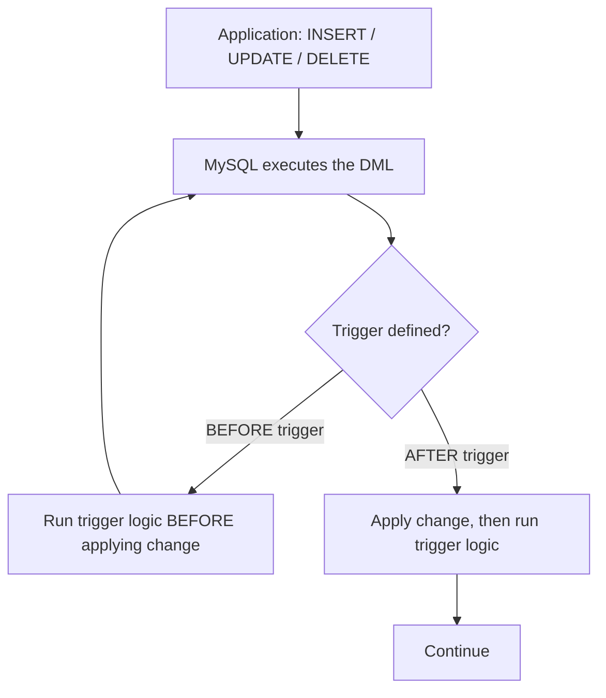

# How to Create and Use Triggers in MySQL

Author: [nawazdhandala](https://www.github.com/nawazdhandala)

Tags: MySQL, SQL, Trigger, Database, Automation

Description: Learn how to create and use MySQL triggers to automatically execute SQL logic in response to INSERT, UPDATE, or DELETE events on a table.

---

## How Triggers Work

A trigger is a stored program that MySQL automatically executes when a specified data modification event (INSERT, UPDATE, or DELETE) occurs on a table. Triggers can fire BEFORE or AFTER the event. They are useful for audit logging, data validation, automatic timestamp updates, and maintaining derived tables.



## Syntax

```sql
DELIMITER $$

CREATE TRIGGER trigger_name
{BEFORE | AFTER} {INSERT | UPDATE | DELETE}
ON table_name
FOR EACH ROW
BEGIN
    -- Trigger body
    -- Use NEW.column for new values (INSERT, UPDATE)
    -- Use OLD.column for old values (UPDATE, DELETE)
END$$

DELIMITER ;
```

## Special Row References

| Reference | Available In | Description |
|-----------|-------------|-------------|
| NEW.column | INSERT, UPDATE | New value being inserted or set |
| OLD.column | UPDATE, DELETE | Previous value before the change |

In BEFORE triggers, you can modify `NEW.column` values before they are written.

## Examples

### Setup: Create Sample Tables

```sql
CREATE TABLE employees (
    id INT PRIMARY KEY AUTO_INCREMENT,
    name VARCHAR(100) NOT NULL,
    salary DECIMAL(10, 2),
    department VARCHAR(50),
    last_modified DATETIME
);

CREATE TABLE salary_audit (
    id INT PRIMARY KEY AUTO_INCREMENT,
    employee_id INT,
    old_salary DECIMAL(10, 2),
    new_salary DECIMAL(10, 2),
    changed_by VARCHAR(100),
    changed_at DATETIME DEFAULT CURRENT_TIMESTAMP
);

CREATE TABLE employee_archive (
    id INT,
    name VARCHAR(100),
    salary DECIMAL(10, 2),
    department VARCHAR(50),
    deleted_at DATETIME DEFAULT CURRENT_TIMESTAMP
);

INSERT INTO employees (name, salary, department) VALUES
    ('Alice', 95000.00, 'Engineering'),
    ('Bob',   72000.00, 'Marketing'),
    ('Carol', 88000.00, 'Engineering');
```

### BEFORE INSERT Trigger: Auto-Set Timestamp

Automatically set `last_modified` on every insert.

```sql
DELIMITER $$

CREATE TRIGGER trg_employee_before_insert
BEFORE INSERT ON employees
FOR EACH ROW
BEGIN
    SET NEW.last_modified = NOW();
END$$

DELIMITER ;

INSERT INTO employees (name, salary, department) VALUES ('Dave', 80000.00, 'Finance');
SELECT id, name, last_modified FROM employees WHERE name = 'Dave';
```

```text
+----+------+---------------------+
| id | name | last_modified       |
+----+------+---------------------+
| 4  | Dave | 2026-03-31 12:00:00 |
+----+------+---------------------+
```

### AFTER UPDATE Trigger: Audit Salary Changes

Log every salary change to the audit table.

```sql
DELIMITER $$

CREATE TRIGGER trg_salary_after_update
AFTER UPDATE ON employees
FOR EACH ROW
BEGIN
    IF OLD.salary <> NEW.salary THEN
        INSERT INTO salary_audit (employee_id, old_salary, new_salary, changed_by)
        VALUES (OLD.id, OLD.salary, NEW.salary, USER());
    END IF;
END$$

DELIMITER ;

-- Give Alice a raise
UPDATE employees SET salary = 105000.00 WHERE name = 'Alice';

-- Check the audit log
SELECT ea.name, sa.old_salary, sa.new_salary, sa.changed_by, sa.changed_at
FROM salary_audit sa
INNER JOIN employees ea ON sa.employee_id = ea.id;
```

```text
+-------+------------+------------+----------------+---------------------+
| name  | old_salary | new_salary | changed_by     | changed_at          |
+-------+------------+------------+----------------+---------------------+
| Alice | 95000.00   | 105000.00  | root@localhost | 2026-03-31 12:01:00 |
+-------+------------+------------+----------------+---------------------+
```

### AFTER DELETE Trigger: Archive Deleted Records

Keep a copy of deleted employees.

```sql
DELIMITER $$

CREATE TRIGGER trg_employee_after_delete
AFTER DELETE ON employees
FOR EACH ROW
BEGIN
    INSERT INTO employee_archive (id, name, salary, department, deleted_at)
    VALUES (OLD.id, OLD.name, OLD.salary, OLD.department, NOW());
END$$

DELIMITER ;

DELETE FROM employees WHERE name = 'Dave';

SELECT * FROM employee_archive;
```

```text
+----+------+----------+------------+---------------------+
| id | name | salary   | department | deleted_at          |
+----+------+----------+------------+---------------------+
| 4  | Dave | 80000.00 | Finance    | 2026-03-31 12:02:00 |
+----+------+----------+------------+---------------------+
```

### BEFORE UPDATE Trigger: Data Validation

Prevent salary from being set below a minimum threshold.

```sql
DELIMITER $$

CREATE TRIGGER trg_salary_validate
BEFORE UPDATE ON employees
FOR EACH ROW
BEGIN
    IF NEW.salary < 30000 THEN
        SIGNAL SQLSTATE '45000'
            SET MESSAGE_TEXT = 'Salary cannot be less than 30000';
    END IF;
    SET NEW.last_modified = NOW();
END$$

DELIMITER ;

-- This will fail with the custom error
UPDATE employees SET salary = 10000 WHERE id = 1;
-- ERROR 1644: Salary cannot be less than 30000
```

### Viewing and Dropping Triggers

```sql
-- List all triggers in the database
SHOW TRIGGERS FROM your_database_name;

-- View trigger definition
SHOW CREATE TRIGGER trg_salary_after_update;

-- Drop a trigger
DROP TRIGGER IF EXISTS trg_salary_after_update;
```

## Best Practices

- Keep trigger logic simple and fast - triggers execute synchronously within the originating transaction.
- Avoid recursive triggers (a trigger firing another trigger on the same table) unless `innodb_autoinc_lock_mode` and `trigger_recursion_depth` are explicitly managed.
- Use `IF OLD.column <> NEW.column THEN` guards in UPDATE triggers to avoid unnecessary operations when the value didn't actually change.
- Use `SIGNAL SQLSTATE '45000'` for custom validation errors that abort the operation.
- Log trigger errors to an error table rather than failing silently - wrap the body in a `DECLARE CONTINUE HANDLER` if you want non-fatal error handling.
- Triggers are invisible to applications - document them carefully to avoid confusion during debugging.

## Summary

MySQL triggers execute automatically in response to INSERT, UPDATE, or DELETE events on a table. BEFORE triggers can modify incoming values or abort the operation; AFTER triggers run after the change and are useful for audit logging, archiving, and updating related tables. Use `NEW.column` for the incoming value and `OLD.column` for the previous value. Keep trigger logic lightweight to avoid impacting the performance of the originating DML operations.
