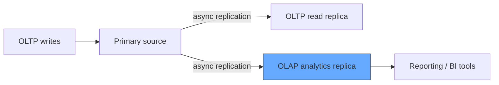
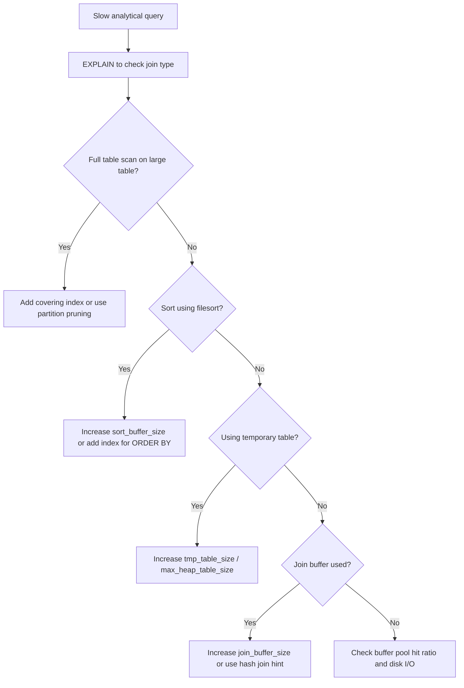

# How to Tune MySQL for OLAP Workloads

Author: [OneUptime](https://oneuptime.com)

Tags: MySQL, OLAP, Performance, Tuning, Analytics

Description: Learn how to tune MySQL for OLAP workloads by optimizing sort buffers, join buffers, parallel query, read-ahead, and schema design for analytical queries.

---

## Introduction

OLAP (Online Analytical Processing) workloads have very different characteristics from OLTP:

| Dimension | OLTP | OLAP |
|---|---|---|
| Query type | Many small, fast queries | Few large, complex queries |
| Data access | Point lookups, narrow ranges | Full or large range scans |
| Concurrency | High (thousands of connections) | Low (tens of connections) |
| Write pattern | Frequent small writes | Bulk loads or batch inserts |
| Join complexity | Few tables | Many large table joins |
| Group by / aggregate | Rare | Very common |

MySQL (InnoDB) is primarily an OLTP engine, but with the right tuning it handles reporting and analytical queries well, especially when data fits largely in memory.

## Buffer pool sizing for analytics

For OLAP, the buffer pool should be large enough to cache the entire working set of the analytical tables:

```ini
# /etc/mysql/mysql.conf.d/mysqld.cnf

[mysqld]
# Set to 70-80% of available RAM for a dedicated analytics server
innodb_buffer_pool_size       = 32G
innodb_buffer_pool_instances  = 8      # one per 4-8 GB, reduces mutex contention
```

```sql
-- Check cache hit ratio (should be > 99% for OLAP working sets)
SELECT
  ROUND(
    (1 - (variable_value / (SELECT variable_value FROM performance_schema.global_status
     WHERE variable_name = 'Innodb_buffer_pool_read_requests'))) * 100, 2
  ) AS buffer_pool_hit_pct
FROM performance_schema.global_status
WHERE variable_name = 'Innodb_buffer_pool_reads';
```

## Sort buffer and join buffer

OLAP queries often sort and join large datasets. Increasing these session-level buffers helps:

```ini
[mysqld]
sort_buffer_size  = 8388608    # 8 MB per sort thread
join_buffer_size  = 8388608    # 8 MB per join (hash/block nested loop)
read_buffer_size  = 4194304    # 4 MB for full table scan read-ahead
read_rnd_buffer_size = 4194304 # 4 MB for random-order reads after sort
```

For a specific analytical session you can set them higher:

```sql
-- For a heavy reporting query
SET SESSION sort_buffer_size  = 67108864;   -- 64 MB
SET SESSION join_buffer_size  = 67108864;   -- 64 MB
SET SESSION read_buffer_size  = 16777216;   -- 16 MB

-- Run the analytical query
SELECT region, SUM(revenue) AS total_revenue
FROM sales_fact
JOIN date_dim ON sales_fact.date_id = date_dim.id
JOIN product_dim ON sales_fact.product_id = product_dim.id
WHERE date_dim.year = 2025
GROUP BY region
ORDER BY total_revenue DESC;
```

## Read-ahead optimization

InnoDB has two read-ahead mechanisms that accelerate sequential full scans:

```ini
[mysqld]
# Linear read-ahead: triggers when N sequential pages are read
innodb_read_ahead_threshold = 56      # default 56; lower for smaller tables

# Disable or reduce random read-ahead for OLAP (avoids wasted I/O)
innodb_random_read_ahead    = OFF
```

## Parallel query with hash joins (MySQL 8.0+)

```sql
-- Enable hash joins (default ON in MySQL 8.0.18+)
SHOW VARIABLES LIKE 'optimizer_switch%' \G
-- Look for: hash_join=on

-- Force a hash join hint for a specific query
SELECT /*+ HASH_JOIN(s, d) */
  d.year,
  d.quarter,
  SUM(s.revenue) AS total
FROM sales_fact s
JOIN date_dim d ON s.date_id = d.id
GROUP BY d.year, d.quarter;

-- Check if hash join was used
EXPLAIN FORMAT=TREE
SELECT d.year, SUM(s.revenue)
FROM sales_fact s JOIN date_dim d ON s.date_id = d.id
GROUP BY d.year\G
```

## OLAP-friendly table design

### Covering indexes for common analytical dimensions

```sql
-- Instead of scanning the full sales_fact table for a year filter:
-- Create a covering index that includes the measure columns
CREATE INDEX idx_sales_date_region_revenue
  ON sales_fact (date_id, region_id, revenue);

-- The query can now use an index-only scan
EXPLAIN SELECT date_id, region_id, SUM(revenue)
FROM sales_fact
WHERE date_id BETWEEN 20250101 AND 20251231
GROUP BY date_id, region_id;
```

### Partition pruning for time-series data

```sql
-- Range partitioning by year for large fact tables
CREATE TABLE sales_fact (
  id         BIGINT UNSIGNED AUTO_INCREMENT,
  sale_date  DATE NOT NULL,
  region_id  INT NOT NULL,
  product_id INT NOT NULL,
  revenue    DECIMAL(12,2) NOT NULL,
  PRIMARY KEY (id, sale_date)
)
PARTITION BY RANGE (YEAR(sale_date)) (
  PARTITION p2023 VALUES LESS THAN (2024),
  PARTITION p2024 VALUES LESS THAN (2025),
  PARTITION p2025 VALUES LESS THAN (2026),
  PARTITION p_future VALUES LESS THAN MAXVALUE
);

-- Analytical queries on 2025 data only touch p2025 partition
EXPLAIN SELECT SUM(revenue)
FROM sales_fact
WHERE sale_date BETWEEN '2025-01-01' AND '2025-12-31'\G
-- Look for: partitions: p2025
```

## Bulk loading for ETL

```sql
-- Disable foreign key checks and unique checks during bulk load
SET foreign_key_checks = 0;
SET unique_checks = 0;
SET sql_log_bin = 0;        -- if replication lag is a concern

LOAD DATA INFILE '/tmp/sales_2025_q4.csv'
INTO TABLE sales_fact
FIELDS TERMINATED BY ','
LINES TERMINATED BY '\n'
(sale_date, region_id, product_id, revenue);

SET foreign_key_checks = 1;
SET unique_checks = 1;

-- Rebuild statistics after bulk load
ANALYZE TABLE sales_fact;
```

## Optimizer settings for complex queries

```sql
-- Increase optimizer search depth for many-table joins
SET SESSION optimizer_search_depth = 0;  -- 0 = auto (recommended for OLAP)

-- Enable block nested loop (for non-equi joins)
SET SESSION optimizer_switch = 'block_nested_loop=on';

-- Increase the in-memory temp table size for GROUP BY / ORDER BY
SET SESSION tmp_table_size    = 268435456;  -- 256 MB
SET SESSION max_heap_table_size = 268435456; -- must match tmp_table_size
```

## Dedicated read replica for analytics



Configure the analytics replica with relaxed durability settings:

```ini
# analytics replica my.cnf

[mysqld]
# Large buffer pool
innodb_buffer_pool_size       = 48G
innodb_buffer_pool_instances  = 12

# Large sort/join buffers
sort_buffer_size              = 16M
join_buffer_size              = 16M

# Reduced durability (replica, not source)
innodb_flush_log_at_trx_commit = 2
sync_binlog                   = 0

# Skip binary logging on replica
skip_log_bin

# Read-only
read_only = ON
```

## Summary query tuning checklist



## Summary

Tuning MySQL for OLAP requires increasing `innodb_buffer_pool_size` to cache analytical working sets, raising session-level `sort_buffer_size`, `join_buffer_size`, `tmp_table_size`, and `max_heap_table_size` for complex queries, leveraging hash joins (MySQL 8.0), and designing tables with range partitioning and covering indexes for common filter/aggregate patterns. For heavy analytical workloads, direct queries to a dedicated read replica configured with a large buffer pool and relaxed durability settings, leaving the primary server for OLTP traffic.
