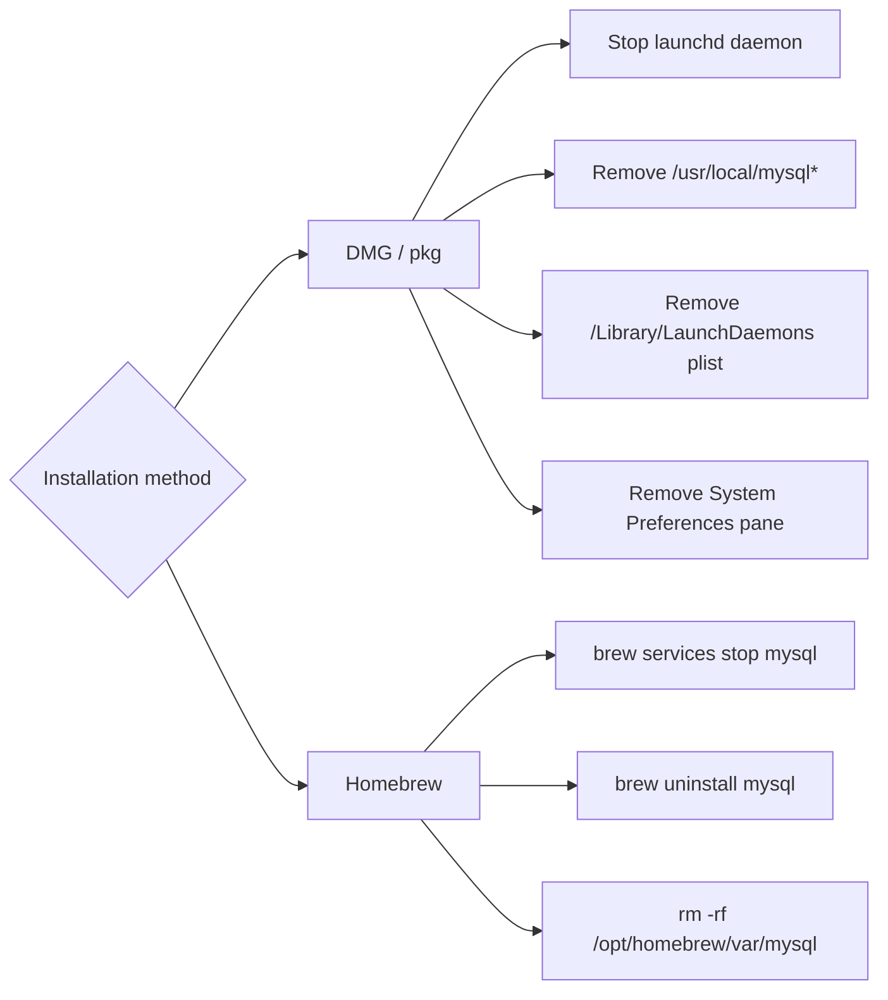

# How to Uninstall MySQL Completely on macOS

Author: [nawazdhandala](https://www.github.com/nawazdhandala)

Tags: MySQL, Uninstall, macOS, Administration, Homebrew

Description: Completely remove MySQL from macOS whether installed via the DMG package or Homebrew, including data directories, launchd plists, and System Settings pane.

---

## How It Works

MySQL on macOS can be installed in two ways: the official DMG/pkg installer or Homebrew. Each leaves files in different locations. A complete removal requires stopping the service, removing the binaries, deleting data directories, and removing launchd plists.



## Method 1 - Uninstall MySQL Installed via DMG Package

### Step 1 - Back Up Your Data

```bash
/usr/local/mysql/bin/mysqldump -u root -p --all-databases > ~/Desktop/mysql-backup.sql
```

### Step 2 - Stop the MySQL Service

```bash
sudo /usr/local/mysql/support-files/mysql.server stop
```

Or unload the launchd daemon.

```bash
sudo launchctl unload -w /Library/LaunchDaemons/com.oracle.oss.mysql.mysqld.plist
```

### Step 3 - Remove MySQL Binaries and Data

```bash
sudo rm -rf /usr/local/mysql
sudo rm -rf /usr/local/mysql*
```

### Step 4 - Remove the launchd Plist

```bash
sudo rm -f /Library/LaunchDaemons/com.oracle.oss.mysql.mysqld.plist
```

### Step 5 - Remove the System Preferences Pane

```bash
sudo rm -rf /Library/PreferencePanes/MySQL.prefPane
```

### Step 6 - Remove Installer Receipts

```bash
sudo rm -rf /Library/Receipts/mysql*
sudo rm -rf /Library/Receipts/MySQL*
sudo pkgutil --forget com.mysql.mysql
sudo pkgutil --forget com.oracle.mysql.startup
```

### Step 7 - Remove Database Files (If Stored Separately)

Check if MySQL was configured to use a custom data directory.

```bash
# Default data directory for DMG installs
sudo rm -rf /usr/local/mysql/data
```

If you changed the data directory in `my.cnf`, also remove that custom path.

### Step 8 - Remove Socket and PID Files

```bash
sudo rm -f /tmp/mysql.sock
sudo rm -f /tmp/mysql.sock.lock
sudo rm -f /var/run/mysqld/mysqld.pid
```

### Step 9 - Remove PATH Entry

If you added MySQL to your shell profile, remove the export line.

```bash
# For Zsh
nano ~/.zshrc
# Remove: export PATH="/usr/local/mysql/bin:$PATH"

# For Bash
nano ~/.bash_profile
# Remove: export PATH="/usr/local/mysql/bin:$PATH"
```

---

## Method 2 - Uninstall MySQL Installed via Homebrew

### Step 1 - Back Up Your Data

```bash
mysqldump -u root -p --all-databases > ~/Desktop/mysql-backup.sql
```

### Step 2 - Stop the Service

```bash
brew services stop mysql
```

### Step 3 - Uninstall MySQL

```bash
brew uninstall mysql
```

If you have multiple versions:

```bash
brew uninstall --force mysql
```

### Step 4 - Remove the Data Directory

The data directory is not removed by `brew uninstall`.

For Apple Silicon (M1/M2/M3/M4):

```bash
rm -rf /opt/homebrew/var/mysql
```

For Intel Macs:

```bash
rm -rf /usr/local/var/mysql
```

### Step 5 - Remove Remaining Configuration Files

```bash
rm -rf /opt/homebrew/etc/my.cnf
rm -rf /opt/homebrew/etc/my.cnf.d
```

### Step 6 - Remove LaunchAgents

```bash
rm -f ~/Library/LaunchAgents/homebrew.mxcl.mysql.plist
```

---

## Verify Complete Removal

```bash
# No mysqld process running
ps aux | grep mysqld | grep -v grep

# No mysql command available
which mysql 2>/dev/null || echo "mysql not found"

# Port 3306 not in use
lsof -iTCP:3306 -sTCP:LISTEN 2>/dev/null || echo "Port 3306 not in use"
```

All checks should return empty output or the "not found" messages.

## Summary

Removing MySQL from macOS completely depends on how it was installed. For the DMG package, delete `/usr/local/mysql*`, the launchd plist in `/Library/LaunchDaemons`, the System Preferences pane, and the installer receipts. For Homebrew installs, `brew uninstall mysql` removes the binaries, but the data directory at `/opt/homebrew/var/mysql` (Apple Silicon) must be deleted manually. Always back up your databases before uninstalling.
