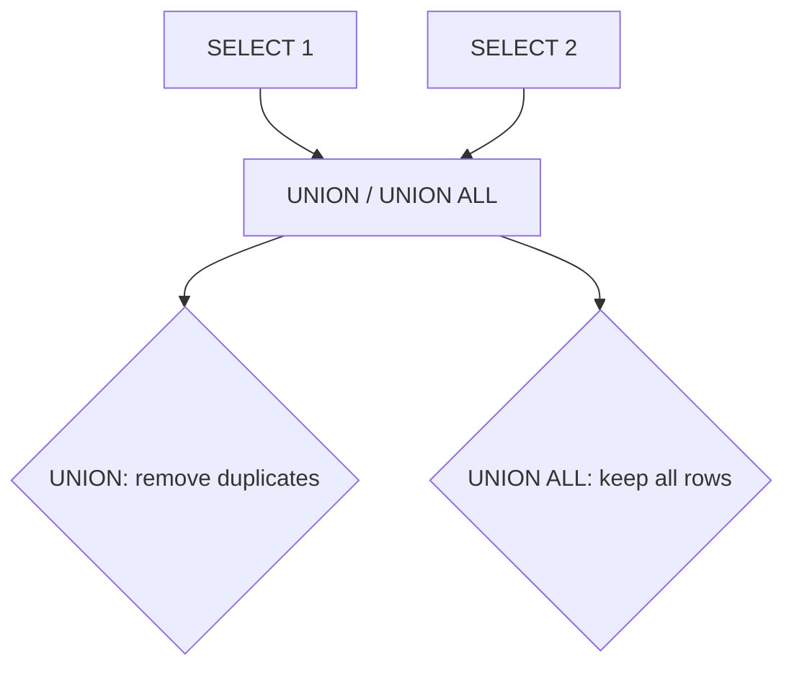

# How to Use UNION and UNION ALL in MySQL

Author: [nawazdhandala](https://www.github.com/nawazdhandala)

Tags: MySQL, SQL, UNION, Database, Query

Description: Learn how to use UNION and UNION ALL in MySQL to combine result sets from multiple SELECT statements into a single output.

---

## How UNION and UNION ALL Work

`UNION` combines the results of two or more SELECT statements into a single result set and removes duplicate rows. `UNION ALL` combines results without removing duplicates, making it faster when you either know there are no duplicates or explicitly want to keep them.



## Rules

- Both SELECT statements must return the same number of columns.
- Corresponding columns must have compatible data types.
- Column names in the result are taken from the first SELECT statement.
- ORDER BY applies to the entire combined result, not individual SELECT statements.

## Syntax

```sql
SELECT columns FROM table_1
UNION
SELECT columns FROM table_2;

SELECT columns FROM table_1
UNION ALL
SELECT columns FROM table_2;
```

## Examples

### Setup: Create Sample Tables

```sql
CREATE TABLE employees_2025 (
    id INT PRIMARY KEY AUTO_INCREMENT,
    name VARCHAR(100) NOT NULL,
    department VARCHAR(50),
    salary DECIMAL(10, 2)
);

CREATE TABLE employees_2026 (
    id INT PRIMARY KEY AUTO_INCREMENT,
    name VARCHAR(100) NOT NULL,
    department VARCHAR(50),
    salary DECIMAL(10, 2)
);

INSERT INTO employees_2025 (name, department, salary) VALUES
    ('Alice', 'Engineering', 95000.00),
    ('Bob',   'Marketing',   72000.00),
    ('Carol', 'Engineering', 88000.00);

INSERT INTO employees_2026 (name, department, salary) VALUES
    ('Alice', 'Engineering', 105000.00),
    ('Dave',  'Finance',      88000.00),
    ('Eve',   'Marketing',    75000.00);
```

### Basic UNION (Removes Duplicates)

Combine all unique employee names from both years.

```sql
SELECT name FROM employees_2025
UNION
SELECT name FROM employees_2026
ORDER BY name;
```

```text
+-------+
| name  |
+-------+
| Alice |
| Bob   |
| Carol |
| Dave  |
| Eve   |
+-------+
```

Alice appears in both tables but only once in the output.

### UNION ALL (Keeps Duplicates)

Keep all rows from both years, including duplicates.

```sql
SELECT name, department, salary, '2025' AS year
FROM employees_2025
UNION ALL
SELECT name, department, salary, '2026' AS year
FROM employees_2026
ORDER BY name, year;
```

```text
+-------+-------------+-----------+------+
| name  | department  | salary    | year |
+-------+-------------+-----------+------+
| Alice | Engineering |  95000.00 | 2025 |
| Alice | Engineering | 105000.00 | 2026 |
| Bob   | Marketing   |  72000.00 | 2025 |
| Carol | Engineering |  88000.00 | 2025 |
| Dave  | Finance     |  88000.00 | 2026 |
| Eve   | Marketing   |  75000.00 | 2026 |
+-------+-------------+-----------+------+
```

### Adding a Source Label

Tag each row with its source table using a literal string column.

```sql
SELECT name, department, salary, 'Year 2025' AS source
FROM employees_2025
UNION ALL
SELECT name, department, salary, 'Year 2026' AS source
FROM employees_2026
ORDER BY department, name;
```

### UNION with Different WHERE Clauses

Combine high earners from different departments in one result.

```sql
SELECT name, department, salary
FROM employees_2025
WHERE salary > 90000

UNION

SELECT name, department, salary
FROM employees_2026
WHERE salary > 90000

ORDER BY salary DESC;
```

```text
+-------+-------------+-----------+
| name  | department  | salary    |
+-------+-------------+-----------+
| Alice | Engineering | 105000.00 |
| Alice | Engineering |  95000.00 |
| Carol | Engineering |  88000.00 |
+-------+-------------+-----------+
```

### ORDER BY and LIMIT on UNION

Apply sorting and row limits to the combined result. The ORDER BY and LIMIT go after the last SELECT statement.

```sql
SELECT name, salary FROM employees_2025
UNION ALL
SELECT name, salary FROM employees_2026
ORDER BY salary DESC
LIMIT 3;
```

```text
+-------+-----------+
| name  | salary    |
+-------+-----------+
| Alice | 105000.00 |
| Alice |  95000.00 |
| Dave  |  88000.00 |
+-------+-----------+
```

### UNION to Merge Different Sources

Combine query results across conceptually different tables that share the same output shape.

```sql
CREATE TABLE contractors (
    id INT PRIMARY KEY AUTO_INCREMENT,
    full_name VARCHAR(100) NOT NULL,
    team VARCHAR(50)
);

INSERT INTO contractors (full_name, team) VALUES
    ('Zach', 'Engineering'), ('Yara', 'Design');

SELECT name AS person, department AS team, 'Employee' AS type
FROM employees_2026
UNION ALL
SELECT full_name AS person, team, 'Contractor' AS type
FROM contractors
ORDER BY type, person;
```

```text
+-------+-------------+------------+
| person | team       | type       |
+-------+-------------+------------+
| Zach  | Engineering | Contractor |
| Yara  | Design      | Contractor |
| Alice | Engineering | Employee   |
| Dave  | Finance     | Employee   |
| Eve   | Marketing   | Employee   |
+-------+-------------+------------+
```

## Best Practices

- Use UNION ALL instead of UNION whenever you know duplicates either don't exist or should be preserved. UNION performs an implicit `DISTINCT` which requires sorting or hashing, adding overhead.
- Ensure column counts and types match across all SELECT statements in the UNION.
- Column names and types come from the first SELECT - alias columns there for clear output headers.
- Place ORDER BY and LIMIT after the last SELECT in the UNION, not on individual statements.
- When combining large tables, UNION ALL with subsequent filtering in a derived table is often more efficient than per-query UNION.

## Summary

UNION combines multiple SELECT results into one set, removing duplicates automatically. UNION ALL does the same without deduplication, making it faster and appropriate when duplicates are intentional or nonexistent. Both require matching column counts and compatible types. Use UNION for distinct result sets across tables and UNION ALL when tracking sources, logging history, or merging partitioned data.
