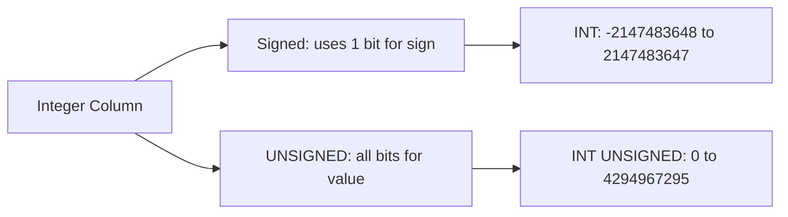

# How to Use UNSIGNED Integer Types in MySQL

Author: [nawazdhandala](https://www.github.com/nawazdhandala)

Tags: MySQL, SQL, Data Type, Integer, Database

Description: Learn how to use UNSIGNED integer types in MySQL to double the positive range of integer columns, prevent negative values, and optimize storage for counters and IDs.

---

## What Is UNSIGNED

The `UNSIGNED` attribute can be applied to any MySQL integer type (`TINYINT`, `SMALLINT`, `MEDIUMINT`, `INT`, `BIGINT`) to prohibit negative values and double the positive range. All bits are used for the positive range instead of reserving one for the sign.



## UNSIGNED Ranges

| Type | Signed Min | Signed Max | Unsigned Min | Unsigned Max |
|---|---|---|---|---|
| `TINYINT` | -128 | 127 | 0 | 255 |
| `SMALLINT` | -32,768 | 32,767 | 0 | 65,535 |
| `MEDIUMINT` | -8,388,608 | 8,388,607 | 0 | 16,777,215 |
| `INT` | -2,147,483,648 | 2,147,483,647 | 0 | 4,294,967,295 |
| `BIGINT` | -9.2 * 10^18 | 9.2 * 10^18 | 0 | 18.4 * 10^18 |

## Syntax

```sql
column_name INT UNSIGNED [NOT NULL] [DEFAULT value] [AUTO_INCREMENT]
```

## Primary Keys with UNSIGNED

Using `INT UNSIGNED AUTO_INCREMENT` instead of `INT AUTO_INCREMENT` doubles the available primary key range from ~2 billion to ~4 billion rows.

```sql
CREATE TABLE customers (
    id         INT UNSIGNED AUTO_INCREMENT PRIMARY KEY,
    email      VARCHAR(255) NOT NULL UNIQUE,
    name       VARCHAR(100) NOT NULL,
    created_at DATETIME NOT NULL DEFAULT CURRENT_TIMESTAMP
);

INSERT INTO customers (email, name) VALUES
('alice@example.com', 'Alice Smith'),
('bob@example.com',   'Bob Johnson');

SELECT id, email FROM customers;
```

```text
+----+-------------------+
| id | email             |
+----+-------------------+
|  1 | alice@example.com |
|  2 | bob@example.com   |
+----+-------------------+
```

## Counters and Metrics

```sql
CREATE TABLE page_metrics (
    id           INT UNSIGNED AUTO_INCREMENT PRIMARY KEY,
    page_path    VARCHAR(500) NOT NULL UNIQUE,
    view_count   BIGINT UNSIGNED NOT NULL DEFAULT 0,
    unique_views BIGINT UNSIGNED NOT NULL DEFAULT 0,
    like_count   INT UNSIGNED NOT NULL DEFAULT 0,
    share_count  INT UNSIGNED NOT NULL DEFAULT 0,
    last_viewed  DATETIME
);

INSERT INTO page_metrics (page_path, view_count, unique_views) VALUES
('/home', 1500000, 900000),
('/about', 75000, 50000);

-- Increment counter
UPDATE page_metrics
SET view_count = view_count + 1,
    last_viewed = NOW()
WHERE page_path = '/home';
```

## File Sizes and Byte Counts

```sql
CREATE TABLE uploaded_files (
    id            INT UNSIGNED AUTO_INCREMENT PRIMARY KEY,
    filename      VARCHAR(255) NOT NULL,
    size_bytes    BIGINT UNSIGNED NOT NULL,   -- file size, never negative
    checksum      BINARY(32) NOT NULL,
    uploaded_at   DATETIME NOT NULL DEFAULT CURRENT_TIMESTAMP
);

INSERT INTO uploaded_files (filename, size_bytes, checksum) VALUES
('document.pdf', 2457600,  UNHEX(SHA2('content1', 256))),
('image.jpg',    524288,   UNHEX(SHA2('content2', 256))),
('video.mp4',    1073741824, UNHEX(SHA2('content3', 256)));

SELECT filename,
       size_bytes,
       ROUND(size_bytes / 1048576, 2) AS size_mb
FROM uploaded_files
ORDER BY size_bytes DESC;
```

```text
+--------------+------------+---------+
| filename     | size_bytes | size_mb |
+--------------+------------+---------+
| video.mp4    | 1073741824 | 1024.00 |
| document.pdf |    2457600 |    2.34 |
| image.jpg    |     524288 |    0.50 |
+--------------+------------+---------+
```

## UNSIGNED for Foreign Key Columns

Foreign key columns should use the same type as the referenced primary key, including `UNSIGNED`.

```sql
CREATE TABLE orders (
    id          INT UNSIGNED AUTO_INCREMENT PRIMARY KEY,
    customer_id INT UNSIGNED NOT NULL,
    total_cents INT UNSIGNED NOT NULL,
    placed_at   DATETIME NOT NULL DEFAULT CURRENT_TIMESTAMP,
    FOREIGN KEY (customer_id) REFERENCES customers (id)
);
```

## Preventing Negative Values

```sql
CREATE TABLE inventory (
    product_id  INT UNSIGNED NOT NULL PRIMARY KEY,
    stock_count INT UNSIGNED NOT NULL DEFAULT 0,   -- cannot go negative
    reserved    INT UNSIGNED NOT NULL DEFAULT 0
);

INSERT INTO inventory (product_id, stock_count) VALUES (101, 100);

-- Strict mode prevents going below 0
UPDATE inventory
SET stock_count = stock_count - 200
WHERE product_id = 101;
-- ERROR 1690 (22003): BIGINT UNSIGNED value is out of range
-- in strict mode this raises an error
```

## UNSIGNED with DECIMAL and FLOAT

`UNSIGNED` also works with `DECIMAL` and `FLOAT`:

```sql
CREATE TABLE product_prices (
    product_id  INT UNSIGNED NOT NULL PRIMARY KEY,
    cost        DECIMAL(10, 2) UNSIGNED NOT NULL,  -- always positive
    price       DECIMAL(10, 2) UNSIGNED NOT NULL,
    weight_kg   FLOAT UNSIGNED                      -- never negative
);
```

## Arithmetic and UNSIGNED Overflow

```sql
-- Subtraction can underflow with UNSIGNED
SELECT CAST(5 AS UNSIGNED) - CAST(10 AS UNSIGNED);
-- In strict mode: ERROR
-- Without strict mode: wraps to a large unsigned number (unsafe)

-- Safe pattern: check before subtracting
UPDATE inventory
SET stock_count = stock_count - 10
WHERE product_id = 101
  AND stock_count >= 10;  -- guard against underflow
```

## Best Practices

- Use `INT UNSIGNED` for primary keys and foreign keys to double the positive range at no extra storage cost.
- Use `BIGINT UNSIGNED` for counters (views, clicks, downloads) that may grow into the billions.
- Always match the type and signedness of a foreign key column to its referenced primary key.
- Use `UNSIGNED` on `DECIMAL` and `FLOAT` for price, weight, and other naturally positive quantities.
- Guard against underflow in `UPDATE` statements by checking the current value before subtracting.
- Be aware that arithmetic mixing signed and unsigned integers can produce unexpected results; cast explicitly.

## Summary

The `UNSIGNED` attribute on MySQL integer columns prevents negative values and doubles the positive range. Use `INT UNSIGNED AUTO_INCREMENT` for primary keys to support up to 4.3 billion rows, `BIGINT UNSIGNED` for large counters, and `UNSIGNED` on any numeric column where negative values are logically impossible (file sizes, stock counts, prices). Always ensure foreign key columns use the same type and signedness as their referenced primary key.
