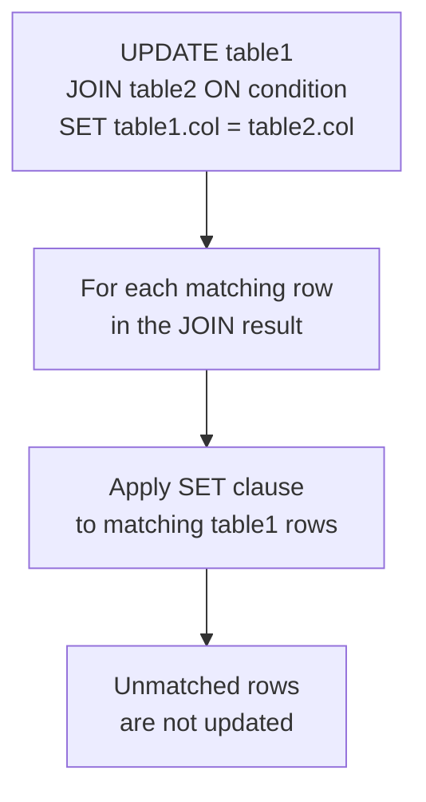

# How to Use UPDATE with JOIN in MySQL

Author: [nawazdhandala](https://www.github.com/nawazdhandala)

Tags: MySQL, SQL, DML, Update, Join, Database

Description: Learn how to use UPDATE with JOIN in MySQL to modify rows in one table based on matching data from another table, with practical examples and performance tips.

---

## What Is UPDATE with JOIN

MySQL supports updating rows in one table based on a JOIN with another table. This is more efficient than using a correlated subquery in some cases, and it allows you to update multiple tables or reference related table data in the SET clause.

The syntax uses `UPDATE table1 JOIN table2 ON condition SET ...` rather than the standard single-table `UPDATE table SET ...`.



## Syntax

```sql
-- Standard UPDATE with JOIN
UPDATE table1
[INNER JOIN | LEFT JOIN] table2 ON join_condition
SET table1.column = expression
[WHERE additional_conditions];

-- Update with multiple tables
UPDATE table1
JOIN table2 ON table1.id = table2.fk_id
JOIN table3 ON table2.id = table3.fk_id
SET table1.col = table3.value
WHERE table3.status = 'active';
```

## Examples

### Setup: Employees and Departments

```sql
CREATE TABLE departments (
    id        INT          PRIMARY KEY AUTO_INCREMENT,
    name      VARCHAR(100) NOT NULL,
    budget    DECIMAL(12,2),
    location  VARCHAR(100)
);

CREATE TABLE employees (
    id          INT          PRIMARY KEY AUTO_INCREMENT,
    name        VARCHAR(100) NOT NULL,
    department_id INT,
    salary      DECIMAL(10,2),
    salary_band VARCHAR(10),
    location    VARCHAR(100),
    FOREIGN KEY (department_id) REFERENCES departments(id)
);

INSERT INTO departments (name, budget, location) VALUES
    ('Engineering', 2000000, 'New York'),
    ('Marketing',   800000,  'Chicago'),
    ('Sales',       600000,  'Austin');

INSERT INTO employees (name, department_id, salary, salary_band, location) VALUES
    ('Alice',   1, 95000, NULL, NULL),
    ('Bob',     1, 82000, NULL, NULL),
    ('Carol',   2, 74000, NULL, NULL),
    ('Dave',    2, 68000, NULL, NULL),
    ('Eve',     3, 59000, NULL, NULL),
    ('Frank',   3, 63000, NULL, NULL);
```

### Update Employee Location from Department Table

```sql
-- Set each employee's location to match their department's location
UPDATE employees e
JOIN departments d ON e.department_id = d.id
SET e.location = d.location;

SELECT name, location FROM employees;
```

```text
+-------+----------+
| name  | location |
+-------+----------+
| Alice | New York |
| Bob   | New York |
| Carol | Chicago  |
| Dave  | Chicago  |
| Eve   | Austin   |
| Frank | Austin   |
+-------+----------+
```

### Update with a Computed Value from the JOIN

```sql
-- Assign salary_band based on salary relative to department budget
UPDATE employees e
JOIN departments d ON e.department_id = d.id
SET e.salary_band = CASE
    WHEN e.salary >= 90000                 THEN 'Senior'
    WHEN e.salary >= 70000                 THEN 'Mid'
    ELSE                                        'Junior'
END;

SELECT name, salary, salary_band FROM employees;
```

```text
+-------+-----------+-------------+
| name  | salary    | salary_band |
+-------+-----------+-------------+
| Alice | 95000.00  | Senior      |
| Bob   | 82000.00  | Mid         |
| Carol | 74000.00  | Mid         |
| Dave  | 68000.00  | Junior      |
| Eve   | 59000.00  | Junior      |
| Frank | 63000.00  | Junior      |
+-------+-----------+-------------+
```

### Give a Raise to Employees in High-Budget Departments

```sql
-- 10% raise for all employees in departments with budget > 1,000,000
UPDATE employees e
JOIN departments d ON e.department_id = d.id
SET e.salary = ROUND(e.salary * 1.10, 2)
WHERE d.budget > 1000000;

SELECT e.name, e.salary, d.name AS department
FROM employees e
JOIN departments d ON e.department_id = d.id;
```

```text
+-------+-----------+-------------+
| name  | salary    | department  |
+-------+-----------+-------------+
| Alice | 104500.00 | Engineering |
| Bob   |  90200.00 | Engineering |
| Carol |  74000.00 | Marketing   |
| Dave  |  68000.00 | Marketing   |
| Eve   |  59000.00 | Sales       |
| Frank |  63000.00 | Sales       |
+-------+-----------+-------------+
```

### LEFT JOIN to Update Rows Without a Match

Use `LEFT JOIN` to update rows even if there is no matching row in the second table:

```sql
-- Set salary_band to 'Unassigned' for employees with no department
UPDATE employees e
LEFT JOIN departments d ON e.department_id = d.id
SET e.salary_band = CASE WHEN d.id IS NULL THEN 'Unassigned' ELSE e.salary_band END;
```

### Update Using a Derived Table (Subquery as JOIN Source)

```sql
-- Update employees with department average salary into a new column
ALTER TABLE employees ADD avg_dept_salary DECIMAL(10,2);

UPDATE employees e
JOIN (
    SELECT department_id, ROUND(AVG(salary), 2) AS avg_salary
    FROM employees
    GROUP BY department_id
) dept_avg ON dept_avg.department_id = e.department_id
SET e.avg_dept_salary = dept_avg.avg_salary;

SELECT name, salary, avg_dept_salary FROM employees;
```

```text
+-------+-----------+-----------------+
| name  | salary    | avg_dept_salary |
+-------+-----------+-----------------+
| Alice | 104500.00 |        97350.00 |
| Bob   |  90200.00 |        97350.00 |
| Carol |  74000.00 |        71000.00 |
| Dave  |  68000.00 |        71000.00 |
| Eve   |  59000.00 |        61000.00 |
| Frank |  63000.00 |        61000.00 |
+-------+-----------+-----------------+
```

### Update with Three-Table JOIN

```sql
CREATE TABLE performance_reviews (
    employee_id INT,
    rating      TINYINT,   -- 1-5
    review_date DATE
);

INSERT INTO performance_reviews VALUES
    (1, 5, '2025-03-01'),
    (2, 4, '2025-03-01'),
    (3, 3, '2025-03-01'),
    (4, 2, '2025-03-01');

-- Give bonus to employees with rating >= 4 in high-budget departments
UPDATE employees e
JOIN departments d ON e.department_id = d.id
JOIN performance_reviews pr ON pr.employee_id = e.id
SET e.salary = ROUND(e.salary * 1.05, 2)
WHERE pr.rating >= 4
  AND d.budget >= 800000;

SELECT e.name, e.salary, d.name AS dept, pr.rating
FROM employees e
JOIN departments d ON e.department_id = d.id
LEFT JOIN performance_reviews pr ON pr.employee_id = e.id;
```

## Preview Before Updating

Always preview the rows that will be affected with a `SELECT` first:

```sql
-- Preview: which employees will get the raise?
SELECT e.name, e.salary, ROUND(e.salary * 1.10, 2) AS new_salary, d.name
FROM employees e
JOIN departments d ON e.department_id = d.id
WHERE d.budget > 1000000;
```

## UPDATE with JOIN vs Correlated Subquery

```sql
-- Using JOIN (often faster, clearer)
UPDATE employees e
JOIN departments d ON e.department_id = d.id
SET e.location = d.location;

-- Using correlated subquery (equivalent but typically slower)
UPDATE employees e
SET e.location = (
    SELECT d.location FROM departments d WHERE d.id = e.department_id
);
```

## Best Practices

- Always run the equivalent `SELECT` with the same `JOIN` and `WHERE` conditions before executing an `UPDATE` to verify which rows will be affected.
- Use `INNER JOIN` when rows without a match should not be updated.
- Use `LEFT JOIN` when you want to handle non-matching rows differently (e.g., set a default value).
- Wrap large `UPDATE ... JOIN` statements in a transaction so you can roll back if the result is unexpected.
- Avoid updating the same column in both tables in a single statement -- it can produce ambiguous behavior.

## Summary

`UPDATE table1 JOIN table2 ON condition SET table1.col = value` updates rows in `table1` based on matching rows in `table2`. Use `INNER JOIN` to update only matched rows, `LEFT JOIN` to include unmatched rows, and a derived table as the JOIN source for complex computed updates. Always preview with a `SELECT` before running the `UPDATE`, and wrap in a transaction for safety.
