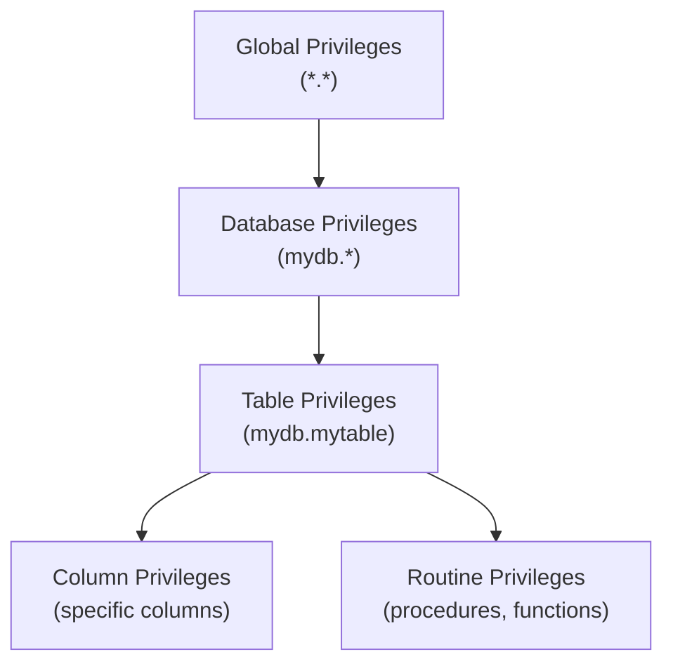

# How to Configure MySQL User Privileges with GRANT

Author: [nawazdhandala](https://www.github.com/nawazdhandala)

Tags: MySQL, Security, GRANT, User Privileges, Database Administration

Description: Learn how to create MySQL users and assign precise privileges using GRANT, including database-level, table-level, column-level, and global privileges.

---

## How MySQL Privileges Work

MySQL uses a privilege system to control what each user can do. Privileges are organized in a hierarchy:



A user's effective privilege for any operation is the union of privileges from all levels. Global privileges apply to all databases; database-level privileges apply to all tables in that database.

## Creating a User

Before granting privileges, create the user account:

```sql
-- Create a user with password authentication
CREATE USER 'appuser'@'localhost' IDENTIFIED BY 'StrongPass123!';

-- Create a user that can connect from any host
CREATE USER 'appuser'@'%' IDENTIFIED BY 'StrongPass123!';

-- Create a user for a specific IP range
CREATE USER 'appuser'@'192.168.1.%' IDENTIFIED BY 'StrongPass123!';

-- Create a user with an expiring password
CREATE USER 'tempuser'@'localhost'
    IDENTIFIED BY 'TempPass123!'
    PASSWORD EXPIRE INTERVAL 30 DAY;
```

## Global Privileges

Global privileges apply to all databases on the server:

```sql
-- Grant all privileges to a superuser (use sparingly)
GRANT ALL PRIVILEGES ON *.* TO 'admin_user'@'localhost' WITH GRANT OPTION;

-- Grant common administrative privileges
GRANT PROCESS, RELOAD, SHOW DATABASES, REPLICATION CLIENT, REPLICATION SLAVE
    ON *.* TO 'dba_user'@'localhost';

-- Grant privilege to create and drop databases
GRANT CREATE, DROP ON *.* TO 'devops_user'@'localhost';
```

## Database-Level Privileges

Grant privileges on all tables within a specific database:

```sql
-- Full access to a single database
GRANT ALL PRIVILEGES ON myapp_db.* TO 'appuser'@'localhost';

-- Read-only access to a database
GRANT SELECT ON myapp_db.* TO 'reporting_user'@'%';

-- Read and write, no DDL
GRANT SELECT, INSERT, UPDATE, DELETE ON myapp_db.* TO 'appuser'@'%';

-- Allow user to create stored procedures and views in the database
GRANT CREATE ROUTINE, ALTER ROUTINE, EXECUTE ON myapp_db.* TO 'dev_user'@'localhost';
```

## Table-Level Privileges

Restrict access to specific tables:

```sql
-- Read-only access to a specific table
GRANT SELECT ON myapp_db.orders TO 'auditor'@'localhost';

-- Allow DML on specific tables only
GRANT SELECT, INSERT, UPDATE ON myapp_db.orders TO 'order_svc'@'%';
GRANT SELECT ON myapp_db.customers TO 'order_svc'@'%';

-- Allow the user to modify table structure
GRANT ALTER ON myapp_db.orders TO 'migration_user'@'localhost';
```

## Column-Level Privileges

Grant access to specific columns only:

```sql
-- Allow user to see only specific columns (not sensitive ones)
GRANT SELECT (order_id, customer_id, amount, created_at)
    ON myapp_db.orders TO 'limited_user'@'localhost';

-- Allow updating only specific columns
GRANT UPDATE (status, updated_at)
    ON myapp_db.orders TO 'status_svc'@'%';
```

## Stored Procedure and Function Privileges

```sql
-- Allow execution of a specific stored procedure
GRANT EXECUTE ON PROCEDURE myapp_db.process_order TO 'app_user'@'%';

-- Allow execution of a specific function
GRANT EXECUTE ON FUNCTION myapp_db.calculate_tax TO 'app_user'@'%';
```

## The WITH GRANT OPTION

Allow a user to grant their own privileges to other users:

```sql
GRANT SELECT, INSERT ON myapp_db.* TO 'team_lead'@'localhost' WITH GRANT OPTION;
```

Use this carefully - it effectively gives the user administrative power over the granted database.

## Common User Profiles

### Application User (Read/Write)

```sql
CREATE USER 'app_rw'@'%' IDENTIFIED BY 'AppRWPass123!';
GRANT SELECT, INSERT, UPDATE, DELETE ON myapp_db.* TO 'app_rw'@'%';
```

### Read-Only Reporting User

```sql
CREATE USER 'reports'@'%' IDENTIFIED BY 'ReportsPass123!';
GRANT SELECT ON myapp_db.* TO 'reports'@'%';
```

### Backup User

```sql
CREATE USER 'backup'@'localhost' IDENTIFIED BY 'BackupPass123!';
GRANT SELECT, SHOW VIEW, RELOAD, REPLICATION CLIENT,
      EVENT, LOCK TABLES, TRIGGER ON *.* TO 'backup'@'localhost';
```

### Replication User

```sql
CREATE USER 'replicator'@'%' IDENTIFIED BY 'ReplPass123!';
GRANT REPLICATION SLAVE ON *.* TO 'replicator'@'%';
```

### Migration/Schema User

```sql
CREATE USER 'migration'@'localhost' IDENTIFIED BY 'MigrPass123!';
GRANT SELECT, INSERT, UPDATE, DELETE, CREATE, ALTER, DROP,
      INDEX, REFERENCES ON myapp_db.* TO 'migration'@'localhost';
```

## Viewing Current Privileges

```sql
-- Show privileges for the current user
SHOW GRANTS;

-- Show privileges for a specific user
SHOW GRANTS FOR 'appuser'@'%';

-- Query information_schema for detailed privilege info
SELECT grantee, table_schema, privilege_type, is_grantable
FROM   information_schema.SCHEMA_PRIVILEGES
WHERE  grantee = "'appuser'@'%'";
```

## Applying Privilege Changes

Privileges granted with `GRANT` take effect immediately. In older MySQL versions, you may need:

```sql
FLUSH PRIVILEGES;
```

In MySQL 8.0+, `FLUSH PRIVILEGES` is only required if you manually edited the `mysql` grant tables directly (which is not recommended).

## Best Practices

- Follow the principle of least privilege: grant only what the user needs.
- Never use `GRANT ALL ON *.* TO ...` for application users.
- Create separate users for different application services.
- Use `WITH GRANT OPTION` only for trusted administrative accounts.
- Restrict user host to specific IPs or subnets (`'user'@'192.168.1.%'`) rather than `'%'`.
- Audit grants regularly with `SHOW GRANTS FOR` and `information_schema.USER_PRIVILEGES`.
- Use password expiration policies for human users; not for service accounts.

## Summary

MySQL's `GRANT` statement assigns specific privileges to users at global, database, table, or column level. Following the least-privilege principle, application users should receive only the operations they need (SELECT, INSERT, UPDATE, DELETE) on the specific databases they access. Administrative functions like RELOAD, REPLICATION CLIENT, and SUPER should be reserved for dedicated administrative accounts.
