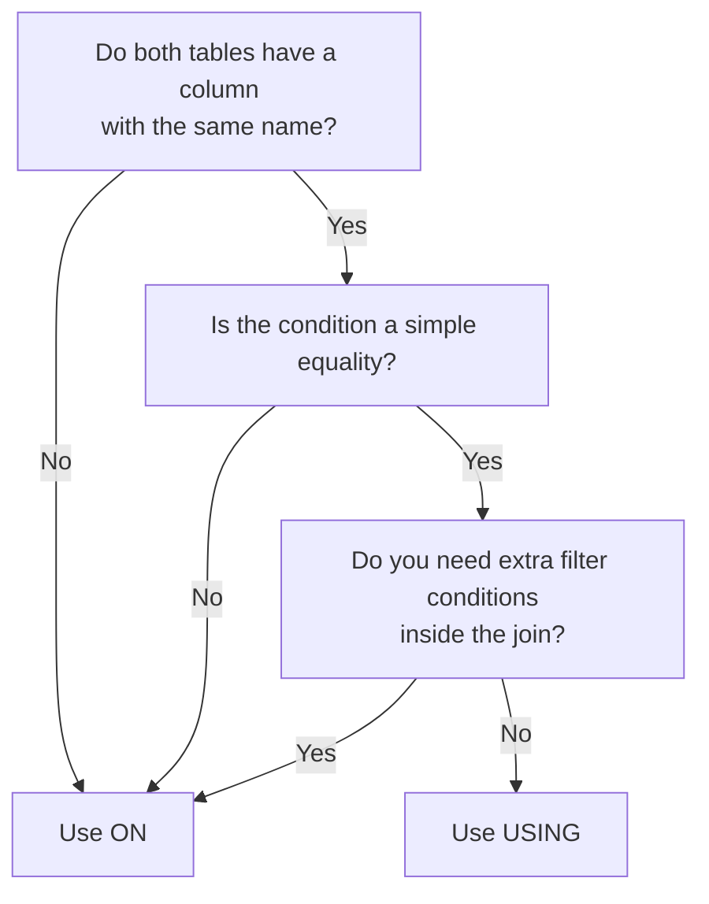

# How to Choose Between USING and ON in MySQL Joins

Author: [nawazdhandala](https://www.github.com/nawazdhandala)

Tags: MySQL, SQL, Join, Database, Query

Description: Understand the differences between USING and ON in MySQL joins, when each is appropriate, how they affect duplicate columns, and best practices for writing clear queries.

---

MySQL provides two ways to specify a join condition: `ON` and `USING`. Knowing which to use results in cleaner, less error-prone SQL.

## Quick comparison

| Feature | USING | ON |
|---|---|---|
| Column name requirement | Same name in both tables | Any names |
| Duplicate column in SELECT * | Eliminated (one copy) | Both copies kept |
| Expressions / inequalities | No | Yes |
| Self-join support | No | Yes |
| Readability (same-name cols) | More concise | More verbose |
| Standard SQL | Yes (SQL-92) | Yes |

## Syntax side by side

```sql
-- USING
SELECT e.name, d.name
FROM employees e
INNER JOIN departments d USING (department_id);

-- Equivalent ON
SELECT e.name, d.name
FROM employees e
INNER JOIN departments d ON e.department_id = d.department_id;
```

Both produce identical rows. The only visible difference in `SELECT *` is the column count.

## When to use USING

Use `USING` when:
- The join column has the same name in both tables.
- You want `SELECT *` to return one copy of the join column.
- The join is a simple equality check with no extra conditions.

```sql
-- Clean, readable with USING
SELECT order_id, c.name, o.order_date
FROM customers c
INNER JOIN orders o USING (customer_id)
INNER JOIN order_items oi USING (order_id);
```

## When to use ON

Use `ON` when:
- Column names differ between tables.
- The condition involves an inequality, range, or expression.
- You are writing a self-join.
- You need to add extra filter conditions within the join itself.

```sql
-- Column names differ
SELECT i.invoice_id, c.name
FROM invoices i
INNER JOIN clients c ON i.client_id = c.id;

-- Non-equi-join
SELECT e.name, sb.band_name
FROM employees e
INNER JOIN salary_bands sb
    ON e.salary BETWEEN sb.min_salary AND sb.max_salary;

-- Self-join
SELECT e.name AS employee, m.name AS manager
FROM employees e
LEFT JOIN employees m ON e.manager_id = m.employee_id;
```

## Duplicate column behaviour

```sql
CREATE TABLE a (id INT, val VARCHAR(10));
CREATE TABLE b (id INT, info VARCHAR(10));

INSERT INTO a VALUES (1, 'alpha'), (2, 'beta');
INSERT INTO b VALUES (1, 'x'),    (2, 'y');

-- ON: two id columns in result
SELECT * FROM a INNER JOIN b ON a.id = b.id;
-- id | val   | id | info

-- USING: one id column in result
SELECT * FROM a INNER JOIN b USING (id);
-- id | val | info
```

The single `id` column produced by `USING` is convenient but means you cannot qualify it with a table name in subsequent clauses.

## Referencing the join column after USING

```sql
-- Correct: unqualified reference
SELECT id, a.val, b.info
FROM a INNER JOIN b USING (id)
WHERE id > 1;

-- Risky: table qualifier on a USING column can cause errors in strict mode
SELECT a.id  -- avoid this pattern
FROM a INNER JOIN b USING (id);
```

## Performance

Both `USING` and `ON` produce the same execution plan when the underlying condition is identical. The optimizer rewrites them equivalently. Indexes on the join column benefit both.

```sql
EXPLAIN
SELECT c.name, o.order_date
FROM customers c
INNER JOIN orders o USING (customer_id);
```

## Combining with other conditions

Only `ON` allows extra predicates inside the join clause:

```sql
-- Extra condition in ON
SELECT e.name, d.name
FROM employees e
LEFT JOIN departments d
    ON e.department_id = d.department_id
    AND d.active = 1;

-- USING cannot carry extra conditions; move them to WHERE
SELECT e.name, d.name
FROM employees e
LEFT JOIN departments d USING (department_id)
WHERE d.active = 1;  -- this turns LEFT JOIN into INNER JOIN behaviour
```

## Decision guide



## Summary

`USING` is a convenience shorthand for equi-joins on identically named columns. It keeps queries shorter and eliminates duplicate columns from `SELECT *`. Use `ON` whenever column names differ, the condition involves an expression or range, you are writing a self-join, or you need additional predicates inside the join clause. When in doubt, `ON` is always safe; `USING` is a readability optimization.
