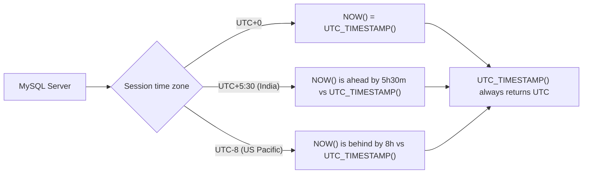

# How to Use UTC_DATE(), UTC_TIME(), UTC_TIMESTAMP() in MySQL

Author: [nawazdhandala](https://www.github.com/nawazdhandala)

Tags: MySQL, SQL, Date Function, UTC, Database

Description: Learn how to use MySQL UTC_DATE(), UTC_TIME(), and UTC_TIMESTAMP() to retrieve the current UTC date, time, and datetime independent of server time zone.

---

## Overview

MySQL provides three functions to retrieve the current Coordinated Universal Time (UTC) regardless of the server or session time zone:

- `UTC_DATE()` - returns the current UTC date.
- `UTC_TIME()` - returns the current UTC time.
- `UTC_TIMESTAMP()` - returns the current UTC datetime.

These functions are essential for applications serving global users, where consistent UTC-based timestamps avoid time zone ambiguity.

---

## UTC_DATE() Function

Returns the current UTC date as a `DATE` value.

**Syntax:**

```sql
UTC_DATE()
UTC_DATE  -- can also be used without parentheses
```

```sql
SELECT UTC_DATE();
-- Returns: '2026-03-31'  (always in UTC)

SELECT UTC_DATE() + 0;
-- Returns: 20260331  (numeric context)
```

---

## UTC_TIME() Function

Returns the current UTC time as a `TIME` value.

**Syntax:**

```sql
UTC_TIME()
UTC_TIME([fsp])  -- fsp = fractional seconds precision 0-6
```

```sql
SELECT UTC_TIME();
-- Returns: '14:30:45'  (current UTC time)

SELECT UTC_TIME(3);
-- Returns: '14:30:45.123'  (with millisecond precision)

SELECT UTC_TIME() + 0;
-- Returns: 143045  (numeric context)
```

---

## UTC_TIMESTAMP() Function

Returns the current UTC datetime as a `DATETIME` value.

**Syntax:**

```sql
UTC_TIMESTAMP()
UTC_TIMESTAMP([fsp])  -- fsp = fractional seconds precision 0-6
```

```sql
SELECT UTC_TIMESTAMP();
-- Returns: '2026-03-31 14:30:45'

SELECT UTC_TIMESTAMP(6);
-- Returns: '2026-03-31 14:30:45.123456'

SELECT UTC_TIMESTAMP() + 0;
-- Returns: 20260331143045  (numeric context)
```

---

## How UTC Functions Differ from Local Time Functions



---

## Comparing UTC Functions with Local Time Functions

```sql
-- Set session to a non-UTC timezone for demonstration
SET time_zone = 'America/New_York';

SELECT
    NOW()            AS local_datetime,
    UTC_TIMESTAMP()  AS utc_datetime,
    CURDATE()        AS local_date,
    UTC_DATE()       AS utc_date,
    CURTIME()        AS local_time,
    UTC_TIME()       AS utc_time;
```

When the session is `America/New_York` (UTC-5 during EST), `NOW()` will be 5 hours behind `UTC_TIMESTAMP()`.

---

## Storing Timestamps in UTC

Best practice is to store all timestamps in UTC and convert to local time only for display:

```sql
CREATE TABLE global_events (
    id INT AUTO_INCREMENT PRIMARY KEY,
    event_name VARCHAR(100),
    created_at DATETIME NOT NULL,
    scheduled_at DATETIME NOT NULL
);

-- Always insert UTC times
INSERT INTO global_events (event_name, created_at, scheduled_at)
VALUES ('Global Webinar', UTC_TIMESTAMP(), '2026-04-01 15:00:00');
-- The scheduled_at should also be in UTC
```

---

## Converting UTC to Local Time for Display

```sql
-- Display UTC stored time in different time zones
SELECT
    event_name,
    created_at AS utc_time,
    CONVERT_TZ(created_at, 'UTC', 'America/New_York') AS new_york_time,
    CONVERT_TZ(created_at, 'UTC', 'Asia/Tokyo')       AS tokyo_time,
    CONVERT_TZ(created_at, 'UTC', 'Europe/London')    AS london_time
FROM global_events;
```

---

## Filtering by UTC Date

```sql
-- Orders created today in UTC
SELECT * FROM orders
WHERE DATE(created_at) = UTC_DATE();

-- Events happening this UTC hour
SELECT * FROM global_events
WHERE DATE(scheduled_at) = UTC_DATE()
  AND HOUR(scheduled_at) = HOUR(UTC_TIMESTAMP());
```

---

## UTC_TIMESTAMP() vs NOW()

| Function          | Returns                                          |
|-------------------|--------------------------------------------------|
| `NOW()`           | Current datetime in the session time zone        |
| `UTC_TIMESTAMP()` | Current datetime always in UTC                   |
| `SYSDATE()`       | Real wall-clock time in session time zone        |

```sql
-- If server is UTC, these are identical
SELECT NOW() = UTC_TIMESTAMP();
-- Returns: 1  (if session timezone is UTC)
-- Returns: 0  (if session timezone is non-UTC)
```

---

## UTC_TIMESTAMP() with Fractional Seconds

```sql
SELECT UTC_TIMESTAMP(3);
-- Returns: '2026-03-31 14:30:45.123'

SELECT UTC_TIMESTAMP(6);
-- Returns: '2026-03-31 14:30:45.123456'
```

Useful for high-precision logging and event ordering:

```sql
CREATE TABLE api_requests (
    id BIGINT AUTO_INCREMENT PRIMARY KEY,
    endpoint VARCHAR(200),
    received_at DATETIME(6) DEFAULT (UTC_TIMESTAMP(6))
);
```

---

## Using UTC_DATE() for Day Boundaries

```sql
-- Rows created today UTC, regardless of server timezone
SELECT *
FROM user_activities
WHERE created_at >= UTC_DATE()
  AND created_at <  UTC_DATE() + INTERVAL 1 DAY;
```

---

## Summary

`UTC_DATE()`, `UTC_TIME()`, and `UTC_TIMESTAMP()` always return the current UTC date, time, and datetime regardless of the MySQL server or session time zone. Use these functions when building globally distributed applications to ensure consistent, unambiguous timestamps. Store all event times in UTC, use `UTC_TIMESTAMP()` for inserts, and use `CONVERT_TZ()` to present local times to end users. All three functions support fractional seconds precision with the optional `fsp` parameter.
