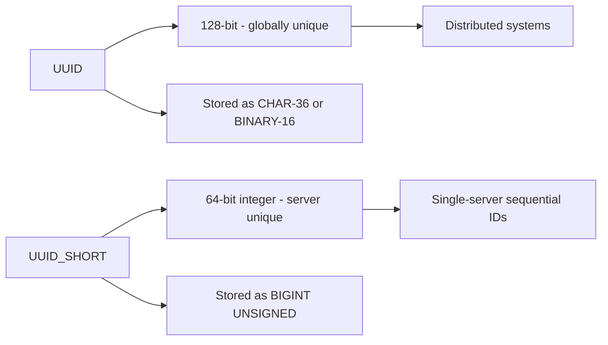

# How to Use MySQL UUID and UUID_SHORT Functions

Author: [nawazdhandala](https://www.github.com/nawazdhandala)

Tags: MySQL, SQL, UUID, Primary Key, Database

Description: Learn how to use MySQL UUID and UUID_SHORT functions to generate unique identifiers for primary keys and distributed system records.

---

## How UUID and UUID_SHORT Work

A UUID (Universally Unique Identifier) is a 128-bit value guaranteed to be unique across space and time without a central authority. `UUID()` generates a version 1 UUID based on the current timestamp and MAC address. `UUID_SHORT()` generates a 64-bit unsigned integer that is unique within a single server instance. MySQL 8.0 also added `UUID_TO_BIN` and `BIN_TO_UUID` for efficient binary storage.



## UUID Function

`UUID()` returns a string in standard 8-4-4-4-12 hexadecimal format.

```sql
SELECT UUID();
-- Result: '6ccd780c-baba-1026-9564-5b8c656024db'
```

**Example - use UUID as a primary key:**

```sql
CREATE TABLE sessions (
    id         CHAR(36)     NOT NULL DEFAULT (UUID()),
    user_id    INT          NOT NULL,
    created_at DATETIME     NOT NULL DEFAULT NOW(),
    data       JSON,
    PRIMARY KEY (id)
);

INSERT INTO sessions (user_id, data)
VALUES (42, '{"browser": "Chrome", "ip": "192.168.1.1"}');

SELECT id, user_id, created_at FROM sessions;
```

## Efficient Storage with BINARY(16)

Storing UUIDs as `CHAR(36)` wastes space and is slow to index. Storing as `BINARY(16)` halves the storage and improves index performance.

**Using UUID_TO_BIN and BIN_TO_UUID (MySQL 8.0+):**

```sql
CREATE TABLE events (
    id         BINARY(16)   NOT NULL DEFAULT (UUID_TO_BIN(UUID(), 1)),
    event_name VARCHAR(100),
    occurred   DATETIME     NOT NULL DEFAULT NOW(),
    PRIMARY KEY (id)
);
```

The second argument `1` to `UUID_TO_BIN` rearranges bytes so the time component is first. This makes UUID v1 values monotonically increasing, which is much better for InnoDB clustered indexes.

**Insert and retrieve:**

```sql
INSERT INTO events (event_name) VALUES ('user_signup'), ('page_view'), ('purchase');

SELECT
    BIN_TO_UUID(id, 1) AS uuid_str,
    event_name,
    occurred
FROM events;
```

**Look up by UUID string:**

```sql
SELECT event_name
FROM events
WHERE id = UUID_TO_BIN('6ccd780c-baba-1026-9564-5b8c656024db', 1);
```

## UUID_SHORT Function

`UUID_SHORT()` returns a 64-bit unsigned integer that is unique within a MySQL server. It is computed from the server's startup time, server ID, and a sequence counter - making it compact and sortable.

```sql
SELECT UUID_SHORT();
-- Result: 92395783831158784
```

**Example - use UUID_SHORT as a primary key:**

```sql
CREATE TABLE log_entries (
    id         BIGINT UNSIGNED NOT NULL DEFAULT (UUID_SHORT()),
    level      VARCHAR(10),
    message    TEXT,
    logged_at  DATETIME NOT NULL DEFAULT NOW(),
    PRIMARY KEY (id)
);

INSERT INTO log_entries (level, message) VALUES
('INFO',  'Application started'),
('WARN',  'High memory usage detected'),
('ERROR', 'Failed to connect to cache');

SELECT id, level, message FROM log_entries ORDER BY id;
```

## Comparing UUID vs. UUID_SHORT vs. AUTO_INCREMENT

```text
Type             Storage     Globally Unique  Sortable  Use Case
-----------      ---------   ---------------  --------  -------------------
AUTO_INCREMENT   4 bytes     No               Yes       Single-server tables
UUID_SHORT       8 bytes     No (server only) Yes       Low-collision single server
UUID CHAR(36)    36 bytes    Yes              No        Distributed systems
UUID BINARY(16)  16 bytes    Yes              Partial   Distributed (efficient)
```

## Generating UUIDs in Application Code vs. MySQL

For distributed systems where the application generates IDs before INSERT, store them as `BINARY(16)`:

```sql
-- Application generates UUID string, MySQL stores as binary:
INSERT INTO events (id, event_name)
VALUES (UUID_TO_BIN('550e8400-e29b-41d4-a716-446655440000', 1), 'checkout');
```

## Best Practices

- Never use `CHAR(36)` UUIDs as a clustered primary key on high-write InnoDB tables - random UUIDs cause severe page fragmentation. Use `UUID_TO_BIN(UUID(), 1)` with BINARY(16) and the swap flag.
- Use `UUID_SHORT()` for internal identifiers on single-server setups where you need sequential-ish IDs without the overhead of full UUID strings.
- Expose UUID strings to external consumers (APIs) while storing `BINARY(16)` internally.
- In MySQL 8.0+ you can use expressions in `DEFAULT` clauses: `DEFAULT (UUID_TO_BIN(UUID(), 1))`.
- Consider UUIDv7 (time-ordered) if you are generating UUIDs outside MySQL - it combines global uniqueness with sequential ordering.

## Summary

MySQL provides `UUID()` for generating globally unique 128-bit identifiers and `UUID_SHORT()` for compact 64-bit server-unique integers. For production use, store UUIDs as `BINARY(16)` using `UUID_TO_BIN(UUID(), 1)` to reduce storage by more than half and keep the time-ordered byte layout that InnoDB clustered indexes benefit from. Use `BIN_TO_UUID` to convert back to string form for display. `UUID_SHORT` is a lightweight alternative for single-server systems that need non-sequential integer IDs.
