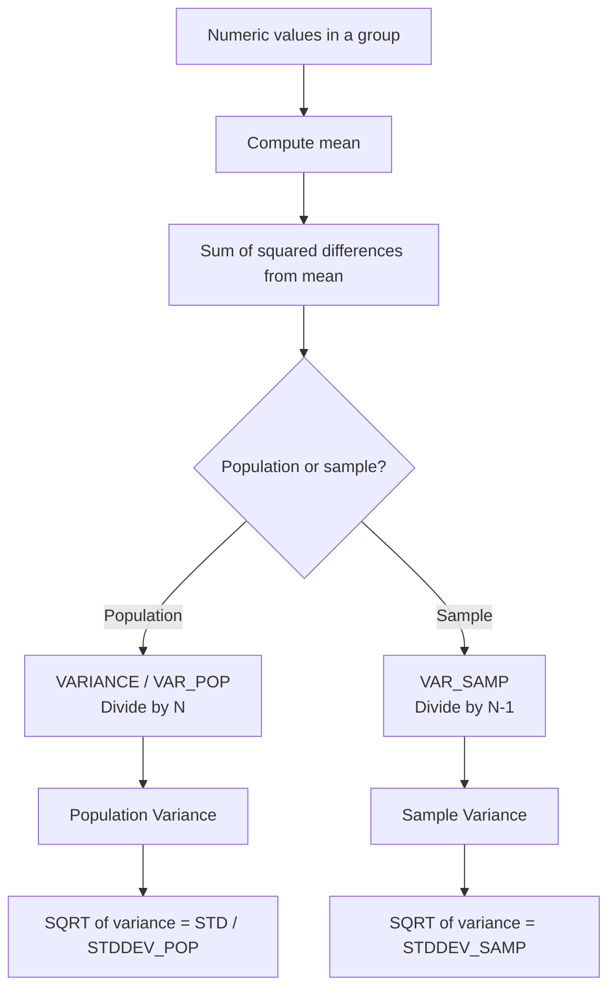

# How to Use VARIANCE() Function in MySQL

Author: [nawazdhandala](https://www.github.com/nawazdhandala)

Tags: MySQL, SQL, Aggregate Function, Statistical Function, Database

Description: Learn how to use MySQL VARIANCE(), VAR_POP(), and VAR_SAMP() to measure data dispersion and variability in numeric columns across groups.

---

## What VARIANCE() Does

`VARIANCE()` returns the population variance of a set of values. Variance measures how far values are spread from their mean. It is the square of the standard deviation. MySQL provides three related functions:

- `VARIANCE(expr)` - population variance (alias for VAR_POP)
- `VAR_POP(expr)` - population variance (divides by N)
- `VAR_SAMP(expr)` - sample variance (divides by N-1, Bessel's correction)



## Syntax

```sql
VARIANCE(expression)
VAR_POP(expression)
VAR_SAMP(expression)
```

All three are aggregate functions that ignore `NULL` values. `VAR_SAMP()` returns `NULL` when there is only one row in the group (division by zero is avoided). If all rows are `NULL`, all return `NULL`.

## Setup: Sample Table

```sql
CREATE TABLE test_scores (
    id         INT AUTO_INCREMENT PRIMARY KEY,
    student    VARCHAR(50),
    subject    VARCHAR(50),
    score      DECIMAL(5, 2),
    test_date  DATE
);

INSERT INTO test_scores (student, subject, score, test_date) VALUES
('Alice', 'Math',    88.0, '2026-01-10'),
('Alice', 'Math',    92.0, '2026-02-10'),
('Alice', 'Math',    85.0, '2026-03-10'),
('Alice', 'Science', 70.0, '2026-01-15'),
('Alice', 'Science', 95.0, '2026-02-15'),
('Alice', 'Science', 60.0, '2026-03-15'),
('Bob',   'Math',    75.0, '2026-01-10'),
('Bob',   'Math',    76.0, '2026-02-10'),
('Bob',   'Math',    74.0, '2026-03-10'),
('Bob',   'Science', 80.0, '2026-01-15'),
('Bob',   'Science', 82.0, '2026-02-15'),
('Bob',   'Science', 78.0, '2026-03-15');
```

## Basic Usage

```sql
SELECT
    student,
    subject,
    COUNT(*)                        AS tests,
    ROUND(AVG(score), 2)            AS avg_score,
    ROUND(VARIANCE(score), 2)       AS variance_pop,
    ROUND(VAR_SAMP(score), 2)       AS variance_samp,
    ROUND(STD(score), 2)            AS std_dev
FROM test_scores
GROUP BY student, subject
ORDER BY student, subject;
```

```text
+---------+---------+-------+-----------+--------------+---------------+---------+
| student | subject | tests | avg_score | variance_pop | variance_samp | std_dev |
+---------+---------+-------+-----------+--------------+---------------+---------+
| Alice   | Math    |     3 |     88.33 |         8.22 |         12.33 |    2.87 |
| Alice   | Science |     3 |     75.00 |        191.67|        287.50 |   13.84 |
| Bob     | Math    |     3 |     75.00 |          0.67|          1.00 |    0.82 |
| Bob     | Science |     3 |     80.00 |          2.67|          4.00 |    1.63 |
+---------+---------+-------+-----------+--------------+---------------+---------+
```

Alice's Science scores have very high variance (191.67) compared to Bob's consistently narrow scores.

## VARIANCE() vs STDDEV(): The Relationship

Variance is the square of the standard deviation:

```sql
SELECT
    student,
    subject,
    ROUND(VARIANCE(score), 4)      AS variance,
    ROUND(STD(score), 4)           AS std_dev,
    ROUND(STD(score) * STD(score), 4) AS std_dev_squared
FROM test_scores
GROUP BY student, subject;
```

`VARIANCE(score)` equals `STD(score)^2`. Use standard deviation when you want units comparable to the original data; use variance when doing further statistical calculations.

## Comparing Variance Across Subjects

```sql
SELECT
    subject,
    COUNT(*)                       AS total_scores,
    ROUND(AVG(score), 2)           AS mean,
    ROUND(VAR_POP(score), 2)       AS variance,
    CASE
        WHEN VAR_POP(score) < 10   THEN 'Low'
        WHEN VAR_POP(score) < 100  THEN 'Medium'
        ELSE 'High'
    END AS spread_level
FROM test_scores
GROUP BY subject
ORDER BY variance DESC;
```

## Finding Consistent Performers (Low Variance)

```sql
SELECT
    student,
    ROUND(AVG(score), 2)      AS avg_score,
    ROUND(VARIANCE(score), 2) AS variance
FROM test_scores
GROUP BY student
HAVING variance < 20
ORDER BY avg_score DESC;
```

## VAR_SAMP() for Statistical Inference

Use `VAR_SAMP()` when your rows represent a sample drawn from a larger population:

```sql
SELECT
    subject,
    COUNT(*)                      AS sample_size,
    ROUND(AVG(score), 2)          AS sample_mean,
    ROUND(VAR_SAMP(score), 4)     AS sample_variance,
    -- 95% confidence interval margin (approximate, large sample)
    ROUND(1.96 * SQRT(VAR_SAMP(score) / COUNT(*)), 2) AS margin_of_error
FROM test_scores
GROUP BY subject;
```

## NULL Handling

`VARIANCE()` and related functions ignore `NULL`:

```sql
SELECT
    VARIANCE(val),
    VAR_SAMP(val)
FROM (
    SELECT 10 AS val UNION ALL
    SELECT NULL       UNION ALL
    SELECT 20         UNION ALL
    SELECT 30
) t;
-- Computes variance of 10, 20, 30 only
```

## VARIANCE() with Window Functions

From MySQL 8.0, you can use `VAR_SAMP` and `VARIANCE` as window functions:

```sql
SELECT
    student,
    test_date,
    score,
    ROUND(
        VAR_SAMP(score) OVER (
            PARTITION BY student
            ORDER BY test_date
            ROWS BETWEEN UNBOUNDED PRECEDING AND CURRENT ROW
        ), 2
    ) AS running_variance
FROM test_scores
ORDER BY student, test_date;
```

## Summary

`VARIANCE()` and `VAR_POP()` compute population variance by dividing the sum of squared deviations by N. `VAR_SAMP()` applies Bessel's correction (divides by N-1) and should be used when analyzing a sample from a larger population. Variance equals the square of the standard deviation. High variance indicates widely spread values; low variance indicates consistency. Both `VARIANCE()` and `VAR_SAMP()` are available as window functions in MySQL 8.0 for running calculations across ordered rows.
