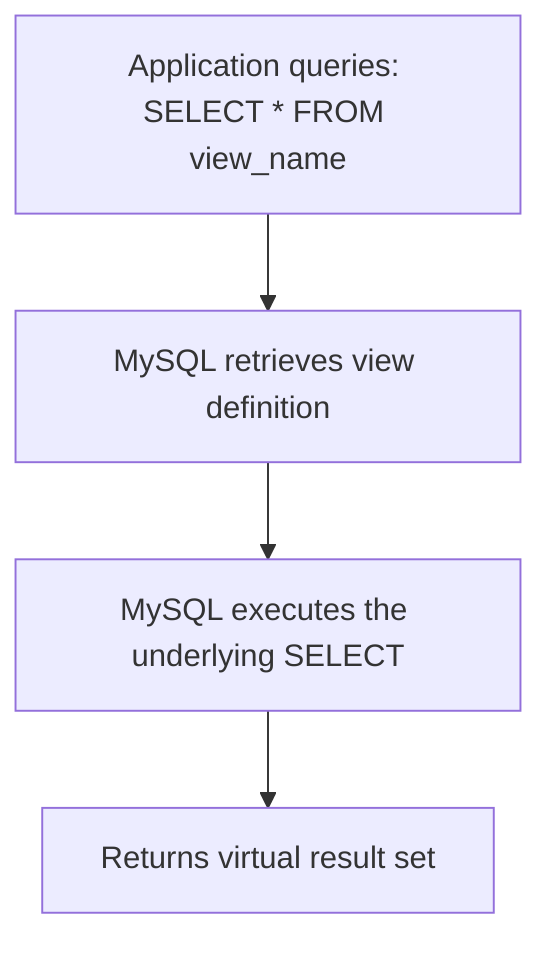

# How to Use MySQL Views

Author: [nawazdhandala](https://www.github.com/nawazdhandala)

Tags: MySQL, SQL, View, Database, Query

Description: Learn how to create and use MySQL views to encapsulate complex queries as reusable virtual tables that simplify application queries and enforce security.

---

## How Views Work

A view is a named SELECT query stored in the database. When you query a view, MySQL executes the underlying SELECT statement and returns the result as if it were a regular table. Views do not store data themselves (unless materialized, which MySQL does not natively support); they are virtual tables.



Views are useful for:
- Simplifying complex queries by giving them a reusable name.
- Restricting column/row access for security (expose only certain columns to a user).
- Providing a stable interface while hiding underlying table structure changes.

## Syntax

```sql
-- Create a view
CREATE VIEW view_name AS
SELECT columns FROM tables WHERE condition;

-- Replace an existing view
CREATE OR REPLACE VIEW view_name AS
SELECT columns FROM tables WHERE condition;

-- Query a view
SELECT * FROM view_name;

-- Drop a view
DROP VIEW IF EXISTS view_name;
```

## Examples

### Setup: Create Sample Tables

```sql
CREATE TABLE employees (
    id INT PRIMARY KEY AUTO_INCREMENT,
    name VARCHAR(100) NOT NULL,
    email VARCHAR(150),
    department_id INT,
    salary DECIMAL(10, 2),
    hire_date DATE,
    is_active TINYINT(1) DEFAULT 1
);

CREATE TABLE departments (
    id INT PRIMARY KEY AUTO_INCREMENT,
    name VARCHAR(100) NOT NULL,
    manager_id INT,
    budget DECIMAL(12, 2)
);

INSERT INTO departments (name, manager_id, budget) VALUES
    ('Engineering', 1, 500000.00),
    ('Marketing',   3, 200000.00),
    ('Finance',     4, 150000.00);

INSERT INTO employees (name, email, department_id, salary, hire_date, is_active) VALUES
    ('Alice',  'alice@co.com',  1, 105000.00, '2020-03-15', 1),
    ('Bob',    'bob@co.com',    2,  72000.00, '2021-06-01', 1),
    ('Carol',  'carol@co.com',  2,  80000.00, '2020-09-05', 1),
    ('Dave',   'dave@co.com',   3,  88000.00, '2022-01-10', 1),
    ('Eve',    'eve@co.com',    1,  98000.00, '2023-02-28', 1),
    ('Frank',  'frank@co.com',  1,  90000.00, '2019-07-20', 0);
```

### Basic View

Create a view that joins employees with their departments, showing only active employees.

```sql
CREATE VIEW active_employee_details AS
SELECT
    e.id,
    e.name,
    e.email,
    d.name AS department,
    e.salary,
    e.hire_date
FROM employees e
INNER JOIN departments d ON e.department_id = d.id
WHERE e.is_active = 1;

-- Query the view like a table
SELECT * FROM active_employee_details ORDER BY department, name;
```

```text
+----+-------+---------------+-------------+-----------+------------+
| id | name  | email         | department  | salary    | hire_date  |
+----+-------+---------------+-------------+-----------+------------+
| 1  | Alice | alice@co.com  | Engineering | 105000.00 | 2020-03-15 |
| 5  | Eve   | eve@co.com    | Engineering |  98000.00 | 2023-02-28 |
| 3  | Carol | carol@co.com  | Marketing   |  80000.00 | 2020-09-05 |
| 2  | Bob   | bob@co.com    | Marketing   |  72000.00 | 2021-06-01 |
| 4  | Dave  | dave@co.com   | Finance     |  88000.00 | 2022-01-10 |
+----+-------+---------------+-------------+-----------+------------+
```

Frank (inactive) is excluded by the view's WHERE clause.

### Security View: Hide Sensitive Columns

Create a view that exposes employee data without salary for HR reporting roles.

```sql
CREATE VIEW employee_public_info AS
SELECT id, name, email, hire_date
FROM employees
WHERE is_active = 1;

-- Grant access only to the view, not the base table
GRANT SELECT ON your_db.employee_public_info TO 'hr_reader'@'%';
-- REVOKE SELECT ON your_db.employees FROM 'hr_reader'@'%';
```

### Aggregation View

Create a view for department-level summary statistics.

```sql
CREATE VIEW department_summary AS
SELECT
    d.name AS department,
    COUNT(e.id) AS headcount,
    ROUND(AVG(e.salary), 2) AS avg_salary,
    MIN(e.salary) AS min_salary,
    MAX(e.salary) AS max_salary,
    SUM(e.salary) AS total_payroll
FROM departments d
LEFT JOIN employees e ON e.department_id = d.id AND e.is_active = 1
GROUP BY d.id, d.name;

SELECT * FROM department_summary ORDER BY total_payroll DESC;
```

```text
+-------------+-----------+------------+------------+------------+---------------+
| department  | headcount | avg_salary | min_salary | max_salary | total_payroll |
+-------------+-----------+------------+------------+------------+---------------+
| Engineering | 2         | 101500.00  | 98000.00   | 105000.00  | 203000.00     |
| Marketing   | 2         | 76000.00   | 72000.00   | 80000.00   | 152000.00     |
| Finance     | 1         | 88000.00   | 88000.00   | 88000.00   |  88000.00     |
+-------------+-----------+------------+------------+------------+---------------+
```

### Updating Through a View

Simple views (single table, no aggregation, no DISTINCT) are updatable.

```sql
CREATE VIEW active_employees AS
SELECT id, name, email, salary, is_active
FROM employees
WHERE is_active = 1;

-- Update through the view
UPDATE active_employees SET salary = 110000.00 WHERE id = 1;

-- Verify
SELECT id, name, salary FROM employees WHERE id = 1;
```

Add `WITH CHECK OPTION` to prevent updates that would make the row invisible through the view:

```sql
CREATE OR REPLACE VIEW active_employees AS
SELECT id, name, email, salary, is_active
FROM employees
WHERE is_active = 1
WITH CHECK OPTION;

-- This will fail because is_active = 0 would hide the row from the view
UPDATE active_employees SET is_active = 0 WHERE id = 1;
-- ERROR: CHECK OPTION failed
```

### Managing Views

```sql
-- List all views in the database
SHOW FULL TABLES WHERE Table_type = 'VIEW';

-- View the definition
SHOW CREATE VIEW active_employee_details;

-- Get view info from information_schema
SELECT table_name, view_definition
FROM information_schema.VIEWS
WHERE table_schema = DATABASE();
```

## Best Practices

- Use views to simplify complex multi-table queries that are run frequently by application code.
- Use `WITH CHECK OPTION` on updatable views to prevent data from being modified in a way that removes it from the view's scope.
- Do not use views as a substitute for indexes - views that wrap complex queries do not cache results and will re-run the full query each time.
- Avoid nesting views inside other views deeply - this can make query optimization difficult.
- Grant SELECT on views instead of base tables to enforce column-level security.
- Update views with `CREATE OR REPLACE VIEW` to avoid dropping and recreating them (preserves dependent privileges).

## Summary

MySQL views are named SELECT queries that act as virtual tables. They simplify complex queries, enable column-level security by hiding sensitive data, and provide a stable interface for applications even when underlying table structures change. Simple single-table views are updatable; complex views with GROUP BY, DISTINCT, or multiple tables are read-only. Use `WITH CHECK OPTION` on updatable views to enforce consistency between the view's WHERE filter and incoming modifications.
