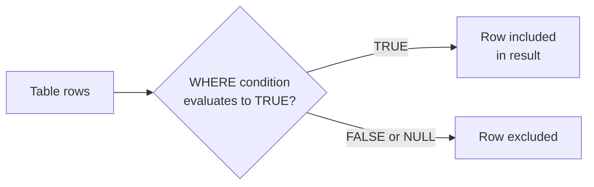

# How to Use WHERE Clause in MySQL Queries

Author: [nawazdhandala](https://www.github.com/nawazdhandala)

Tags: MySQL, SQL, DML, WHERE, Query, Filter

Description: Filter MySQL query results with the WHERE clause using comparison operators, logical operators, BETWEEN, IN, LIKE, IS NULL, and compound conditions.

---

## How It Works

The `WHERE` clause filters rows returned by a `SELECT`, `UPDATE`, or `DELETE` statement. MySQL evaluates the condition for every row and includes only rows where the expression evaluates to TRUE. Rows where the condition is FALSE or NULL are excluded.



## Sample Data

```sql
CREATE TABLE products (
    id          INT UNSIGNED AUTO_INCREMENT PRIMARY KEY,
    name        VARCHAR(255)   NOT NULL,
    category    VARCHAR(50)    NOT NULL,
    price       DECIMAL(10, 2) NOT NULL,
    stock       INT UNSIGNED   NOT NULL DEFAULT 0,
    is_active   BOOLEAN        NOT NULL DEFAULT TRUE,
    created_at  DATETIME       NOT NULL DEFAULT CURRENT_TIMESTAMP
);

INSERT INTO products (name, category, price, stock, is_active) VALUES
    ('Widget',          'Hardware',  9.99,  100, TRUE),
    ('Gadget',          'Hardware', 29.99,   50, TRUE),
    ('Doohickey',       'Hardware',  4.99,    0, FALSE),
    ('SQL Handbook',    'Books',    39.99,   20, TRUE),
    ('MySQL Cookbook',  'Books',    49.99,   15, TRUE),
    ('Notepad',         'Office',    2.99,  200, TRUE),
    ('USB Hub',         'Hardware', 19.99,   75, TRUE),
    ('Pen Set',         'Office',    5.99,   80, TRUE);
```

## Comparison Operators

```sql
-- Equal
SELECT name, price FROM products WHERE category = 'Books';

-- Not equal
SELECT name FROM products WHERE category != 'Hardware';
-- or <>
SELECT name FROM products WHERE category <> 'Hardware';

-- Greater than / less than
SELECT name, price FROM products WHERE price > 20;
SELECT name, price FROM products WHERE price <= 10;

-- Greater than or equal / less than or equal
SELECT name, price FROM products WHERE price >= 30;
```

```text
-- price > 20 result:
+----------------+-------+
| name           | price |
+----------------+-------+
| Gadget         | 29.99 |
| SQL Handbook   | 39.99 |
| MySQL Cookbook | 49.99 |
+----------------+-------+
```

## Logical Operators - AND, OR, NOT

```sql
-- AND: both conditions must be true
SELECT name, price, stock
FROM products
WHERE category = 'Hardware' AND price < 20;
```

```text
+------------+-------+-------+
| name       | price | stock |
+------------+-------+-------+
| Widget     |  9.99 |   100 |
| Doohickey  |  4.99 |     0 |
| USB Hub    | 19.99 |    75 |
+------------+-------+-------+
```

```sql
-- OR: at least one condition must be true
SELECT name, category FROM products
WHERE category = 'Books' OR category = 'Office';

-- NOT: negate a condition
SELECT name FROM products WHERE NOT is_active;
```

## Operator Precedence

`AND` has higher precedence than `OR`. Use parentheses to make intent explicit.

```sql
-- WITHOUT parentheses (AND evaluated first):
-- WHERE (category = 'Hardware' AND price < 10) OR category = 'Books'
SELECT name FROM products
WHERE category = 'Hardware' AND price < 10
   OR category = 'Books';

-- WITH parentheses (clearer intent):
SELECT name FROM products
WHERE (category = 'Hardware' OR category = 'Books')
  AND price < 40;
```

## BETWEEN

`BETWEEN low AND high` is inclusive on both ends.

```sql
SELECT name, price FROM products
WHERE price BETWEEN 5.00 AND 30.00
ORDER BY price;
```

```text
+----------+-------+
| name     | price |
+----------+-------+
| Pen Set  |  5.99 |
| Widget   |  9.99 |
| USB Hub  | 19.99 |
| Gadget   | 29.99 |
+----------+-------+
```

Date ranges also work with BETWEEN.

```sql
SELECT * FROM products
WHERE created_at BETWEEN '2024-01-01' AND '2024-12-31 23:59:59';
```

## IN - Match a List of Values

```sql
SELECT name, category FROM products
WHERE category IN ('Books', 'Office')
ORDER BY category, name;
```

```text
+----------------+----------+
| name           | category |
+----------------+----------+
| SQL Handbook   | Books    |
| MySQL Cookbook | Books    |
| Notepad        | Office   |
| Pen Set        | Office   |
+----------------+----------+
```

Use `NOT IN` to exclude values.

```sql
SELECT name FROM products
WHERE category NOT IN ('Books');
```

## LIKE - Pattern Matching

`%` matches any sequence of characters; `_` matches exactly one character.

```sql
-- Names starting with 'G'
SELECT name FROM products WHERE name LIKE 'G%';

-- Names containing 'book' (case-insensitive by default)
SELECT name FROM products WHERE name LIKE '%book%';

-- Names with exactly 6 characters
SELECT name FROM products WHERE name LIKE '______';

-- NOT LIKE
SELECT name FROM products WHERE name NOT LIKE '%SQL%';
```

```text
-- name LIKE '%book%'
+----------------+
| name           |
+----------------+
| SQL Handbook   |
| MySQL Cookbook |
+----------------+
```

## IS NULL / IS NOT NULL

```sql
-- Add a nullable column
ALTER TABLE products ADD COLUMN description TEXT;

UPDATE products SET description = 'A small hardware widget' WHERE id = 1;

-- Find rows with no description
SELECT name FROM products WHERE description IS NULL;

-- Find rows that have a description
SELECT name, description FROM products WHERE description IS NOT NULL;
```

## EXISTS - Subquery Check

```sql
-- Products that appear in at least one order
SELECT name FROM products p
WHERE EXISTS (
    SELECT 1 FROM order_items oi
    WHERE oi.product_id = p.id
);
```

## REGEXP - Regular Expression Matching

```sql
-- Names starting with a vowel
SELECT name FROM products WHERE name REGEXP '^[AEIOUaeiou]';

-- Names containing digits
SELECT name FROM products WHERE name REGEXP '[0-9]';
```

## Filtering on Calculated Expressions

```sql
-- Products where value of stock > 1000 (price * stock)
SELECT name, price, stock, ROUND(price * stock, 2) AS inventory_value
FROM products
WHERE price * stock > 1000
ORDER BY inventory_value DESC;
```

```text
+----------+-------+-------+-----------------+
| name     | price | stock | inventory_value |
+----------+-------+-------+-----------------+
| Notepad  |  2.99 |   200 |          598.00 |
| Gadget   | 29.99 |    50 |         1499.50 |
| Widget   |  9.99 |   100 |          999.00 |
+----------+-------+-------+-----------------+
```

## Best Practices

- Use index-friendly conditions: compare an indexed column to a literal value rather than applying a function to the column.
- Avoid `WHERE YEAR(created_at) = 2024`; instead use `WHERE created_at BETWEEN '2024-01-01' AND '2024-12-31 23:59:59'`.
- Prefer `IN (...)` over multiple `OR` conditions for readability and potential performance gains.
- Use `EXISTS` instead of `IN` with subqueries that return many rows.
- Always use `IS NULL` / `IS NOT NULL` to test for NULL; `= NULL` never evaluates to TRUE.

## Summary

The `WHERE` clause is the primary filtering mechanism in MySQL. It supports comparison operators (`=`, `!=`, `<`, `>`), logical operators (`AND`, `OR`, `NOT`), range tests (`BETWEEN`), membership tests (`IN`), pattern matching (`LIKE`, `REGEXP`), and NULL checks (`IS NULL`). Write index-friendly conditions - compare indexed columns to literals rather than wrapping them in functions - to ensure MySQL can use indexes effectively.
