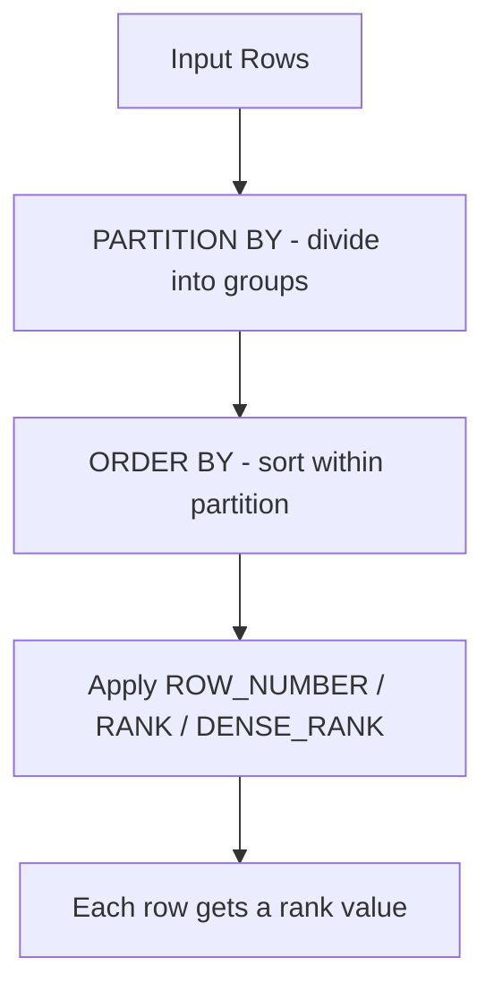

# How to Use Window Functions in MySQL 8.0 (ROW_NUMBER, RANK, DENSE_RANK)

Author: [nawazdhandala](https://www.github.com/nawazdhandala)

Tags: MySQL, SQL, Window Function, ROW_NUMBER, RANK, DENSE_RANK, MySQL 8.0, Database

Description: Learn how to use ROW_NUMBER, RANK, and DENSE_RANK window functions in MySQL 8.0 to assign row numbers and rankings within result partitions.

---

## How Window Functions Work

Window functions perform calculations across a set of rows related to the current row - a "window" - without collapsing the rows into a single output like GROUP BY does. They are computed after WHERE, GROUP BY, and HAVING but before ORDER BY.

The three ranking functions are:
- `ROW_NUMBER()` - assigns a unique sequential integer to each row within a partition, with no ties.
- `RANK()` - assigns ranks where tied rows get the same rank. The next rank after a tie skips numbers (1, 2, 2, 4).
- `DENSE_RANK()` - assigns ranks where tied rows get the same rank, but the next rank does not skip (1, 2, 2, 3).



## Syntax

```sql
ROW_NUMBER() OVER ([PARTITION BY column] ORDER BY column)
RANK()       OVER ([PARTITION BY column] ORDER BY column)
DENSE_RANK() OVER ([PARTITION BY column] ORDER BY column)
```

## Examples

### Setup: Create Sample Tables

```sql
CREATE TABLE sales (
    id INT PRIMARY KEY AUTO_INCREMENT,
    salesperson VARCHAR(100) NOT NULL,
    region VARCHAR(50),
    amount DECIMAL(10, 2),
    sale_date DATE
);

INSERT INTO sales (salesperson, region, amount, sale_date) VALUES
    ('Alice', 'North', 5200.00, '2026-01-10'),
    ('Bob',   'North', 4800.00, '2026-01-15'),
    ('Carol', 'North', 5200.00, '2026-01-18'),
    ('Dave',  'South', 6100.00, '2026-01-05'),
    ('Eve',   'South', 5800.00, '2026-01-12'),
    ('Frank', 'South', 5800.00, '2026-01-20'),
    ('Grace', 'East',  7000.00, '2026-01-08'),
    ('Hank',  'East',  6500.00, '2026-01-22');
```

### Comparing ROW_NUMBER, RANK, and DENSE_RANK

Run all three functions together to see the differences.

```sql
SELECT
    salesperson,
    region,
    amount,
    ROW_NUMBER() OVER (ORDER BY amount DESC) AS row_num,
    RANK()       OVER (ORDER BY amount DESC) AS rnk,
    DENSE_RANK() OVER (ORDER BY amount DESC) AS dense_rnk
FROM sales
ORDER BY amount DESC;
```

```text
+-------------+--------+--------+---------+-----+-----------+
| salesperson | region | amount | row_num | rnk | dense_rnk |
+-------------+--------+--------+---------+-----+-----------+
| Grace       | East   | 7000   | 1       | 1   | 1         |
| Hank        | East   | 6500   | 2       | 2   | 2         |
| Dave        | South  | 6100   | 3       | 3   | 3         |
| Eve         | South  | 5800   | 4       | 4   | 4         |
| Frank       | South  | 5800   | 5       | 4   | 4         |
| Alice       | North  | 5200   | 6       | 6   | 5         |
| Carol       | North  | 5200   | 7       | 6   | 5         |
| Bob         | North  | 4800   | 8       | 8   | 6         |
+-------------+--------+--------+---------+-----+-----------+
```

Notice that Eve and Frank are tied at 5800. RANK skips rank 5 (goes 4, 4, 6), while DENSE_RANK does not skip (goes 4, 4, 5).

### PARTITION BY: Rank Within Each Region

Add PARTITION BY to compute rankings separately for each region.

```sql
SELECT
    salesperson,
    region,
    amount,
    ROW_NUMBER() OVER (PARTITION BY region ORDER BY amount DESC) AS region_row,
    RANK()       OVER (PARTITION BY region ORDER BY amount DESC) AS region_rank,
    DENSE_RANK() OVER (PARTITION BY region ORDER BY amount DESC) AS region_dense_rank
FROM sales
ORDER BY region, amount DESC;
```

```text
+-------------+--------+--------+------------+-------------+-------------------+
| salesperson | region | amount | region_row | region_rank | region_dense_rank |
+-------------+--------+--------+------------+-------------+-------------------+
| Grace       | East   | 7000   | 1          | 1           | 1                 |
| Hank        | East   | 6500   | 2          | 2           | 2                 |
| Alice       | North  | 5200   | 1          | 1           | 1                 |
| Carol       | North  | 5200   | 2          | 1           | 1                 |
| Bob         | North  | 4800   | 3          | 3           | 2                 |
| Dave        | South  | 6100   | 1          | 1           | 1                 |
| Eve         | South  | 5800   | 2          | 2           | 2                 |
| Frank       | South  | 5800   | 3          | 2           | 2                 |
+-------------+--------+--------+------------+-------------+-------------------+
```

Each region's rankings reset independently.

### Top-N Per Group Using ROW_NUMBER

Use ROW_NUMBER with a CTE or subquery to get the top 2 salespeople per region.

```sql
WITH ranked_sales AS (
    SELECT salesperson, region, amount,
           ROW_NUMBER() OVER (PARTITION BY region ORDER BY amount DESC) AS rn
    FROM sales
)
SELECT salesperson, region, amount
FROM ranked_sales
WHERE rn <= 2
ORDER BY region, amount DESC;
```

```text
+-------------+--------+--------+
| salesperson | region | amount |
+-------------+--------+--------+
| Grace       | East   | 7000   |
| Hank        | East   | 6500   |
| Alice       | North  | 5200   |
| Carol       | North  | 5200   |
| Dave        | South  | 6100   |
| Eve         | South  | 5800   |
+-------------+--------+--------+
```

ROW_NUMBER ensures exactly 2 rows per region even when scores are tied. Use RANK if you want all tied rows to qualify.

### Remove Duplicate Rows with ROW_NUMBER

ROW_NUMBER is useful for deduplication: keep only the first occurrence of each duplicate group.

```sql
CREATE TABLE log_events (
    id INT PRIMARY KEY AUTO_INCREMENT,
    event_type VARCHAR(50),
    recorded_at DATETIME
);

INSERT INTO log_events (event_type, recorded_at) VALUES
    ('login', '2026-03-01 08:00:00'),
    ('login', '2026-03-01 08:00:05'),
    ('logout', '2026-03-01 09:30:00'),
    ('login', '2026-03-01 10:00:00');

WITH deduped AS (
    SELECT id, event_type, recorded_at,
           ROW_NUMBER() OVER (PARTITION BY event_type ORDER BY recorded_at) AS rn
    FROM log_events
)
SELECT id, event_type, recorded_at
FROM deduped
WHERE rn = 1;
```

## Best Practices

- Use ROW_NUMBER for pagination or deduplication where unique sequential numbers are needed.
- Use RANK when ties should share the same rank and you want gaps in the sequence to reflect the tied count.
- Use DENSE_RANK when ties should share the same rank and the next rank should not have gaps.
- Always specify PARTITION BY to compute rankings within groups rather than globally.
- Window functions cannot be used directly in WHERE clauses - wrap them in a CTE or subquery first.

## Summary

ROW_NUMBER, RANK, and DENSE_RANK are ranking window functions in MySQL 8.0 that assign sequential integers to rows within a window. They differ in how they handle ties: ROW_NUMBER always assigns unique numbers, RANK leaves gaps after ties, and DENSE_RANK never leaves gaps. Combined with PARTITION BY, they enable per-group rankings without self-joins or complex subqueries. A common use case is the top-N per group pattern using ROW_NUMBER wrapped in a CTE.
