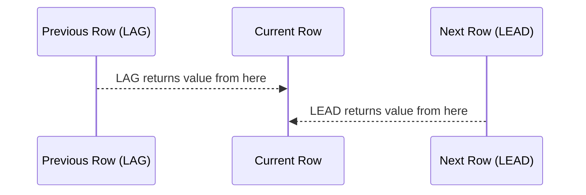

# How to Use LEAD and LAG in MySQL Window Functions

Author: [nawazdhandala](https://www.github.com/nawazdhandala)

Tags: MySQL, SQL, Window Function, LEAD, LAG, MySQL 8.0, Database

Description: Learn how to use LEAD and LAG window functions in MySQL 8.0 to access values from the next or previous row without a self-join.

---

## How LEAD and LAG Work

`LAG` accesses a value from a previous row in the same result partition. `LEAD` accesses a value from a subsequent row. Both functions eliminate the need for self-joins when comparing a row to its neighbor.

- `LAG(column, offset, default)` - returns the value `offset` rows before the current row.
- `LEAD(column, offset, default)` - returns the value `offset` rows after the current row.

The `offset` defaults to 1 (the immediately adjacent row). The `default` value is returned when no row exists at that offset (NULL by default).



## Syntax

```sql
LAG(expression [, offset [, default]])  OVER ([PARTITION BY ...] ORDER BY ...)
LEAD(expression [, offset [, default]]) OVER ([PARTITION BY ...] ORDER BY ...)
```

## Examples

### Setup: Create Sample Data

```sql
CREATE TABLE monthly_revenue (
    id INT PRIMARY KEY AUTO_INCREMENT,
    year INT,
    month INT,
    product_line VARCHAR(50),
    revenue DECIMAL(12, 2)
);

INSERT INTO monthly_revenue (year, month, product_line, revenue) VALUES
    (2026, 1, 'Hardware', 120000.00),
    (2026, 2, 'Hardware', 135000.00),
    (2026, 3, 'Hardware', 128000.00),
    (2026, 4, 'Hardware', 142000.00),
    (2026, 1, 'Software', 85000.00),
    (2026, 2, 'Software', 92000.00),
    (2026, 3, 'Software', 97000.00),
    (2026, 4, 'Software', 91000.00);
```

### Month-over-Month Revenue Change with LAG

Calculate the revenue change compared to the previous month.

```sql
SELECT
    product_line,
    year,
    month,
    revenue,
    LAG(revenue) OVER (PARTITION BY product_line ORDER BY year, month) AS prev_month_revenue,
    ROUND(
        revenue - LAG(revenue) OVER (PARTITION BY product_line ORDER BY year, month),
        2
    ) AS change_abs,
    ROUND(
        (revenue - LAG(revenue) OVER (PARTITION BY product_line ORDER BY year, month))
        / LAG(revenue) OVER (PARTITION BY product_line ORDER BY year, month) * 100,
        1
    ) AS change_pct
FROM monthly_revenue
ORDER BY product_line, month;
```

```text
+--------------+------+-------+-----------+--------------------+------------+------------+
| product_line | year | month | revenue   | prev_month_revenue | change_abs | change_pct |
+--------------+------+-------+-----------+--------------------+------------+------------+
| Hardware     | 2026 | 1     | 120000.00 | NULL               | NULL       | NULL       |
| Hardware     | 2026 | 2     | 135000.00 | 120000.00          | 15000.00   | 12.5       |
| Hardware     | 2026 | 3     | 128000.00 | 135000.00          | -7000.00   | -5.2       |
| Hardware     | 2026 | 4     | 142000.00 | 128000.00          | 14000.00   | 10.9       |
| Software     | 2026 | 1     |  85000.00 | NULL               | NULL       | NULL       |
| Software     | 2026 | 2     |  92000.00 |  85000.00          |  7000.00   | 8.2        |
| Software     | 2026 | 3     |  97000.00 |  92000.00          |  5000.00   | 5.4        |
| Software     | 2026 | 4     |  91000.00 |  97000.00          | -6000.00   | -6.2       |
+--------------+------+-------+-----------+--------------------+------------+------------+
```

### LEAD: Preview the Next Month's Revenue

```sql
SELECT
    product_line,
    month,
    revenue,
    LEAD(revenue) OVER (PARTITION BY product_line ORDER BY month) AS next_month_forecast,
    LEAD(revenue, 2, 0) OVER (PARTITION BY product_line ORDER BY month) AS two_months_ahead
FROM monthly_revenue
ORDER BY product_line, month;
```

```text
+--------------+-------+-----------+---------------------+------------------+
| product_line | month | revenue   | next_month_forecast | two_months_ahead |
+--------------+-------+-----------+---------------------+------------------+
| Hardware     | 1     | 120000.00 | 135000.00           | 128000.00        |
| Hardware     | 2     | 135000.00 | 128000.00           | 142000.00        |
| Hardware     | 3     | 128000.00 | 142000.00           | 0.00             |
| Hardware     | 4     | 142000.00 | NULL                | 0.00             |
| ...          |       |           |                     |                  |
+--------------+-------+-----------+---------------------+------------------+
```

### Default Value for Missing Neighbors

Provide a fallback for the first/last row where no LAG/LEAD value exists.

```sql
SELECT
    month,
    revenue,
    LAG(revenue, 1, revenue) OVER (ORDER BY month) AS prev_or_self
FROM monthly_revenue
WHERE product_line = 'Software'
ORDER BY month;
```

When `month = 1`, there is no previous row, so `prev_or_self` returns the current revenue instead of NULL.

### Identify Consecutive Drops

Find months where revenue dropped for two consecutive months.

```sql
WITH revenue_trends AS (
    SELECT
        product_line,
        month,
        revenue,
        LAG(revenue, 1) OVER (PARTITION BY product_line ORDER BY month) AS prev_1,
        LAG(revenue, 2) OVER (PARTITION BY product_line ORDER BY month) AS prev_2
    FROM monthly_revenue
)
SELECT product_line, month, revenue
FROM revenue_trends
WHERE revenue < prev_1 AND prev_1 < prev_2;
```

## Best Practices

- Always specify ORDER BY in the OVER clause so the row ordering is deterministic.
- Use PARTITION BY to compute LAG/LEAD within groups (e.g., per product, per region).
- Provide a default value as the third argument to replace NULL for boundary rows.
- Wrap complex LAG/LEAD expressions in a CTE to avoid repeating the window definition multiple times.
- Use LAG/LEAD in CTEs, then filter in the outer query - window functions cannot appear in WHERE clauses directly.

## Summary

LEAD and LAG are MySQL 8.0 window functions that access values from adjacent rows without requiring a self-join. LAG looks backward and LEAD looks forward by a specified offset (default 1 row). They are indispensable for time-series analysis, calculating period-over-period changes, and identifying trends. Always pair them with ORDER BY to define a deterministic row sequence, and use PARTITION BY to apply them within groups.
