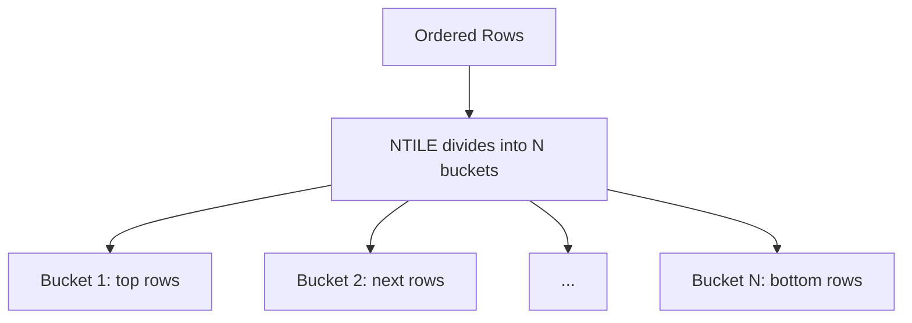

# How to Use NTILE in MySQL Window Functions

Author: [nawazdhandala](https://www.github.com/nawazdhandala)

Tags: MySQL, SQL, Window Function, NTILE, MySQL 8.0, Database

Description: Learn how to use the NTILE window function in MySQL 8.0 to divide rows into N equal-sized buckets for percentile and quartile analysis.

---

## How NTILE Works

`NTILE(N)` divides the rows in a partition into N roughly equal-sized buckets (tiles) and assigns a bucket number (1 through N) to each row. It is commonly used to compute quartiles (NTILE(4)), quintiles (NTILE(5)), deciles (NTILE(10)), or percentiles (NTILE(100)).

When the total number of rows is not evenly divisible by N, the earlier buckets receive one extra row compared to the later buckets.



## Syntax

```sql
NTILE(N) OVER ([PARTITION BY column] ORDER BY column)
```

## Examples

### Setup: Create Sample Data

```sql
CREATE TABLE employee_performance (
    id INT PRIMARY KEY AUTO_INCREMENT,
    name VARCHAR(100) NOT NULL,
    department VARCHAR(50),
    performance_score INT,
    sales_amount DECIMAL(10, 2)
);

INSERT INTO employee_performance (name, department, performance_score, sales_amount) VALUES
    ('Alice',  'Sales', 92,  45000.00),
    ('Bob',    'Sales', 78,  32000.00),
    ('Carol',  'Sales', 85,  39000.00),
    ('Dave',   'Sales', 61,  22000.00),
    ('Eve',    'Sales', 95,  52000.00),
    ('Frank',  'Sales', 73,  28000.00),
    ('Grace',  'Sales', 88,  41000.00),
    ('Hank',   'Sales', 55,  18000.00),
    ('Iris',   'Eng',   90,  NULL),
    ('Jack',   'Eng',   82,  NULL),
    ('Karen',  'Eng',   76,  NULL),
    ('Leo',    'Eng',   68,  NULL);
```

### Basic NTILE: Divide Into Quartiles

Assign each sales employee to one of 4 quartiles based on their performance score.

```sql
SELECT
    name,
    performance_score,
    NTILE(4) OVER (ORDER BY performance_score DESC) AS quartile
FROM employee_performance
WHERE department = 'Sales'
ORDER BY performance_score DESC;
```

```text
+-------+-------------------+----------+
| name  | performance_score | quartile |
+-------+-------------------+----------+
| Eve   | 95                | 1        |
| Alice | 92                | 1        |
| Grace | 88                | 2        |
| Carol | 85                | 2        |
| Bob   | 78                | 3        |
| Frank | 73                | 3        |
| Dave  | 61                | 4        |
| Hank  | 55                | 4        |
+-------+-------------------+----------+
```

Q1 (top performers) contains Eve and Alice. Q4 (bottom performers) contains Dave and Hank.

### NTILE with PARTITION BY: Per-Department Quartiles

Compute quartiles separately for each department.

```sql
SELECT
    name,
    department,
    performance_score,
    NTILE(4) OVER (PARTITION BY department ORDER BY performance_score DESC) AS dept_quartile
FROM employee_performance
ORDER BY department, performance_score DESC;
```

```text
+-------+------------+-------------------+---------------+
| name  | department | performance_score | dept_quartile |
+-------+------------+-------------------+---------------+
| Iris  | Eng        | 90                | 1             |
| Jack  | Eng        | 82                | 2             |
| Karen | Eng        | 76                | 3             |
| Leo   | Eng        | 68                | 4             |
| Eve   | Sales      | 95                | 1             |
| Alice | Sales      | 92                | 1             |
| Grace | Sales      | 88                | 2             |
| Carol | Sales      | 85                | 2             |
| Bob   | Sales      | 78                | 3             |
| Frank | Sales      | 73                | 3             |
| Dave  | Sales      | 61                | 4             |
| Hank  | Sales      | 55                | 4             |
+-------+------------+-------------------+---------------+
```

### Labeling Buckets as Percentile Tiers

Use a CASE expression to convert NTILE bucket numbers into human-readable labels.

```sql
WITH quartiled AS (
    SELECT
        name,
        performance_score,
        sales_amount,
        NTILE(4) OVER (ORDER BY performance_score DESC) AS quartile
    FROM employee_performance
    WHERE department = 'Sales'
)
SELECT
    name,
    performance_score,
    sales_amount,
    quartile,
    CASE quartile
        WHEN 1 THEN 'Top Performer'
        WHEN 2 THEN 'Above Average'
        WHEN 3 THEN 'Below Average'
        WHEN 4 THEN 'Needs Improvement'
    END AS tier
FROM quartiled
ORDER BY quartile, performance_score DESC;
```

```text
+-------+-------------------+--------------+----------+-------------------+
| name  | performance_score | sales_amount | quartile | tier              |
+-------+-------------------+--------------+----------+-------------------+
| Eve   | 95                | 52000.00     | 1        | Top Performer     |
| Alice | 92                | 45000.00     | 1        | Top Performer     |
| Grace | 88                | 41000.00     | 2        | Above Average     |
| Carol | 85                | 39000.00     | 2        | Above Average     |
| Bob   | 78                | 32000.00     | 3        | Below Average     |
| Frank | 73                | 28000.00     | 3        | Below Average     |
| Dave  | 61                | 22000.00     | 4        | Needs Improvement |
| Hank  | 55                | 18000.00     | 4        | Needs Improvement |
+-------+-------------------+--------------+----------+-------------------+
```

### NTILE for A/B Testing Bucket Assignment

Divide users into 10 groups for A/B test allocation.

```sql
SELECT
    name,
    NTILE(10) OVER (ORDER BY id) AS ab_group
FROM employee_performance
ORDER BY ab_group, name;
```

## Best Practices

- Ensure rows are ordered deterministically by specifying a unique or near-unique ORDER BY column to avoid unpredictable bucket assignments.
- NTILE distributes extra rows to the first buckets, not the last, when rows are not evenly divisible by N.
- Use NTILE(100) for true percentile groupings, NTILE(4) for quartiles, NTILE(10) for deciles.
- Combine with CASE to translate numeric bucket numbers into meaningful category labels.
- NTILE does not handle ties as gracefully as RANK - tied values can fall in different buckets depending on ordering. Use RANK or DENSE_RANK when tie handling matters.

## Summary

NTILE(N) is a MySQL 8.0 window function that partitions an ordered result set into N approximately equal-sized buckets and assigns a bucket number to each row. It is the standard tool for computing quartiles, deciles, percentiles, and any fixed-N distribution analysis. Combined with PARTITION BY it computes buckets independently per group. Use CASE expressions to translate numeric bucket numbers into business-meaningful tiers such as "Top Performer" or "Needs Improvement."
