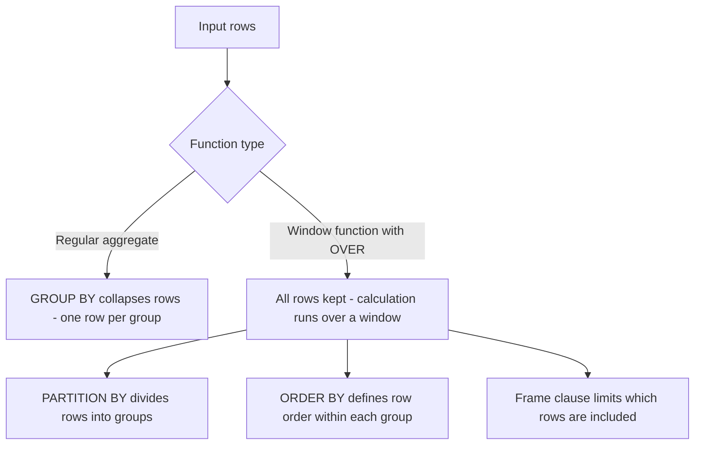

# How to Use OVER() Clause with PARTITION BY in MySQL

Author: [nawazdhandala](https://www.github.com/nawazdhandala)

Tags: MySQL, Window Function, SQL, Analytics, Database

Description: Learn how to use the OVER() clause with PARTITION BY in MySQL 8.0 window functions to perform calculations across logical row groups without collapsing the result set.

---

## What is the OVER() Clause?

The `OVER()` clause turns a regular function into a window function. Instead of aggregating all rows into a single result row, a window function performs the calculation for each row while retaining all rows in the output.



## Syntax

```sql
function_name() OVER (
    [PARTITION BY partition_expression, ...]
    [ORDER BY order_expression [ASC | DESC], ...]
    [frame_clause]
)
```

- `PARTITION BY` - divides rows into independent groups (partitions). The window function resets for each partition.
- `ORDER BY` - defines the logical order of rows within each partition.
- Frame clause (`ROWS` / `RANGE`) - limits the subset of rows the function sees (covered in a separate article).

## Setup: Sample Tables

```sql
CREATE TABLE employees (
    id         INT PRIMARY KEY AUTO_INCREMENT,
    name       VARCHAR(100),
    department VARCHAR(50),
    role       VARCHAR(50),
    salary     DECIMAL(10,2),
    hire_date  DATE
);

INSERT INTO employees (name, department, role, salary, hire_date) VALUES
    ('Alice',   'Engineering', 'Senior',   95000.00, '2020-03-15'),
    ('Bob',     'Engineering', 'Junior',   65000.00, '2022-07-01'),
    ('Carol',   'Engineering', 'Senior',  105000.00, '2019-01-10'),
    ('Dave',    'Marketing',   'Manager',  88000.00, '2018-06-20'),
    ('Eve',     'Marketing',   'Junior',   60000.00, '2023-02-14'),
    ('Frank',   'Finance',     'Analyst',  75000.00, '2021-09-05'),
    ('Grace',   'Finance',     'Manager',  92000.00, '2017-11-30'),
    ('Hank',    'Finance',     'Analyst',  78000.00, '2020-04-22');
```

## OVER() Without PARTITION BY

Omitting `PARTITION BY` treats the entire result set as one partition.

```sql
-- Compare each employee's salary to the overall average
SELECT
    name,
    department,
    salary,
    AVG(salary)  OVER () AS overall_avg,
    salary - AVG(salary) OVER () AS diff_from_avg
FROM employees
ORDER BY department, salary DESC;
```

```text
+-------+-------------+-----------+-------------+---------------+
| name  | department  | salary    | overall_avg | diff_from_avg |
+-------+-------------+-----------+-------------+---------------+
| Carol | Engineering | 105000.00 |   82250.00  |   22750.00    |
| Alice | Engineering |  95000.00 |   82250.00  |   12750.00    |
| Bob   | Engineering |  65000.00 |   82250.00  |  -17250.00    |
| Grace | Finance     |  92000.00 |   82250.00  |    9750.00    |
| Hank  | Finance     |  78000.00 |   82250.00  |   -4250.00    |
| Frank | Finance     |  75000.00 |   82250.00  |   -7250.00    |
| Dave  | Marketing   |  88000.00 |   82250.00  |    5750.00    |
| Eve   | Marketing   |  60000.00 |   82250.00  |  -22250.00    |
+-------+-------------+-----------+-------------+---------------+
```

## OVER() With PARTITION BY

Partition by department to compute per-department aggregates while keeping all rows.

```sql
SELECT
    name,
    department,
    salary,
    AVG(salary)   OVER (PARTITION BY department) AS dept_avg,
    MAX(salary)   OVER (PARTITION BY department) AS dept_max,
    MIN(salary)   OVER (PARTITION BY department) AS dept_min,
    COUNT(*)      OVER (PARTITION BY department) AS dept_headcount
FROM employees
ORDER BY department, salary DESC;
```

```text
+-------+-------------+-----------+----------+----------+----------+----------------+
| name  | department  | salary    | dept_avg | dept_max | dept_min | dept_headcount |
+-------+-------------+-----------+----------+----------+----------+----------------+
| Carol | Engineering | 105000.00 | 88333.33 | 105000   | 65000    | 3              |
| Alice | Engineering |  95000.00 | 88333.33 | 105000   | 65000    | 3              |
| Bob   | Engineering |  65000.00 | 88333.33 | 105000   | 65000    | 3              |
| Grace | Finance     |  92000.00 | 81666.67 | 92000    | 75000    | 3              |
| Hank  | Finance     |  78000.00 | 81666.67 | 92000    | 75000    | 3              |
| Frank | Finance     |  75000.00 | 81666.67 | 92000    | 75000    | 3              |
| Dave  | Marketing   |  88000.00 | 74000.00 | 88000    | 60000    | 2              |
| Eve   | Marketing   |  60000.00 | 74000.00 | 88000    | 60000    | 2              |
+-------+-------------+-----------+----------+----------+----------+----------------+
```

## PARTITION BY with ORDER BY

Adding `ORDER BY` inside the OVER clause changes how cumulative functions (like `SUM`, `COUNT`) behave - they compute a running total rather than a group total.

```sql
SELECT
    name,
    department,
    salary,
    SUM(salary) OVER (PARTITION BY department ORDER BY salary ASC) AS running_dept_total
FROM employees
ORDER BY department, salary ASC;
```

```text
+-------+-------------+-----------+--------------------+
| name  | department  | salary    | running_dept_total |
+-------+-------------+-----------+--------------------+
| Bob   | Engineering |  65000.00 |           65000.00 |
| Alice | Engineering |  95000.00 |          160000.00 |
| Carol | Engineering | 105000.00 |          265000.00 |
| Frank | Finance     |  75000.00 |           75000.00 |
| Hank  | Finance     |  78000.00 |          153000.00 |
| Grace | Finance     |  92000.00 |          245000.00 |
| Eve   | Marketing   |  60000.00 |           60000.00 |
| Dave  | Marketing   |  88000.00 |          148000.00 |
+-------+-------------+-----------+--------------------+
```

## Ranking within Partitions

`ROW_NUMBER()`, `RANK()`, and `DENSE_RANK()` all depend on `PARTITION BY` and `ORDER BY` in OVER.

```sql
SELECT
    name,
    department,
    salary,
    ROW_NUMBER() OVER (PARTITION BY department ORDER BY salary DESC) AS row_num,
    RANK()       OVER (PARTITION BY department ORDER BY salary DESC) AS rnk
FROM employees
ORDER BY department, salary DESC;
```

## Named Windows with the WINDOW Clause

When the same OVER definition is reused in multiple expressions, define it once with a `WINDOW` clause.

```sql
SELECT
    name,
    department,
    salary,
    AVG(salary) OVER dept_window AS dept_avg,
    MAX(salary) OVER dept_window AS dept_max,
    RANK()      OVER dept_window AS dept_rank
FROM employees
WINDOW dept_window AS (PARTITION BY department ORDER BY salary DESC)
ORDER BY department, salary DESC;
```

This is cleaner and easier to maintain than repeating the OVER definition on every column.

## PARTITION BY on Multiple Columns

Partition by two columns simultaneously for finer groupings.

```sql
SELECT
    name,
    department,
    role,
    salary,
    AVG(salary) OVER (PARTITION BY department, role) AS role_avg
FROM employees
ORDER BY department, role, salary;
```

## Best Practices

- Always add an `ORDER BY` inside OVER when using ranking or cumulative functions such as `ROW_NUMBER()`, `RANK()`, `SUM() OVER`, or `LAG()`.
- Omit `ORDER BY` inside OVER for pure aggregate windows (AVG, MAX, MIN, COUNT) where you want the full-partition value on every row.
- Use the `WINDOW` clause to avoid duplicating long OVER definitions.
- Window functions are evaluated after WHERE, GROUP BY, and HAVING but before ORDER BY and LIMIT - you cannot filter on window function results in the same query level; use a subquery or CTE.

## Summary

The `OVER()` clause is the foundation of all MySQL 8.0 window functions. `PARTITION BY` inside OVER divides the result set into independent groups, causing the window function to reset its calculation for each group. Adding `ORDER BY` enables cumulative and ranking behaviours. Named windows via the `WINDOW` clause reduce repetition when multiple expressions share the same partition and order definition.
