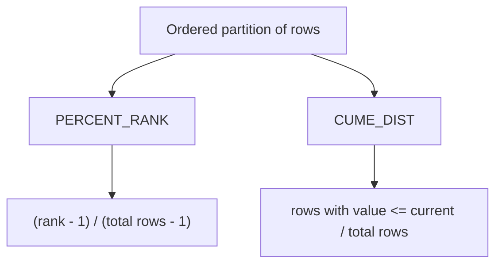

# How to Use PERCENT_RANK() and CUME_DIST() in MySQL

Author: [nawazdhandala](https://www.github.com/nawazdhandala)

Tags: MySQL, Window Function, SQL, Analytics, Database

Description: Learn how to use PERCENT_RANK() and CUME_DIST() window functions in MySQL 8.0 to compute relative rankings and cumulative distributions within partitioned result sets.

---

## Overview

`PERCENT_RANK()` and `CUME_DIST()` are window functions introduced in MySQL 8.0 that express a row's position as a fraction between 0 and 1. They are used in statistical analysis, percentile calculations, and data distribution reports.



### PERCENT_RANK()

Returns a value in the range `[0, 1]`. The first row always gets 0. The formula is:

```
PERCENT_RANK = (rank - 1) / (N - 1)
```

where `rank` is the row's RANK() value and `N` is the number of rows in the partition.

### CUME_DIST()

Returns the cumulative distribution: the fraction of rows with a value less than or equal to the current row's value. The formula is:

```
CUME_DIST = (number of rows with value <= current row value) / N
```

The last row (or tied last rows) always returns 1.

## Setup: Sample Table

```sql
CREATE TABLE sales_reps (
    id         INT PRIMARY KEY AUTO_INCREMENT,
    name       VARCHAR(100),
    region     VARCHAR(50),
    revenue    DECIMAL(12,2)
);

INSERT INTO sales_reps (name, region, revenue) VALUES
    ('Alice',   'East',  120000.00),
    ('Bob',     'East',   95000.00),
    ('Carol',   'East',  120000.00),
    ('Dave',    'East',   80000.00),
    ('Eve',     'West',  200000.00),
    ('Frank',   'West',  155000.00),
    ('Grace',   'West',  155000.00),
    ('Hank',    'West',   90000.00);
```

## PERCENT_RANK() Example

Calculate the percentile rank of each sales rep within their region.

```sql
SELECT
    name,
    region,
    revenue,
    RANK()         OVER w AS rnk,
    PERCENT_RANK() OVER w AS pct_rank
FROM sales_reps
WINDOW w AS (PARTITION BY region ORDER BY revenue DESC);
```

```text
+-------+--------+-----------+-----+----------+
| name  | region | revenue   | rnk | pct_rank |
+-------+--------+-----------+-----+----------+
| Alice | East   | 120000.00 |   1 |   0.0000 |
| Carol | East   | 120000.00 |   1 |   0.0000 |
| Dave  | East   |  95000.00 |   3 |   0.6667 |
| Bob   | East   |  80000.00 |   4 |   1.0000 |
| Eve   | West   | 200000.00 |   1 |   0.0000 |
| Frank | West   | 155000.00 |   2 |   0.3333 |
| Grace | West   | 155000.00 |   2 |   0.3333 |
| Hank  | West   |  90000.00 |   4 |   1.0000 |
+-------+--------+-----------+-----+----------+
```

Alice and Carol are tied at rank 1, so both get `PERCENT_RANK = 0`. Bob is the last in the East partition, so he gets `PERCENT_RANK = 1`.

## CUME_DIST() Example

Calculate the cumulative distribution for each sales rep within their region.

```sql
SELECT
    name,
    region,
    revenue,
    CUME_DIST() OVER w AS cume_dist
FROM sales_reps
WINDOW w AS (PARTITION BY region ORDER BY revenue DESC);
```

```text
+-------+--------+-----------+-----------+
| name  | region | revenue   | cume_dist |
+-------+--------+-----------+-----------+
| Alice | East   | 120000.00 |    0.5000 |
| Carol | East   | 120000.00 |    0.5000 |
| Dave  | East   |  95000.00 |    0.7500 |
| Bob   | East   |  80000.00 |    1.0000 |
| Eve   | West   | 200000.00 |    0.2500 |
| Frank | West   | 155000.00 |    0.7500 |
| Grace | West   | 155000.00 |    0.7500 |
| Hank  | West   |  90000.00 |    1.0000 |
+-------+--------+-----------+-----------+
```

Alice and Carol both have a `CUME_DIST` of 0.50, meaning 50% of East reps have revenue at or below 120000.

## Comparing PERCENT_RANK and CUME_DIST Side by Side

```sql
SELECT
    name,
    region,
    revenue,
    ROUND(PERCENT_RANK() OVER w, 4) AS pct_rank,
    ROUND(CUME_DIST()    OVER w, 4) AS cume_dist
FROM sales_reps
WINDOW w AS (PARTITION BY region ORDER BY revenue ASC);
```

The key differences:
- `PERCENT_RANK` starts at 0 for the lowest row; `CUME_DIST` starts at a value > 0.
- `CUME_DIST` accounts for ties by advancing the cumulative count for all tied rows at once.
- Both return 1 for the highest row(s) in the partition.

## Filtering by Percentile: Top 50% of Revenue

Wrap the window function in a subquery (window functions cannot appear directly in WHERE).

```sql
SELECT name, region, revenue, pct_rank
FROM (
    SELECT
        name,
        region,
        revenue,
        PERCENT_RANK() OVER (PARTITION BY region ORDER BY revenue DESC) AS pct_rank
    FROM sales_reps
) ranked
WHERE pct_rank <= 0.5;
```

```text
+-------+--------+-----------+----------+
| name  | region | revenue   | pct_rank |
+-------+--------+-----------+----------+
| Alice | East   | 120000.00 |   0.0000 |
| Carol | East   | 120000.00 |   0.0000 |
| Eve   | West   | 200000.00 |   0.0000 |
| Frank | West   | 155000.00 |   0.3333 |
| Grace | West   | 155000.00 |   0.3333 |
+-------+--------+-----------+----------+
```

## Global Percentile (No PARTITION BY)

Omit `PARTITION BY` to rank across the entire table.

```sql
SELECT
    name,
    revenue,
    ROUND(PERCENT_RANK() OVER (ORDER BY revenue ASC), 4) AS global_pct_rank,
    ROUND(CUME_DIST()    OVER (ORDER BY revenue ASC), 4) AS global_cume_dist
FROM sales_reps
ORDER BY revenue ASC;
```

## Best Practices

- Use `ROUND()` on the result to make percentile values readable.
- To filter by percentile, always wrap in a subquery or CTE since window functions are not allowed in WHERE clauses.
- `CUME_DIST` is better for asking "what fraction of rows are at or below this value."
- `PERCENT_RANK` is better for mapping rows to a 0-to-1 percentile scale similar to statistical definitions.
- Both functions require `ORDER BY` inside the OVER clause; without it, all rows receive 0 (PERCENT_RANK) or 1 (CUME_DIST).

## Summary

`PERCENT_RANK()` and `CUME_DIST()` are MySQL 8.0 window functions for relative positional analysis. PERCENT_RANK maps a row to a 0-1 scale based on its rank, while CUME_DIST measures the fraction of rows with values at or below the current row. Both support PARTITION BY for per-group calculations and are commonly used to filter top or bottom percentiles via a wrapping subquery.
