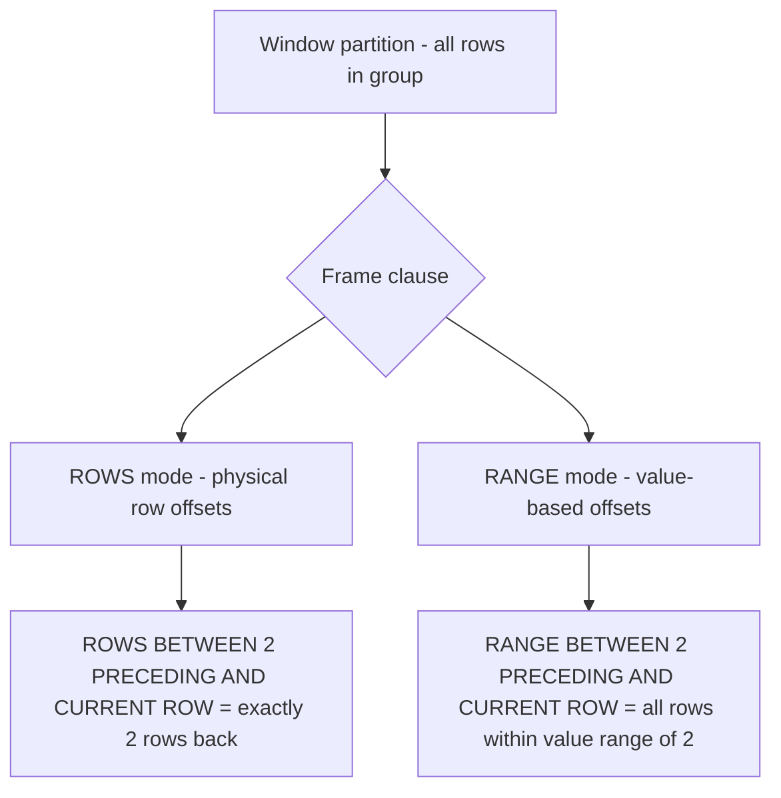
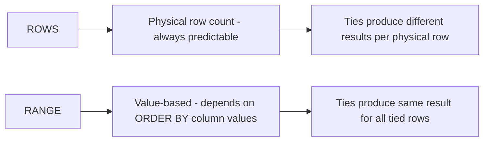

# How to Use ROWS vs RANGE in MySQL Window Frame Specification

Author: [nawazdhandala](https://www.github.com/nawazdhandala)

Tags: MySQL, Window Function, SQL, Analytics, Database

Description: Learn the difference between ROWS and RANGE frame modes in MySQL 8.0 window functions, how each handles ties, and practical examples using SUM, AVG, and sliding windows.

---

## What is a Window Frame?

A window frame narrows the subset of rows a window function sees for each row it is computing. Without a frame clause, most aggregate window functions default to `RANGE BETWEEN UNBOUNDED PRECEDING AND CURRENT ROW` when `ORDER BY` is present.



## Syntax

```sql
function_name() OVER (
    [PARTITION BY ...]
    ORDER BY col [ASC|DESC]
    {ROWS | RANGE} BETWEEN frame_start AND frame_end
)
```

Frame boundaries:
- `UNBOUNDED PRECEDING` - first row of the partition
- `N PRECEDING` - N rows/values before the current row
- `CURRENT ROW` - the current row
- `N FOLLOWING` - N rows/values after the current row
- `UNBOUNDED FOLLOWING` - last row of the partition

## Setup: Sample Table

```sql
CREATE TABLE daily_sales (
    sale_date  DATE PRIMARY KEY,
    amount     DECIMAL(10,2)
);

INSERT INTO daily_sales (sale_date, amount) VALUES
    ('2024-01-01', 100.00),
    ('2024-01-02', 150.00),
    ('2024-01-03', 150.00),
    ('2024-01-04', 200.00),
    ('2024-01-05', 175.00),
    ('2024-01-06', 225.00),
    ('2024-01-07', 300.00);
```

## ROWS Mode

`ROWS` counts physical rows. `ROWS BETWEEN 2 PRECEDING AND CURRENT ROW` means exactly the two rows before the current row plus the current row itself - regardless of the values in the ORDER BY column.

```sql
SELECT
    sale_date,
    amount,
    SUM(amount) OVER (ORDER BY sale_date ROWS BETWEEN 2 PRECEDING AND CURRENT ROW) AS rows_3day_sum
FROM daily_sales;
```

```text
+------------+--------+---------------+
| sale_date  | amount | rows_3day_sum |
+------------+--------+---------------+
| 2024-01-01 | 100.00 |        100.00 |
| 2024-01-02 | 150.00 |        250.00 |
| 2024-01-03 | 150.00 |        400.00 |
| 2024-01-04 | 200.00 |        500.00 |
| 2024-01-05 | 175.00 |        525.00 |
| 2024-01-06 | 225.00 |        600.00 |
| 2024-01-07 | 300.00 |        700.00 |
+------------+--------+---------------+
```

Each row always includes exactly up to 3 rows (itself and up to 2 preceding).

## RANGE Mode

`RANGE` is value-based. `RANGE BETWEEN 2 PRECEDING AND CURRENT ROW` includes all rows whose ORDER BY value is within 2 units of the current row's ORDER BY value. This matters most when there are ties or non-contiguous values.

```sql
-- Using a numeric column to illustrate RANGE behaviour
CREATE TABLE scores (
    student_id INT PRIMARY KEY,
    score      INT
);

INSERT INTO scores VALUES
    (1, 70), (2, 72), (3, 72), (4, 75), (5, 80);

SELECT
    student_id,
    score,
    SUM(score) OVER (ORDER BY score ROWS  BETWEEN 1 PRECEDING AND CURRENT ROW) AS rows_sum,
    SUM(score) OVER (ORDER BY score RANGE BETWEEN 2 PRECEDING AND CURRENT ROW) AS range_sum
FROM scores;
```

```text
+------------+-------+----------+-----------+
| student_id | score | rows_sum | range_sum |
+------------+-------+----------+-----------+
|          1 |    70 |       70 |        70 |
|          2 |    72 |      142 |       214 |
|          3 |    72 |      144 |       214 |
|          4 |    75 |      147 |       219 |
|          5 |    80 |      155 |        80 |
+------------+-------+----------+-----------+
```

For student_id 2 (score 72): `RANGE BETWEEN 2 PRECEDING AND CURRENT ROW` includes all rows with scores in the range [70, 72], which is students 1, 2, and 3 (70+72+72=214). `ROWS BETWEEN 1 PRECEDING` only includes students 1 and 2 (70+72=142).

## RANGE Default Behavior with ORDER BY

When you specify `ORDER BY` but no frame clause, MySQL defaults to `RANGE BETWEEN UNBOUNDED PRECEDING AND CURRENT ROW`. This means all tied rows get the same cumulative total.

```sql
SELECT
    student_id,
    score,
    SUM(score) OVER (ORDER BY score) AS default_running_sum
FROM scores;
```

```text
+------------+-------+---------------------+
| student_id | score | default_running_sum |
+------------+-------+---------------------+
|          1 |    70 |                  70 |
|          2 |    72 |                 214 |
|          3 |    72 |                 214 |
|          4 |    75 |                 289 |
|          5 |    80 |                 369 |
+------------+-------+---------------------+
```

Students 2 and 3 both get 214 because they tie at score 72 and the RANGE default groups them together.

To get a strict row-by-row running total (no tie grouping), use `ROWS BETWEEN UNBOUNDED PRECEDING AND CURRENT ROW`.

```sql
SELECT
    student_id,
    score,
    SUM(score) OVER (ORDER BY score ROWS BETWEEN UNBOUNDED PRECEDING AND CURRENT ROW) AS strict_running_sum
FROM scores;
```

```text
+------------+-------+--------------------+
| student_id | score | strict_running_sum |
+------------+-------+--------------------+
|          1 |    70 |                 70 |
|          2 |    72 |                142 |
|          3 |    72 |                214 |
|          4 |    75 |                289 |
|          5 |    80 |                369 |
+------------+-------+--------------------+
```

## Sliding Window Average (3-Row Moving Average)

```sql
SELECT
    sale_date,
    amount,
    ROUND(AVG(amount) OVER (
        ORDER BY sale_date
        ROWS BETWEEN 2 PRECEDING AND CURRENT ROW
    ), 2) AS moving_avg_3day
FROM daily_sales;
```

```text
+------------+--------+-----------------+
| sale_date  | amount | moving_avg_3day |
+------------+--------+-----------------+
| 2024-01-01 | 100.00 |          100.00 |
| 2024-01-02 | 150.00 |          125.00 |
| 2024-01-03 | 150.00 |          133.33 |
| 2024-01-04 | 200.00 |          166.67 |
| 2024-01-05 | 175.00 |          175.00 |
| 2024-01-06 | 225.00 |          200.00 |
| 2024-01-07 | 300.00 |          233.33 |
+------------+--------+-----------------+
```

## Full Partition Frames

| Goal | Frame clause |
|---|---|
| Sum of all rows in partition | `ROWS BETWEEN UNBOUNDED PRECEDING AND UNBOUNDED FOLLOWING` |
| Running total from start | `ROWS BETWEEN UNBOUNDED PRECEDING AND CURRENT ROW` |
| Trailing N-row window | `ROWS BETWEEN N PRECEDING AND CURRENT ROW` |
| Centered window | `ROWS BETWEEN 1 PRECEDING AND 1 FOLLOWING` |

```sql
SELECT
    sale_date,
    amount,
    SUM(amount) OVER (ORDER BY sale_date ROWS BETWEEN UNBOUNDED PRECEDING AND UNBOUNDED FOLLOWING) AS partition_total,
    SUM(amount) OVER (ORDER BY sale_date ROWS BETWEEN UNBOUNDED PRECEDING AND CURRENT ROW)          AS running_total,
    SUM(amount) OVER (ORDER BY sale_date ROWS BETWEEN 1 PRECEDING AND 1 FOLLOWING)                  AS centered_3day
FROM daily_sales;
```

## ROWS vs RANGE: Key Differences



Use `ROWS` when:
- You need a fixed-size sliding window (N-day moving average).
- Ties should be treated as distinct rows.
- The ORDER BY column has unique values.

Use `RANGE` when:
- You want all rows with the same ORDER BY value treated as a group.
- The window boundary is a value interval (e.g., "all dates within 7 days of this date").

## Best Practices

- Be explicit with your frame clause. Relying on the default `RANGE UNBOUNDED PRECEDING` can produce surprising results with ties.
- For moving averages and sliding windows, almost always use `ROWS`.
- For cumulative totals where ties should receive the same total, the default `RANGE` behaviour is appropriate.
- Index the ORDER BY column to improve window function performance.

## Summary

`ROWS` and `RANGE` are two frame modes for MySQL window functions. `ROWS` operates on a fixed count of physical rows before and after the current row, making it ideal for sliding windows. `RANGE` operates on value intervals and groups tied rows together, which is the MySQL default when ORDER BY is specified without an explicit frame. Choose `ROWS` for predictable fixed-size windows and `RANGE` when you need value-boundary semantics.
