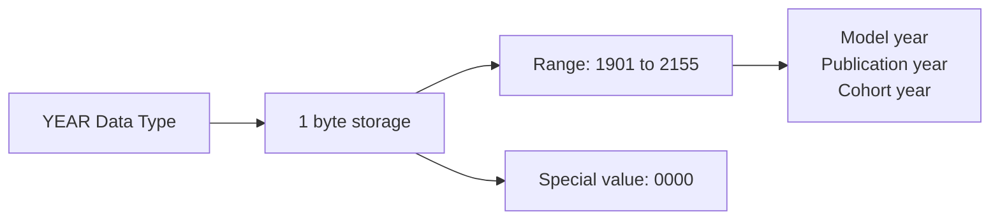

# How to Use YEAR Data Type in MySQL

Author: [nawazdhandala](https://www.github.com/nawazdhandala)

Tags: MySQL, SQL, Data Type, Date, Database

Description: Learn how to use the YEAR data type in MySQL to store 4-digit year values efficiently, including valid ranges, input formats, and practical examples.

---

## What Is the YEAR Data Type

`YEAR` is a compact MySQL data type that stores a 4-digit year value in **1 byte**. It is the most storage-efficient way to record a calendar year when you do not need month or day information.



## Storage and Range

| Attribute | Value |
|---|---|
| Storage | 1 byte |
| Valid range | 1901 to 2155 |
| Zero value | 0000 |
| Default display | 4-digit year (YYYY) |

## Syntax

```sql
column_name YEAR [NOT NULL] [DEFAULT value]
```

Note: `YEAR(4)` is the same as `YEAR`; the display-width parameter is deprecated in MySQL 8.0.17+.

## Basic Usage

```sql
CREATE TABLE vehicles (
    id           INT AUTO_INCREMENT PRIMARY KEY,
    make         VARCHAR(50) NOT NULL,
    model        VARCHAR(100) NOT NULL,
    model_year   YEAR NOT NULL,
    purchase_year YEAR
);

INSERT INTO vehicles (make, model, model_year, purchase_year) VALUES
('Toyota',  'Camry',   2022, 2022),
('Honda',   'Civic',   2019, 2020),
('Ford',    'F-150',   2024, 2023),
('Chevrolet','Malibu', 1965, NULL);

SELECT make, model, model_year, purchase_year FROM vehicles;
```

```text
+------------+--------+------------+---------------+
| make       | model  | model_year | purchase_year |
+------------+--------+------------+---------------+
| Toyota     | Camry  |       2022 |          2022 |
| Honda      | Civic  |       2019 |          2020 |
| Ford       | F-150  |       2024 |          2023 |
| Chevrolet  | Malibu |       1965 |          NULL |
+------------+--------+------------+---------------+
```

## Academic and Publication Year

```sql
CREATE TABLE publications (
    id              INT AUTO_INCREMENT PRIMARY KEY,
    title           VARCHAR(300) NOT NULL,
    author          VARCHAR(200) NOT NULL,
    publication_year YEAR NOT NULL,
    isbn            CHAR(13) UNIQUE
);

INSERT INTO publications (title, author, publication_year, isbn) VALUES
('The Art of SQL',       'Stephane Faroult',  2006, '9780596008949'),
('High Performance MySQL','Baron Schwartz',    2012, '9781449314286'),
('Designing Data-Intensive Applications','Martin Kleppmann', 2017, '9781449373320');

-- Books published in the 2010s
SELECT title, author, publication_year
FROM publications
WHERE publication_year BETWEEN 2010 AND 2019
ORDER BY publication_year;
```

```text
+-------------------------------------------+------------------+-----------------+
| title                                     | author           | publication_year|
+-------------------------------------------+------------------+-----------------+
| High Performance MySQL                    | Baron Schwartz   |            2012 |
| Designing Data-Intensive Applications     | Martin Kleppmann |            2017 |
+-------------------------------------------+------------------+-----------------+
```

## Cohort and Vintage Analysis

```sql
CREATE TABLE customers (
    id            INT AUTO_INCREMENT PRIMARY KEY,
    name          VARCHAR(100) NOT NULL,
    signup_year   YEAR NOT NULL,
    birth_year    YEAR
);

INSERT INTO customers (name, signup_year, birth_year) VALUES
('Alice',  2018, 1990),
('Bob',    2018, 1985),
('Carol',  2020, 1993),
('David',  2020, 1978),
('Eve',    2022, 2000);

-- Cohort analysis: customers by signup year
SELECT signup_year,
       COUNT(*) AS customer_count
FROM customers
GROUP BY signup_year
ORDER BY signup_year;
```

```text
+-------------+----------------+
| signup_year | customer_count |
+-------------+----------------+
|        2018 |              2 |
|        2020 |              2 |
|        2022 |              1 |
+-------------+----------------+
```

## YEAR vs SMALLINT for Year Storage

```sql
-- YEAR: 1 byte, range 1901-2155, built-in validation
-- SMALLINT: 2 bytes, range -32768 to 32767, no built-in validation

-- YEAR prevents invalid values
INSERT INTO vehicles (make, model, model_year) VALUES ('Test', 'Car', 1800);
-- ERROR 1264 (22003): Out of range value for column 'model_year' at row 1
-- YEAR only accepts 1901-2155

-- YEAR automatically validates the year range, SMALLINT does not
```

## Two-Digit Year Input (Deprecated)

In older MySQL versions, 2-digit year inputs were interpreted as:
- 00-69 -> 2000-2069
- 70-99 -> 1970-1999

This behavior is deprecated. Always use 4-digit years.

```sql
-- Always use 4-digit years
INSERT INTO publications (title, author, publication_year) VALUES
('Old Book', 'Author Name', 1975);  -- correct
```

## Filtering and Sorting by YEAR

```sql
-- Find vehicles from the current year
SELECT make, model FROM vehicles
WHERE model_year = YEAR(CURDATE());

-- Find vehicles newer than 5 years
SELECT make, model, model_year FROM vehicles
WHERE model_year >= YEAR(CURDATE()) - 5
ORDER BY model_year DESC;
```

## Combining YEAR with DATE Functions

```sql
-- Extract year from a DATE column and compare
CREATE TABLE orders (
    id          INT AUTO_INCREMENT PRIMARY KEY,
    customer_id INT NOT NULL,
    order_date  DATE NOT NULL,
    amount      DECIMAL(10, 2) NOT NULL
);

-- Annual revenue report using YEAR() function on a DATE column
SELECT YEAR(order_date) AS year,
       COUNT(*)          AS order_count,
       SUM(amount)       AS total_revenue
FROM orders
GROUP BY YEAR(order_date)
ORDER BY year;
```

## Best Practices

- Use `YEAR` instead of `SMALLINT` for year-only columns; it uses half the storage and validates the range automatically.
- Always insert 4-digit years (e.g., `2025`) to avoid ambiguous 2-digit year interpretation.
- Use `YEAR(CURDATE())` to get the current year in queries.
- Index `YEAR` columns used in `WHERE` and `GROUP BY` for efficient cohort queries.
- Do not use `YEAR` when you need month or day; use `DATE` instead.
- Remember the upper limit is 2155; plan accordingly for long-lived datasets.

## Summary

The MySQL `YEAR` data type stores 4-digit calendar years in 1 byte, covering the range 1901 to 2155. It is the most storage-efficient option for year-only data such as model years, publication years, and cohort years. It automatically validates input values, rejecting years outside its range. Always use 4-digit year literals when inserting data, and use `YEAR(CURDATE())` in queries to reference the current year.
