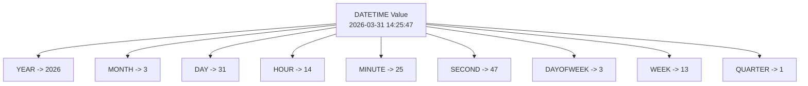

# How to Use MySQL YEAR, MONTH, DAY, HOUR, MINUTE, SECOND Functions

Author: [nawazdhandala](https://www.github.com/nawazdhandala)

Tags: MySQL, SQL, Date Function, Time Function, Database

Description: Learn how to use MySQL date part extraction functions YEAR, MONTH, DAY, HOUR, MINUTE, and SECOND to break down datetime values for filtering and grouping.

---

## How Date Part Functions Work

MySQL provides a family of functions that extract individual components from `DATE`, `DATETIME`, and `TIMESTAMP` values. Instead of formatting a date as a string and parsing it, you can directly retrieve the numeric year, month, day, hour, minute, or second. These extracted values are integers, which makes them ideal for `GROUP BY`, `ORDER BY`, and arithmetic.



## Setup: Sample Table

```sql
CREATE TABLE events (
    id          INT AUTO_INCREMENT PRIMARY KEY,
    event_name  VARCHAR(100),
    event_type  VARCHAR(50),
    starts_at   DATETIME NOT NULL,
    ends_at     DATETIME NOT NULL
);

INSERT INTO events (event_name, event_type, starts_at, ends_at) VALUES
('New Year Webinar',     'webinar',  '2026-01-01 09:00:00', '2026-01-01 10:30:00'),
('Q1 Planning',          'meeting',  '2026-01-15 14:00:00', '2026-01-15 16:00:00'),
('Valentine Campaign',   'marketing','2026-02-14 08:00:00', '2026-02-14 18:00:00'),
('Spring Release',       'launch',   '2026-03-20 10:00:00', '2026-03-20 11:00:00'),
('Easter Sale',          'marketing','2026-04-05 00:00:00', '2026-04-06 23:59:59'),
('Midnight Maintenance', 'ops',      '2026-05-31 23:00:00', '2026-06-01 02:00:00');
```

## YEAR, MONTH, DAY

These functions return the year, month (1-12), and day (1-31) components respectively.

```sql
SELECT
    event_name,
    starts_at,
    YEAR(starts_at)  AS yr,
    MONTH(starts_at) AS mo,
    DAY(starts_at)   AS dy
FROM events;
```

```text
+---------------------+---------------------+------+----+----+
| event_name          | starts_at           | yr   | mo | dy |
+---------------------+---------------------+------+----+----+
| New Year Webinar    | 2026-01-01 09:00:00 | 2026 | 1  | 1  |
| Q1 Planning         | 2026-01-15 14:00:00 | 2026 | 1  | 15 |
| Valentine Campaign  | 2026-02-14 08:00:00 | 2026 | 2  | 14 |
| Spring Release      | 2026-03-20 10:00:00 | 2026 | 3  | 20 |
| Easter Sale         | 2026-04-05 00:00:00 | 2026 | 4  | 5  |
| Midnight Maintenance| 2026-05-31 23:00:00 | 2026 | 5  | 31 |
+---------------------+---------------------+------+----+----+
```

**Group events by month:**

```sql
SELECT
    YEAR(starts_at)  AS yr,
    MONTH(starts_at) AS mo,
    COUNT(*)         AS events_count
FROM events
GROUP BY yr, mo
ORDER BY yr, mo;
```

## HOUR, MINUTE, SECOND

```sql
SELECT
    event_name,
    starts_at,
    HOUR(starts_at)   AS hr,
    MINUTE(starts_at) AS mn,
    SECOND(starts_at) AS sec
FROM events;
```

**Find events that start in business hours (9am-5pm):**

```sql
SELECT event_name, starts_at
FROM events
WHERE HOUR(starts_at) >= 9 AND HOUR(starts_at) < 17;
```

## DAYOFWEEK, DAYOFYEAR, DAYNAME

```sql
SELECT
    event_name,
    starts_at,
    DAYOFWEEK(starts_at) AS dow,       -- 1=Sunday, 7=Saturday
    DAYNAME(starts_at)   AS day_name,
    DAYOFYEAR(starts_at) AS doy
FROM events;
```

**Find weekend events:**

```sql
SELECT event_name FROM events
WHERE DAYOFWEEK(starts_at) IN (1, 7);  -- 1=Sunday, 7=Saturday
```

## WEEK, WEEKOFYEAR, QUARTER

```sql
SELECT
    event_name,
    WEEK(starts_at)       AS week_num,
    WEEKOFYEAR(starts_at) AS iso_week,
    QUARTER(starts_at)    AS quarter
FROM events;
```

**Count events per quarter:**

```sql
SELECT
    QUARTER(starts_at) AS q,
    COUNT(*)            AS events_in_quarter
FROM events
GROUP BY q
ORDER BY q;
```

## MICROSECOND and TIME-based Extraction

```sql
SELECT TIME(starts_at)          AS time_part;   -- Returns TIME portion
SELECT MICROSECOND('10:30:00.123456');           -- Returns 123456
SELECT EXTRACT(HOUR_MINUTE FROM starts_at) AS hhmm FROM events;
```

## EXTRACT Function

`EXTRACT` is the SQL-standard alternative to individual functions:

```sql
SELECT
    event_name,
    EXTRACT(YEAR   FROM starts_at) AS yr,
    EXTRACT(MONTH  FROM starts_at) AS mo,
    EXTRACT(DAY    FROM starts_at) AS dy,
    EXTRACT(HOUR   FROM starts_at) AS hr
FROM events;
```

EXTRACT supports composite units too:

```text
YEAR_MONTH       - YYYYMM as integer
DAY_HOUR
DAY_MINUTE
DAY_SECOND
HOUR_MINUTE
HOUR_SECOND
MINUTE_SECOND
```

## Practical Use: Reporting Dashboard

```sql
SELECT
    YEAR(starts_at)                          AS year,
    MONTHNAME(starts_at)                     AS month_name,
    COUNT(*)                                 AS total_events,
    SUM(IF(event_type = 'webinar', 1, 0))    AS webinars,
    SUM(IF(event_type = 'meeting', 1, 0))    AS meetings,
    SUM(IF(event_type = 'marketing', 1, 0))  AS campaigns
FROM events
GROUP BY YEAR(starts_at), MONTH(starts_at), MONTHNAME(starts_at)
ORDER BY YEAR(starts_at), MONTH(starts_at);
```

## Best Practices

- Avoid applying date-part functions to indexed columns in WHERE clauses - `WHERE YEAR(col) = 2026` cannot use an index. Use range conditions instead: `WHERE col >= '2026-01-01' AND col < '2027-01-01'`.
- Use `EXTRACT` for portability; use the named functions (YEAR, MONTH, etc.) for readability when SQL standard portability is not a concern.
- For grouping by month/year, `DATE_FORMAT(starts_at, '%Y-%m')` as a GROUP BY key is readable and sorts correctly as a string.
- Store event times in UTC and convert for display using `CONVERT_TZ`.

## Summary

MySQL's date part extraction functions - `YEAR`, `MONTH`, `DAY`, `HOUR`, `MINUTE`, `SECOND` - break down datetime values into their integer components. Supporting functions like `DAYNAME`, `DAYOFWEEK`, `WEEK`, and `QUARTER` provide additional temporal context. The `EXTRACT` function offers SQL-standard syntax covering both simple and composite date parts. These functions are especially valuable for time-series reporting, where grouping and filtering by specific date components is a common requirement.
