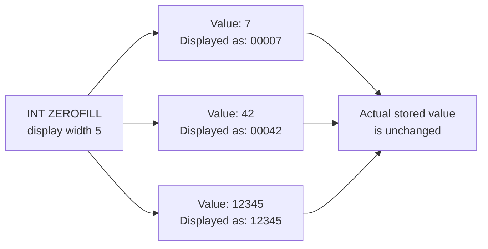

# How to Use ZEROFILL Attribute in MySQL

Author: [nawazdhandala](https://www.github.com/nawazdhandala)

Tags: MySQL, SQL, Data Type, Integer, Database

Description: Learn how the ZEROFILL attribute works in MySQL, how it pads integer display values with leading zeros, its limitations, and what to use instead in MySQL 8.0+.

---

## What Is ZEROFILL

`ZEROFILL` is a display attribute for MySQL numeric columns that pads the displayed value with leading zeros up to the column's display width. A `ZEROFILL` column is automatically `UNSIGNED`.

> **Note:** `ZEROFILL` is **deprecated** as of MySQL 8.0.17. The recommended replacement is to use `LPAD()` or application-level formatting. It is still functional but may be removed in a future release.



## Syntax

```sql
column_name INT(display_width) ZEROFILL [NOT NULL] [DEFAULT value]
```

The `display_width` in parentheses controls how many characters the display output is padded to. It does **not** affect storage or the maximum value.

## Basic Example

```sql
CREATE TABLE product_codes (
    id          INT UNSIGNED AUTO_INCREMENT PRIMARY KEY,
    sku_number  INT(8) ZEROFILL NOT NULL,  -- displays with 8 digits, zero-padded
    batch_id    SMALLINT(5) ZEROFILL NOT NULL
);

INSERT INTO product_codes (sku_number, batch_id) VALUES
(1,     12),
(100,   999),
(12345, 10000);

SELECT sku_number, batch_id FROM product_codes;
```

```text
+----------+----------+
| sku_number| batch_id |
+----------+----------+
| 00000001  | 00012    |
| 00000100  | 00999    |
| 00012345  | 10000    |
+----------+----------+
```

## ZEROFILL Implies UNSIGNED

When you declare a column as `ZEROFILL`, MySQL automatically makes it `UNSIGNED`. You cannot store negative values.

```sql
CREATE TABLE invoice_numbers (
    id          INT UNSIGNED AUTO_INCREMENT PRIMARY KEY,
    invoice_no  INT(7) ZEROFILL NOT NULL
);

INSERT INTO invoice_numbers (invoice_no) VALUES (-1);
-- ERROR 1264 (22003): Out of range value for column 'invoice_no'
-- ZEROFILL columns are implicitly UNSIGNED
```

## Stored Value vs Displayed Value

The stored integer value is not changed by `ZEROFILL`. Padding is only a display artifact.

```sql
SELECT
    sku_number,
    sku_number + 0          AS actual_value,
    sku_number * 2          AS doubled,
    LENGTH(sku_number + 0)  AS stored_length
FROM product_codes;
```

```text
+----------+--------------+---------+---------------+
| sku_number | actual_value | doubled | stored_length |
+----------+--------------+---------+---------------+
| 00000001   |            1 |       2 |             1 |
| 00000100   |          100 |     200 |             3 |
| 00012345   |        12345 |   24690 |             5 |
+----------+--------------+---------+---------------+
```

## The Deprecated Status and Alternatives

Since MySQL 8.0.17, `ZEROFILL` is deprecated. The preferred approach is to format the value in a query or in the application.

```sql
-- Modern alternative using LPAD() in a query
CREATE TABLE modern_product_codes (
    id         INT UNSIGNED AUTO_INCREMENT PRIMARY KEY,
    sku_number INT UNSIGNED NOT NULL
);

INSERT INTO modern_product_codes (sku_number) VALUES (1), (100), (12345);

SELECT LPAD(sku_number, 8, '0') AS sku_display FROM modern_product_codes;
```

```text
+------------+
| sku_display|
+------------+
| 00000001   |
| 00000100   |
| 00012345   |
+------------+
```

## Using LPAD in a View

```sql
CREATE VIEW product_sku_view AS
SELECT id,
       sku_number                        AS raw_sku,
       LPAD(sku_number, 8, '0')          AS formatted_sku
FROM modern_product_codes;

SELECT * FROM product_sku_view;
```

## Generated Column Alternative

```sql
CREATE TABLE orders (
    id              INT UNSIGNED AUTO_INCREMENT PRIMARY KEY,
    order_number    INT UNSIGNED NOT NULL,
    order_display   VARCHAR(10) GENERATED ALWAYS AS (LPAD(order_number, 7, '0')) VIRTUAL,
    placed_at       DATETIME NOT NULL DEFAULT CURRENT_TIMESTAMP
);

INSERT INTO orders (order_number) VALUES (1), (500), (123456);

SELECT order_number, order_display FROM orders;
```

```text
+--------------+---------------+
| order_number | order_display |
+--------------+---------------+
|            1 | 0000001       |
|          500 | 0000500       |
|       123456 | 0123456       |
+--------------+---------------+
```

## ZEROFILL in Older Schema (Reading Existing Tables)

If you encounter `ZEROFILL` in an existing schema, you can inspect it:

```sql
SHOW CREATE TABLE product_codes\G
-- Will show: `sku_number` int(8) unsigned zerofill NOT NULL,

-- Check column info
SELECT column_name, column_type, extra
FROM information_schema.columns
WHERE table_schema = DATABASE()
  AND table_name = 'product_codes';
```

## Migrating Away from ZEROFILL

```sql
-- Step 1: Add a new column without ZEROFILL
ALTER TABLE product_codes
    ADD COLUMN sku_number_new INT UNSIGNED NOT NULL DEFAULT 0;

-- Step 2: Copy data
UPDATE product_codes SET sku_number_new = sku_number + 0;

-- Step 3: Drop old column and rename new one
ALTER TABLE product_codes DROP COLUMN sku_number;
ALTER TABLE product_codes RENAME COLUMN sku_number_new TO sku_number;
```

## Best Practices

- Avoid using `ZEROFILL` in new MySQL 8.0+ schemas because it is deprecated and may be removed in a future version.
- Use `LPAD(column, width, '0')` in queries or views to format numbers with leading zeros.
- Use a virtual generated column with `LPAD()` if you need the padded value available as a column expression.
- If you maintain older schemas with `ZEROFILL`, plan a migration to remove it before upgrading to a version that drops support.
- Remember that `ZEROFILL` forces `UNSIGNED`; if you need signed values, do not use `ZEROFILL`.

## Summary

`ZEROFILL` is a MySQL attribute that pads integer display values with leading zeros up to the column's declared display width. The stored value is unchanged; only the display is affected. A `ZEROFILL` column is implicitly `UNSIGNED`. As of MySQL 8.0.17, `ZEROFILL` is deprecated. Use `LPAD(column, width, '0')` in queries or a virtual generated column as the modern alternative.
