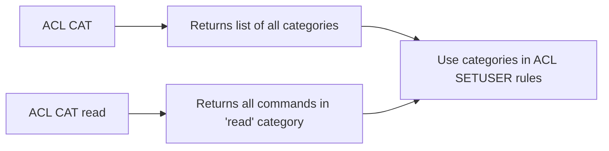

# How to Use ACL CAT in Redis to List Available Command Categories

Author: [nawazdhandala](https://www.github.com/nawazdhandala)

Tags: Redis, ACL, Security, Command, User Management

Description: Learn how to use ACL CAT in Redis to list all command categories and the commands within each category, making it easier to write precise ACL rules for users.

---

## Overview

`ACL CAT` lists the command categories that Redis uses to group related commands. These categories are used in ACL rules with the `+@category` and `-@category` syntax. Knowing the available categories and the commands within them lets you write precise, maintainable ACL rules without having to enumerate individual commands.



## Syntax

```redis
ACL CAT [categoryname]
```

- No arguments: returns all category names
- With a category name: returns all commands belonging to that category

## List All Categories

```redis
ACL CAT
```

```text
 1) "keyspace"
 2) "read"
 3) "write"
 4) "set"
 5) "sortedset"
 6) "list"
 7) "hash"
 8) "string"
 9) "bitmap"
10) "hyperloglog"
11) "geo"
12) "stream"
13) "pubsub"
14) "admin"
15) "fast"
16) "slow"
17) "blocking"
18) "dangerous"
19) "connection"
20) "transaction"
21) "scripting"
```

## List Commands in a Category

### Read commands

```redis
ACL CAT read
```

```text
 1) "getdel"
 2) "substr"
 3) "sunionstore"
 4) "georadiusbymember_ro"
 5) "lpos"
 6) "smembers"
 7) "sintercard"
 8) "getrange"
 9) "lrange"
10) "zrangebyscore"
...
```

### Write commands

```redis
ACL CAT write
```

### Admin commands

```redis
ACL CAT admin
```

```text
 1) "replicaof"
 2) "slowlog"
 3) "acl"
 4) "debug"
 5) "config"
 6) "cluster"
 7) "info"
 8) "flushdb"
 9) "monitor"
10) "bgsave"
...
```

### Dangerous commands

```redis
ACL CAT dangerous
```

These are commands that can have significant side effects, such as `FLUSHDB`, `DEBUG`, `CONFIG RESETSTAT`, and `KEYS`.

## Using Categories in ACL Rules

Categories discovered via `ACL CAT` map directly to the `+@` / `-@` prefixes in `ACL SETUSER`:

```redis
# Allow only read commands on all keys
ACL SETUSER readonly_user on >mypassword ~* +@read

# Allow read and write but not dangerous commands
ACL SETUSER app_user on >mypassword ~app:* +@read +@write -@dangerous

# Allow everything except admin commands
ACL SETUSER power_user on >mypassword ~* +@all -@admin
```

## Category Reference

| Category | Description |
|----------|-------------|
| `read` | Commands that read data without modifying it |
| `write` | Commands that modify data |
| `admin` | Administrative commands (CONFIG, DEBUG, etc.) |
| `dangerous` | Commands with destructive or high-impact potential |
| `pubsub` | Pub/Sub related commands |
| `scripting` | Lua scripting commands (EVAL, EVALSHA, etc.) |
| `transaction` | MULTI/EXEC transaction commands |
| `connection` | Connection management (AUTH, SELECT, QUIT) |
| `fast` | Commands that run in O(1) time |
| `slow` | Commands that may take longer (O(n) or higher) |
| `blocking` | Commands that can block the server (BLPOP, etc.) |

## Finding Which Category a Command Belongs To

You can search across all categories to find where a specific command appears:

```redis
# Check which categories contain FLUSHDB
ACL CAT admin
ACL CAT dangerous
ACL CAT keyspace
```

A command can appear in multiple categories. For example, `FLUSHDB` appears in both `admin` and `dangerous`.

## Summary

`ACL CAT` lists Redis command categories when called without arguments, and lists the commands within a specific category when called with a category name. These categories -- such as `read`, `write`, `admin`, and `dangerous` -- are used in `ACL SETUSER` rules with `+@category` and `-@category` syntax. Use `ACL CAT` when designing ACL rules to discover which commands fall into each category and avoid granting unintended permissions.
