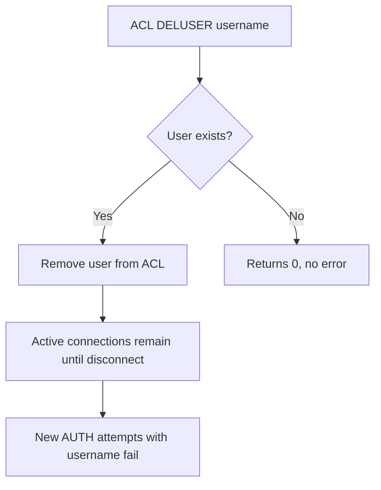
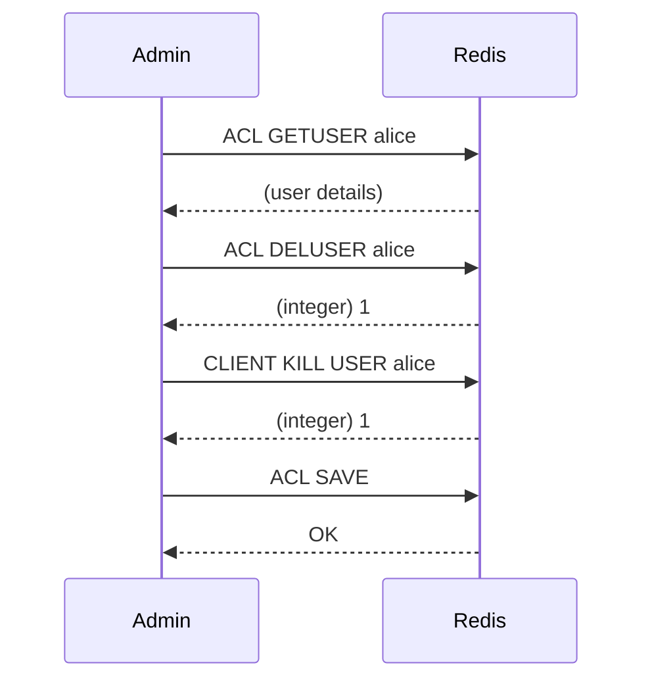

# How to Use ACL DELUSER in Redis to Remove Users

Author: [nawazdhandala](https://www.github.com/nawazdhandala)

Tags: Redis, ACL, Security, User Management, Authentication

Description: Learn how to use ACL DELUSER in Redis to permanently remove one or more users from the ACL system, including what happens to active connections from deleted users.

---

## Overview

`ACL DELUSER` removes one or more users from the Redis Access Control List. Once a user is deleted, any new authentication attempts using that username will fail. Existing connections authenticated as the deleted user are not immediately terminated but lose their session when they reconnect or when the server processes the next command in some configurations.



## Syntax

```redis
ACL DELUSER username [username ...]
```

Returns the number of users actually removed. If a username does not exist, it is silently skipped and not counted.

## Basic Usage

### Remove a single user

```redis
ACL DELUSER alice
```

```text
(integer) 1
```

### Remove multiple users at once

```redis
ACL DELUSER alice bob carol
```

```text
(integer) 3
```

### Attempt to remove a user that does not exist

```redis
ACL DELUSER nonexistent
```

```text
(integer) 0
```

### Remove a mix of existing and non-existing users

```redis
ACL DELUSER alice nonexistent bob
```

```text
(integer) 2
```

Only `alice` and `bob` were removed; `nonexistent` was skipped.

## Verifying Deletion

After deleting a user, confirm they are gone with `ACL LIST` or `ACL GETUSER`:

```redis
ACL LIST
```

```text
1) "user default on nopass ~* &* +@all"
```

```redis
ACL GETUSER alice
```

```text
(nil)
```

## Important Notes

### The default user cannot be deleted

```redis
ACL DELUSER default
```

```text
(error) ERR The 'default' user cannot be removed
```

The `default` user is always present. You can disable it with `ACL SETUSER default off` but not delete it.

### Active connections are not immediately killed

Deleting a user does not close existing connections that were already authenticated. If you need to immediately terminate those connections, use `CLIENT KILL` after `ACL DELUSER`:

```redis
ACL DELUSER alice
CLIENT KILL USER alice
```

### Persisting the change

`ACL DELUSER` only modifies the in-memory ACL. To persist the deletion to the ACL file, run:

```redis
ACL SAVE
```

Or reload the file (which discards the deleted user if the file does not contain them):

```redis
ACL LOAD
```

## Workflow Example

### Offboarding a user completely

```redis
# 1. Verify the user exists
ACL GETUSER alice

# 2. Delete the user
ACL DELUSER alice

# 3. Kill any active connections from alice
CLIENT KILL USER alice

# 4. Persist the change
ACL SAVE
```



## Summary

`ACL DELUSER` removes one or more users from the Redis ACL and returns the count of deleted users. The `default` user cannot be removed. Existing authenticated connections are not terminated automatically, so follow up with `CLIENT KILL USER` if immediate disconnection is required. Always call `ACL SAVE` after deleting users to persist the change to the ACL file, otherwise the deletion is lost on restart.
