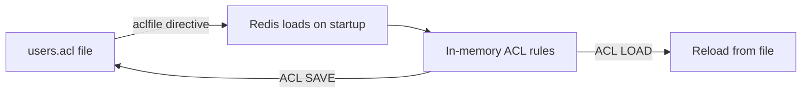
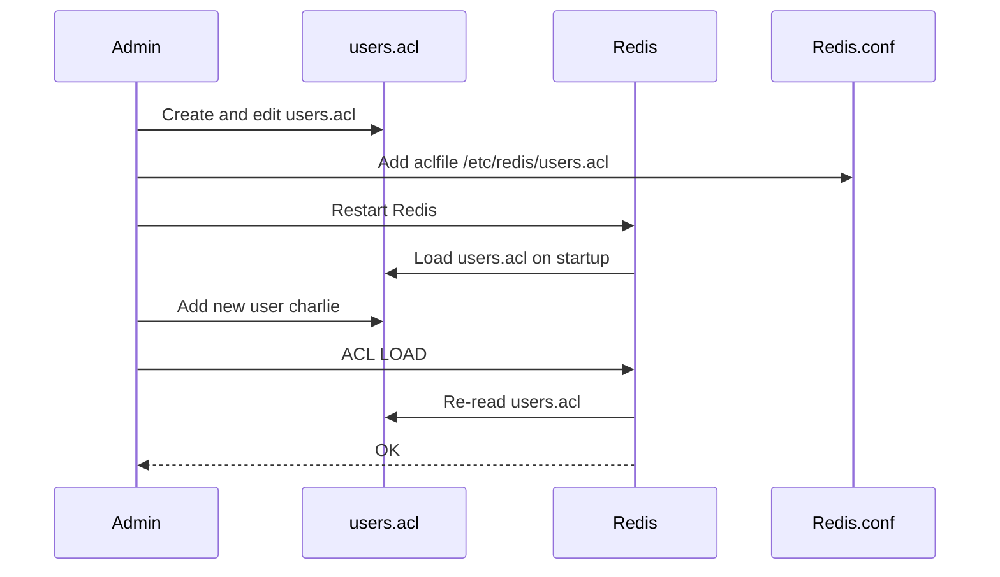

# How to Configure Redis ACL File for User Management

Author: [nawazdhandala](https://www.github.com/nawazdhandala)

Tags: Redis, ACL, Security, Configuration, User Management

Description: Learn how to configure a Redis ACL file to manage users and permissions externally, covering file format, hashed passwords, key patterns, and loading rules into Redis.

---

## Overview

The Redis ACL file is an external text file that defines users, passwords, key access patterns, and command permissions. Instead of managing users through `ACL SETUSER` commands or inline directives in `redis.conf`, an ACL file centralizes all user definitions in one place. It can be managed with standard text editors, version control systems, and configuration management tools.



## Configuring the ACL File Path

In `redis.conf`, add:

```text
aclfile /etc/redis/users.acl
```

Create the file with appropriate permissions:

```bash
sudo touch /etc/redis/users.acl
sudo chown redis:redis /etc/redis/users.acl
sudo chmod 640 /etc/redis/users.acl
```

## ACL File Format

Each line defines one user. The format matches `ACL SETUSER` syntax:

```text
user username [on|off] [nopass | >password | #passwordhash] [~keypattern] [&channelpattern] [+command | -command | +@category | -@category]
```

### A complete example file

```text
user default on nopass ~* &* +@all
user readonly on >readpass ~* +@read
user writer on >writepass ~data:* +@read +@write -@dangerous
user alice on >s3cr3t ~user:alice:* +@all
user monitoring on >monpass ~* +@read -@dangerous +info +ping +latency
user admin on >adminpass ~* &* +@all
```

## Password Options

### Plaintext password (not recommended in production)

```text
user alice on >plaintext_password ~* +@read
```

### SHA-256 hashed password (recommended)

Generate a hash:

```bash
echo -n "mypassword" | sha256sum
```

```text
89e01536ac207279409d4de1e5253e01ea85473516c7ddca3abe4b2b5f39a9b5  -
```

Use the hash in the ACL file with the `#` prefix:

```text
user alice on #89e01536ac207279409d4de1e5253e01ea85473516c7ddca3abe4b2b5f39a9b5 ~* +@read
```

### No password required

```text
user internal_service on nopass ~service:* +@all
```

## Key Patterns

Key patterns use glob-style matching:

```text
# Access to all keys
~*

# Access only to keys starting with "user:"
~user:*

# Access to keys matching "session:*" or "token:*"
~session:* ~token:*

# No key access
```

## Channel Patterns (Pub/Sub)

```text
# Allow all channels
&*

# Allow only channels starting with "events:"
&events:*

# No channel access (omit the & directive entirely)
```

## Command Permissions

```text
# Allow all commands
+@all

# Allow read and write but not dangerous
+@read +@write -@dangerous

# Allow specific commands
+get +set +del +exists

# Deny specific commands from a category
+@all -@admin -flushdb -flushall
```

## Disabling a User

```text
user alice off >password ~* +@read
```

The `off` flag disables the user without deleting them. Re-enable with `on`.

## Loading the ACL File

After editing the file, apply changes without restarting:

```redis
ACL LOAD
```

```text
OK
```

## Verifying Users After Load

```redis
ACL LIST
```

```text
1) "user default on nopass ~* &* +@all"
2) "user readonly on #... ~* -@all +@read"
3) "user writer on #... ~data:* +@read +@write -@dangerous"
```

```redis
ACL GETUSER alice
```

## Complete Setup Workflow



## Summary

The Redis ACL file centralizes user management in a versioned, auditable text file. Configure it with `aclfile /path/to/users.acl` in `redis.conf`. Each line defines a user with optional flags for enabled state, hashed passwords, key patterns, channel patterns, and command permissions. Use `ACL LOAD` to apply file changes at runtime without a restart, and `ACL SAVE` to write in-memory ACL changes back to the file. Store passwords as SHA-256 hashes using the `#hash` syntax for security.
