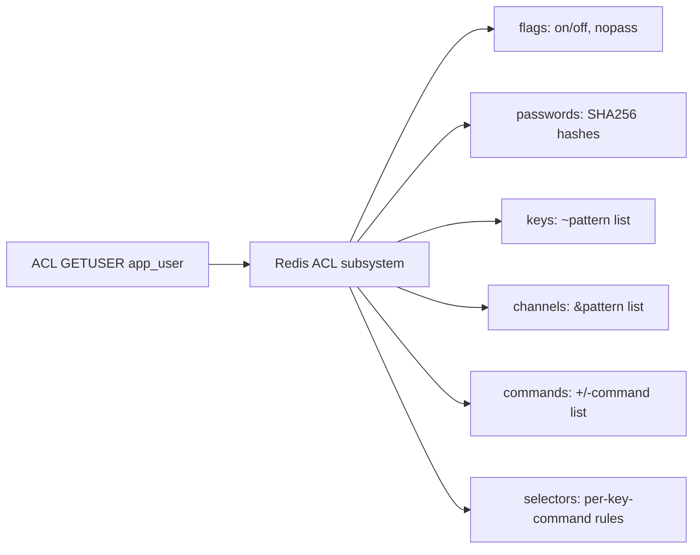
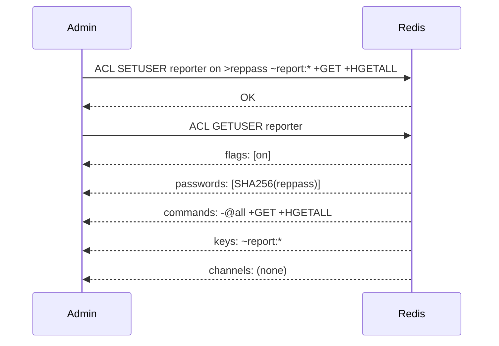
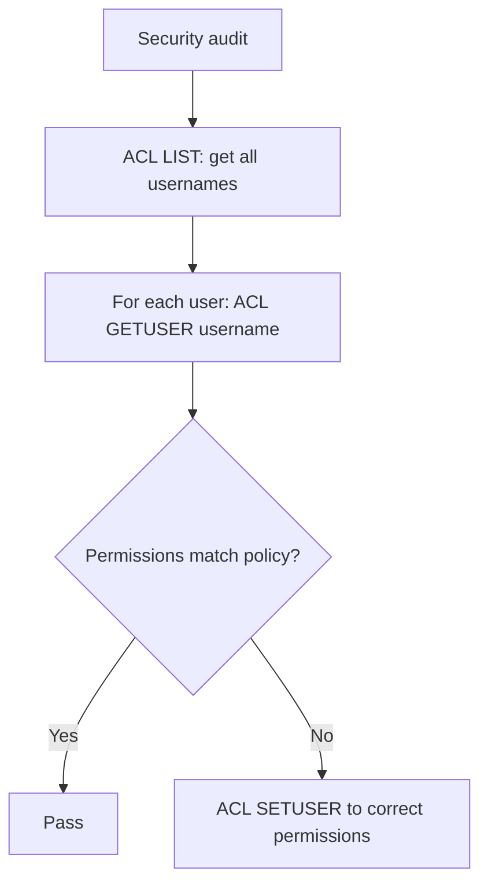

# How to Use ACL GETUSER in Redis to View User Permissions

Author: [nawazdhandala](https://www.github.com/nawazdhandala)

Tags: Redis, ACL GETUSER, ACL, Security, User Management

Description: Learn how to use ACL GETUSER in Redis to inspect a specific user's configuration including passwords, enabled state, key patterns, and command permissions.

---

## What is ACL GETUSER

ACL GETUSER returns the complete configuration of a named Redis user, including whether the user is active, the hashed passwords, allowed key patterns, allowed channel patterns, and the exact set of permitted commands.

```redis
ACL GETUSER username
```

The response is a map (array of field/value pairs in older Redis versions, a flat map in Redis 7.0+).



## Output Fields

A typical ACL GETUSER response:

```text
 1) "flags"
 2) 1) "on"
 3) "passwords"
 4) 1) "a665a45920422f9d417e4867efdc4fb8a04a1f3fff1fa07e998e86f7f7a27ae3"
 5) "commands"
 6) "-@all +GET +SET +DEL"
 7) "keys"
 8) "~cache:*"
 9) "channels"
10) "&*"
11) "selectors"
12) (empty array)
```

| Field | Description |
|---|---|
| `flags` | `on` or `off`, plus `nopass` if passwordless login is enabled |
| `passwords` | SHA256 hashes of all registered passwords |
| `commands` | Compact representation of allowed/denied commands |
| `keys` | Key patterns the user can access |
| `channels` | Pub/Sub channel patterns allowed |
| `selectors` | Per-command-set key restrictions (Redis 7.0+) |

## Basic Usage

### Inspect a user created with ACL SETUSER

```redis
ACL SETUSER app_user on >mypassword ~app:* +GET +SET +DEL
ACL GETUSER app_user
```

### Check whether a user is enabled

```redis
ACL GETUSER app_user
-- Look at flags field: ["on"] means enabled, ["off"] means disabled
```

### Verify password hashes

Passwords are stored as SHA256 hashes. You can verify a password by hashing it and comparing to the stored hash:

```redis
ACL GETUSER app_user
-- passwords: ["e3b0c44298fc1c149afbf4c8996fb92427ae41e4649b934ca495991b7852b855"]
```

```bash
# Verify a password matches
echo -n "mypassword" | sha256sum
```



## Interpreting the Commands Field

The `commands` field shows the effective permission set as a compact expression:

| Expression | Meaning |
|---|---|
| `-@all +GET +SET` | Deny everything, then allow GET and SET |
| `+@read -KEYS` | Allow all read commands except KEYS |
| `allcommands` | Allow all commands |
| `nocommands` | Deny all commands |

To understand what commands are actually allowed, use ACL WHOAMI from the user's connection, or use ACL LOG to see what was denied.

## Checking the Default User

The `default` user is the built-in user that unauthenticated clients connect as:

```redis
ACL GETUSER default
-- Shows the permissions for unauthenticated connections
-- In secure deployments, this user should have nopass disabled and restrictive permissions
```

## Auditing User Access

ACL GETUSER is the primary tool for auditing individual user permissions. Use it regularly to verify that users have only the access they need:

```redis
-- Audit each service account
ACL GETUSER api_service
ACL GETUSER background_worker
ACL GETUSER read_replica_monitor
```



## User Does Not Exist

```redis
ACL GETUSER nonexistent
-- Returns: (nil)
```

A nil response means the user was never created. Use ACL LIST to see all existing users.

## Selectors (Redis 7.0+)

Selectors allow different key patterns for different command sets within the same user. ACL GETUSER shows selectors in a nested structure:

```redis
ACL SETUSER selective_user on >pass (~cache:* +GET) (~data:* +GET +SET)
ACL GETUSER selective_user
-- selectors:
--   1) keys: ~cache:*  commands: +GET
--   2) keys: ~data:*   commands: +GET +SET
```

## Summary

ACL GETUSER returns the complete access configuration for a named Redis user, including their enabled state, hashed passwords, permitted commands, key patterns, and Pub/Sub channel patterns. It is the essential tool for verifying user permissions after creation or modification with ACL SETUSER. Use it as part of regular security audits to confirm that service accounts have only the access they require.
