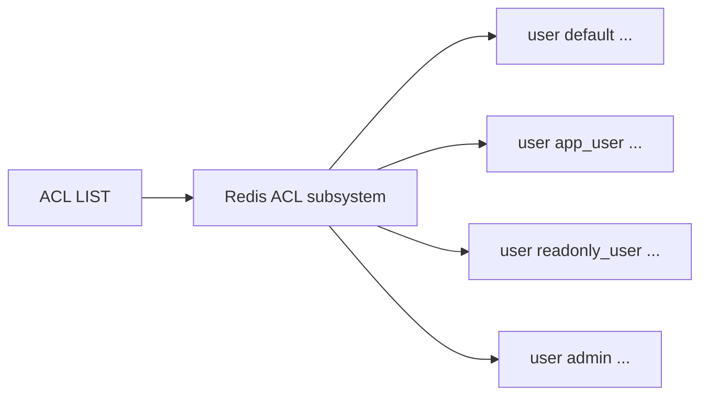
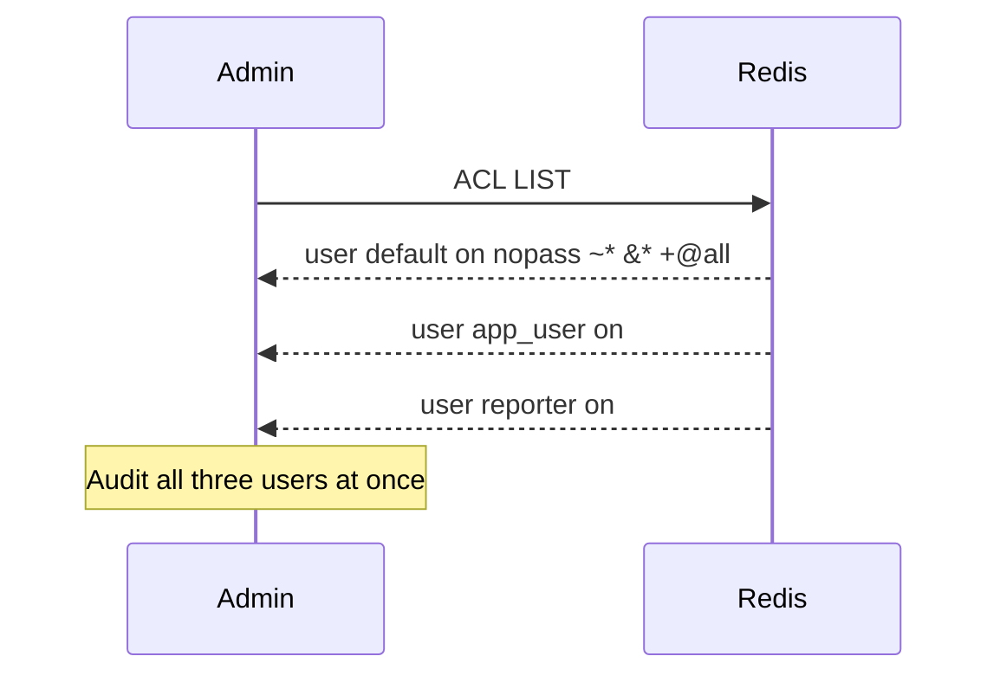

# How to Use ACL LIST in Redis to View All ACL Rules

Author: [nawazdhandala](https://www.github.com/nawazdhandala)

Tags: Redis, ACL LIST, ACL, Security, User management

Description: Learn how to use ACL LIST in Redis to retrieve all user access control rules in a human-readable format for auditing and configuration management.

---

## What is ACL LIST

ACL LIST returns all users defined in the Redis ACL system, each represented as a single-line rule string in the same format used by the ACL configuration file. This makes it straightforward to audit all users at once, export the current configuration, or compare it against a desired state.

```redis
ACL LIST
```

ACL LIST takes no arguments. It always returns the full list of users.



## Output Format

Each entry in the ACL LIST output is a string in the format:

```text
user <name> <flags> <passwords> <keys> <channels> <commands>
```

Example output:

```text
1) "user default on nopass ~* &* +@all"
2) "user app_user on #a665a45920422f9d417e4867efdc4fb8... ~app:* &* -@all +GET +SET +DEL"
3) "user readonly on #3d7c6b5... ~cache:* resetchannels -@all +@read"
4) "user monitor off nopass ~* &* -@all +INFO +CLIENT"
```

### Reading a rule line

```text
user readonly on #3d7c6b5a... ~cache:* resetchannels -@all +@read
  |       |   |  |              |           |            |       |
  |       |   |  |              |           |            |       +-- Allow @read category
  |       |   |  |              |           |            +---------- Deny all commands first
  |       |   |  |              |           +----------------------- Remove all channel access
  |       |   |  |              +----------------------------------- Key pattern: cache:*
  |       |   |  +-------------------------------------------------- Password hash (SHA256, prefixed with #)
  |       |   +----------------------------------------------------- Enabled
  |       +--------------------------------------------------------- Username
  +----------------------------------------------------------------- Keyword
```

## Basic Usage

### List all users

```redis
ACL LIST
```

### Check the default user's permissions

The `default` user is always present and represents unauthenticated connections:

```redis
ACL LIST
-- Look for: user default on nopass ~* &* +@all
-- A permissive default user is a security risk in production
```

### Count total users

```redis
-- From redis-cli
redis-cli ACL LIST | wc -l
```



## Exporting ACL Configuration

ACL LIST output can be saved and replayed to recreate the same user setup:

```bash
# Export current ACLs
redis-cli ACL LIST > acl_backup.txt

# The output contains lines like:
# user app_user on #hash... ~app:* &* -@all +GET +SET

# These lines can be pasted directly into an aclfile or used with ACL SETUSER
```

## Comparing with a Desired State

In automated deployments, ACL LIST is useful for detecting configuration drift:

```bash
# Generate current state
redis-cli ACL LIST | sort > current_acl.txt

# Compare with expected state
diff expected_acl.txt current_acl.txt
```

## ACL LIST vs ACL GETUSER

| Command | Scope | Format | Best for |
|---|---|---|---|
| `ACL LIST` | All users | One-line rule strings | Bulk audit, export, diff |
| `ACL GETUSER username` | One user | Structured map | Deep inspection of a single user |

```redis
-- Get all users at once
ACL LIST

-- Inspect one user in detail
ACL GETUSER app_user
```

## ACL USERS vs ACL LIST

`ACL USERS` returns only the usernames without any permission details:

```redis
ACL USERS
-- Returns: ["default", "app_user", "readonly", "monitor"]

ACL LIST
-- Returns full rule strings for all users
```

Use ACL USERS when you just need the list of names. Use ACL LIST when you need the full permissions.

## Securing the Default User

A common security hardening step visible via ACL LIST is locking down the default user:

```redis
-- Before hardening
ACL LIST
-- user default on nopass ~* &* +@all  (dangerous!)

-- Disable nopass and restrict
ACL SETUSER default on >strongpassword ~* &* +@all

-- After hardening
ACL LIST
-- user default on #hash... ~* &* +@all
```

Or disable unauthenticated access entirely:

```redis
ACL SETUSER default off
```

## Summary

ACL LIST returns all Redis users and their complete permission rules as human-readable configuration strings. It is the fastest way to audit the full ACL state of a Redis instance, export the current configuration, or detect drift from a desired state. Combine it with ACL GETUSER for detailed inspection of individual users and with ACL SETUSER to make corrections.
