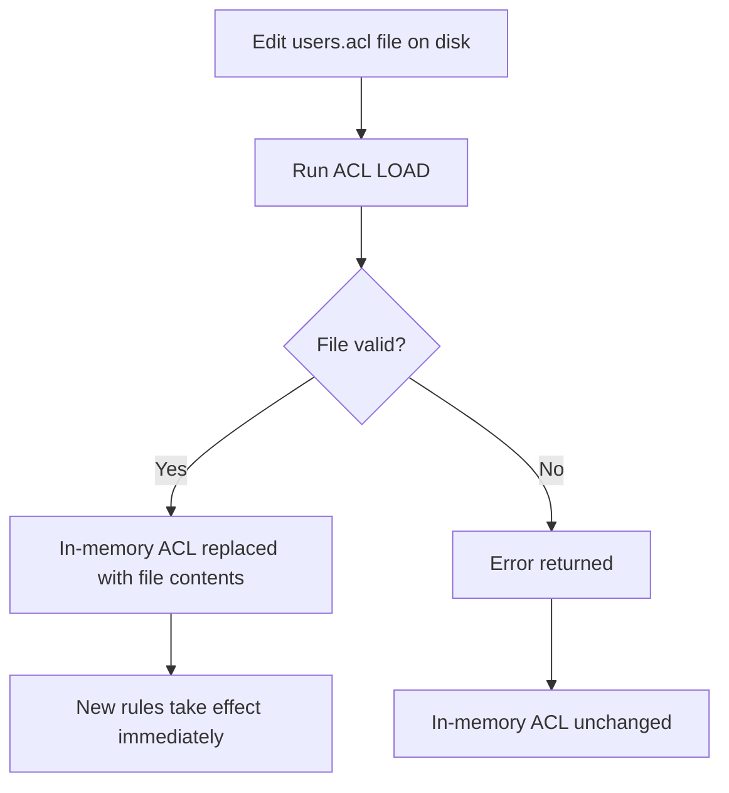
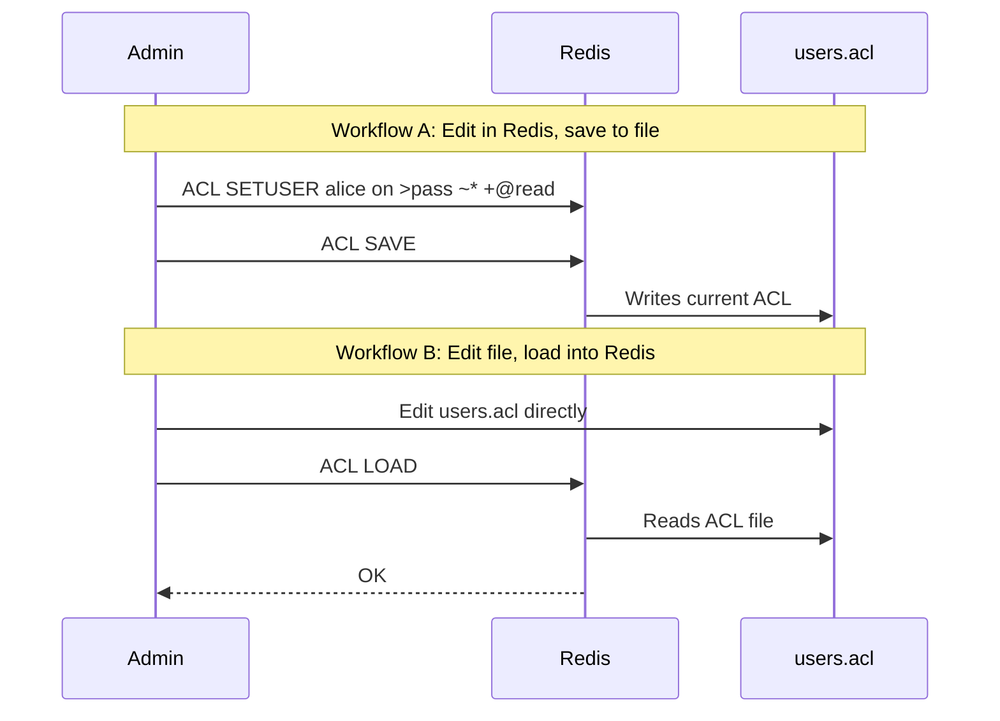

# How to Use ACL LOAD in Redis to Reload ACL Rules

Author: [nawazdhandala](https://www.github.com/nawazdhandala)

Tags: Redis, ACL, Security, Configuration, User Management

Description: Learn how to use ACL LOAD in Redis to reload ACL rules from the ACL file on disk, replacing in-memory rules and enabling live ACL updates without a server restart.

---

## Overview

`ACL LOAD` reads the ACL file configured via `aclfile` in `redis.conf` and replaces the current in-memory ACL rules with the contents of that file. This allows you to update ACL rules by editing the file directly and then applying them live without restarting Redis. If the ACL file has syntax errors, `ACL LOAD` aborts without modifying the in-memory rules.



## Prerequisites

`ACL LOAD` requires that `aclfile` is configured in `redis.conf`:

```text
aclfile /etc/redis/users.acl
```

## Syntax

```redis
ACL LOAD
```

Returns `OK` on success. Returns an error if the file is missing, unreadable, or contains syntax errors.

## Basic Usage

### Reload after editing the ACL file

```bash
# Edit the ACL file directly
cat /etc/redis/users.acl
```

```text
user default on nopass ~* &* +@all
user alice on #8a9bcdef1234... ~cache:* +@read
user bob on #abcdef5678... ~app:* +@read +@write
```

```bash
# Add a new user to the file
echo "user charlie on #deadbeef... ~reports:* +@read" >> /etc/redis/users.acl
```

```redis
# Apply the changes
ACL LOAD
```

```text
OK
```

```redis
# Verify the new user exists
ACL GETUSER charlie
```

### Discard in-memory changes and revert to file

If you have made experimental ACL changes in memory that you want to discard:

```redis
# Revert in-memory ACL to what is on disk
ACL LOAD
```

## Error Handling

### File not found or unreadable

```redis
ACL LOAD
```

```text
(error) ERR /etc/redis/users.acl: No such file or directory
```

### Syntax error in ACL file

```text
(error) ERR /etc/redis/users.acl:3: Unrecognized option 'badoption'
```

The in-memory ACL is not modified when an error occurs, so the server continues running with the previous rules.

## ACL File Format

The ACL file follows the same format as inline ACL directives in `redis.conf`:

```text
user username [on|off] [>password] [~keypattern] [+command|-command] [+@category|-@category]
```

Example file:

```text
user default on nopass ~* &* +@all
user readonly on >readpass ~* +@read
user writer on >writepass ~data:* +@read +@write -@dangerous
user admin on >adminpass ~* +@all
```

## Relationship with ACL SAVE

`ACL LOAD` and `ACL SAVE` work in opposite directions:



Use `ACL SAVE` when you manage ACLs through Redis commands. Use `ACL LOAD` when you manage ACLs by editing the file directly (for example, with configuration management tools like Ansible or Chef).

## Automation Example

Using `ACL LOAD` in a deployment pipeline:

```bash
#!/bin/bash
# Deploy updated ACL file and reload

ACL_FILE=/etc/redis/users.acl
REDIS_CLI="redis-cli -a adminpassword"

# Validate ACL file syntax before deploying
$REDIS_CLI --pipe-mode < /dev/null

# Copy the new ACL file
cp /deploy/users.acl $ACL_FILE

# Reload into Redis
$REDIS_CLI ACL LOAD

# Verify
$REDIS_CLI ACL LIST
```

## Summary

`ACL LOAD` reloads ACL rules from the configured `aclfile` into Redis memory, replacing any in-memory changes. It is the counterpart to `ACL SAVE` and is particularly useful when managing ACL files with external tools or configuration management systems. The operation is atomic: if the file contains errors, the in-memory ACL remains unchanged. Always validate the ACL file before calling `ACL LOAD` in production deployments.
