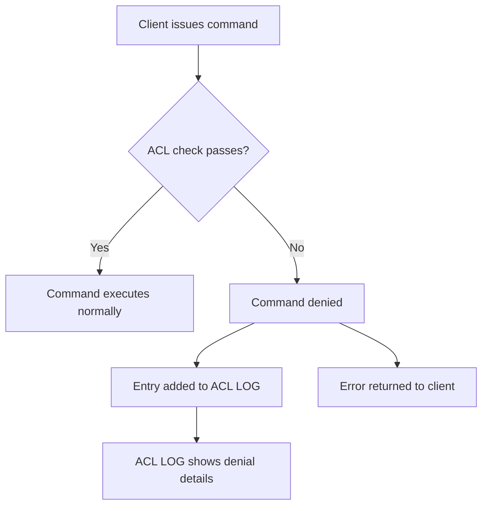
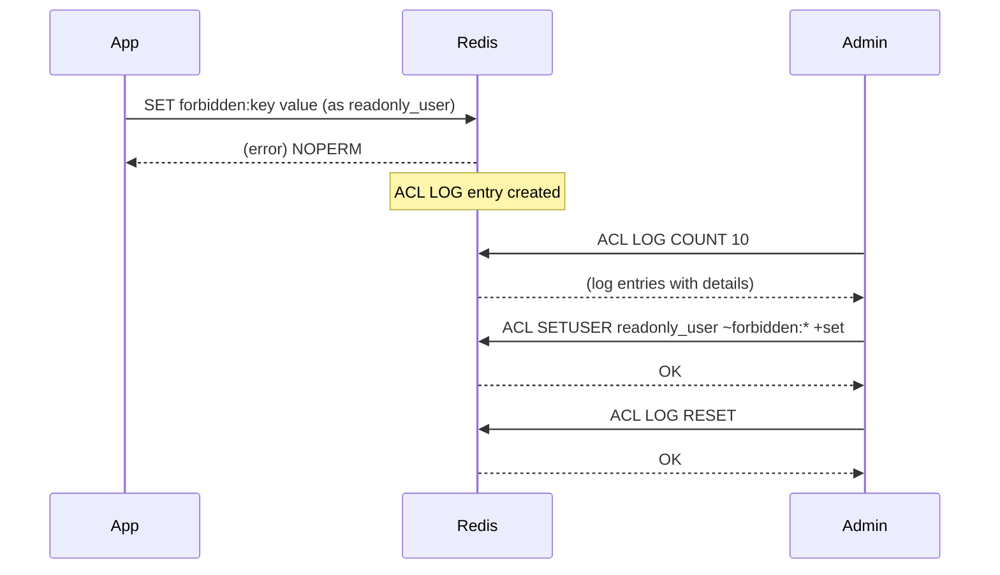

# How to Use ACL LOG in Redis to Monitor Command Denials

Author: [nawazdhandala](https://www.github.com/nawazdhandala)

Tags: Redis, ACL, Security, Monitoring, Logging

Description: Learn how to use ACL LOG in Redis to view a record of recently denied commands, helping you audit security violations and debug ACL rule misconfigurations.

---

## Overview

`ACL LOG` maintains an in-memory log of commands that were denied due to ACL restrictions. Each entry records the username, the client address, the denied command, the key that triggered the denial, and a timestamp. This log is invaluable for security auditing and for debugging ACL rules that are too restrictive or incorrectly configured.



## Syntax

```redis
ACL LOG [COUNT count | RESET]
```

- No arguments: returns all recent log entries (up to `acllog-max-len`)
- `COUNT count`: returns the most recent `count` entries
- `RESET`: clears the log

## Reading the Log

### View all log entries

```redis
ACL LOG
```

```text
1)  1) "count"
    2) (integer) 3
    3) "reason"
    4) "command"
    5) "context"
    6) "toplevel"
    7) "object"
    8) "set"
    9) "username"
   10) "readonly_user"
   11) "age-seconds"
   12) "4.256"
   13) "client-info"
   14) "id=12 addr=127.0.0.1:54321 laddr=127.0.0.1:6379 fd=8 name= age=12 ..."
   15) "entry-id"
   16) (integer) 1
   17) "timestamp-created"
   18) (integer) 1711900000
   19) "timestamp-last-updated"
   20) (integer) 1711900015
```

Each entry contains:

| Field | Meaning |
|-------|---------|
| `count` | How many times this denial occurred (entries are deduplicated) |
| `reason` | `command`, `key`, `channel`, or `auth` |
| `context` | `toplevel`, `multi`, `lua`, or `module` |
| `object` | The command or key name that was denied |
| `username` | The user who attempted the command |
| `age-seconds` | Seconds since the denial occurred |
| `client-info` | Connection details of the offending client |

### View only the most recent 5 entries

```redis
ACL LOG COUNT 5
```

### Clear the log

```redis
ACL LOG RESET
```

```text
OK
```

## Denial Reasons

`ACL LOG` entries have one of four reasons:

### `command` - the command itself is not permitted

```redis
# Logged as: reason=command, object=set
ACL SETUSER readonly_user on >pass ~* +@read
AUTH readonly_user pass
SET blocked:key value
```

```text
(error) NOPERM this user has no permissions to run the 'set' command
```

### `key` - the command is allowed but the key is not

```redis
# Logged as: reason=key, object=secret:key
ACL SETUSER limited_user on >pass ~cache:* +@all
AUTH limited_user pass
GET secret:key
```

```text
(error) NOPERM No permissions to access a key
```

### `channel` - Pub/Sub channel is not permitted

```redis
# Logged as: reason=channel, object=private:channel
SUBSCRIBE private:channel
```

```text
(error) NOPERM No permissions to access a channel
```

### `auth` - authentication failed

```redis
AUTH nonexistent wrongpassword
```

```text
(error) WRONGPASS invalid username-password pair or user is disabled.
```

Auth failures are also logged with `reason=auth`.

## Configuring Log Size

The maximum number of log entries is controlled by `acllog-max-len` in `redis.conf`:

```text
acllog-max-len 128
```

The default is 128. Entries are deduplicated by username, command, and key -- so repeated identical violations increment the `count` field rather than adding new entries.

## Monitoring Workflow



## Summary

`ACL LOG` provides an in-memory record of recently denied commands with details on the username, command, key, denial reason, and client address. Use `ACL LOG` to audit access violations, debug over-restrictive ACL rules, and investigate suspicious activity. Use `ACL LOG COUNT n` to limit results and `ACL LOG RESET` to clear the log after resolving issues. Configure `acllog-max-len` in `redis.conf` to control how many entries are retained.
