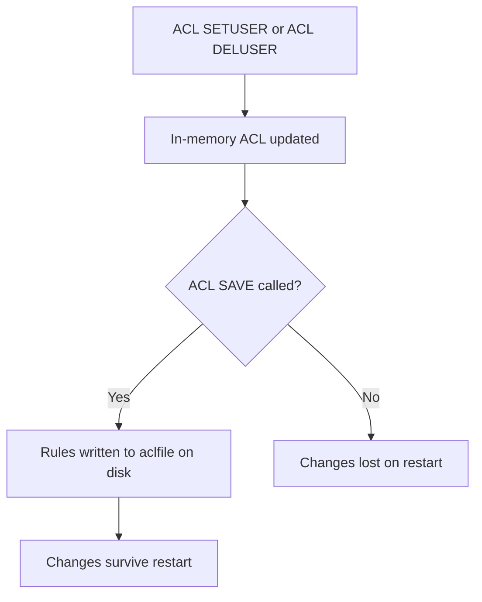
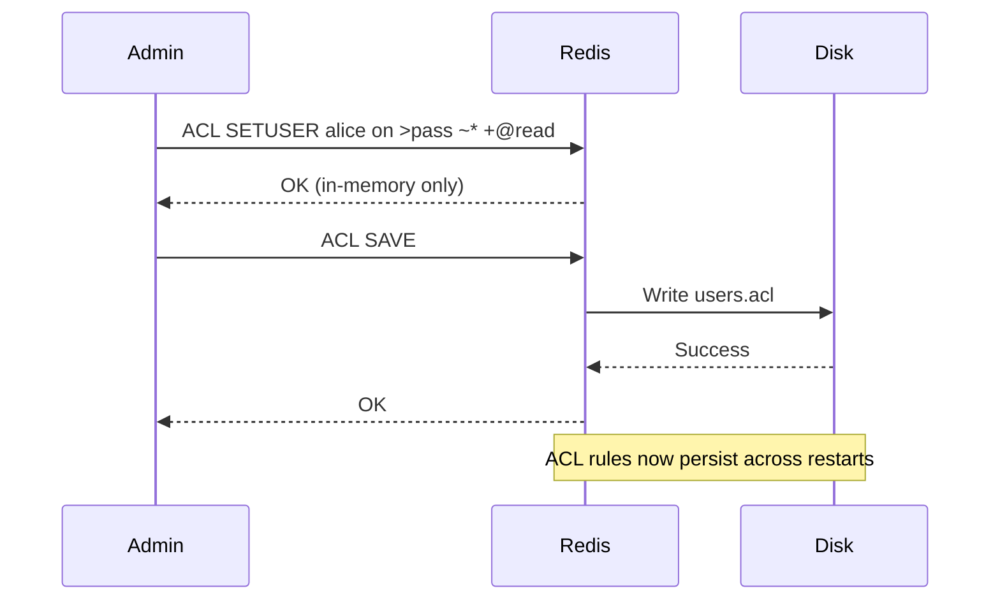

# How to Use ACL SAVE in Redis to Persist ACL Rules

Author: [nawazdhandala](https://www.github.com/nawazdhandala)

Tags: Redis, ACL, Security, Persistence, Configuration

Description: Learn how to use ACL SAVE in Redis to write the current in-memory ACL rules to the configured ACL file, ensuring user permissions survive server restarts.

---

## Overview

ACL rules created or modified with `ACL SETUSER` and `ACL DELUSER` exist only in memory until explicitly persisted. `ACL SAVE` writes the current state of all ACL rules to the file specified by the `aclfile` directive in `redis.conf`. Without calling `ACL SAVE`, any ACL changes are lost when the server restarts.



## Prerequisites

`ACL SAVE` requires that `aclfile` is configured in `redis.conf`. Without it, the command returns an error.

### Configure the ACL file path

In `redis.conf`:

```text
aclfile /etc/redis/users.acl
```

Then restart Redis or reload the configuration.

## Syntax

```redis
ACL SAVE
```

Returns `OK` on success.

## Basic Usage

### Persist ACL rules after making changes

```redis
# Create a new user
ACL SETUSER alice on >s3cr3t ~cache:* +@read

# Verify user was created
ACL LIST

# Save to disk
ACL SAVE
```

```text
OK
```

### Persist after deleting a user

```redis
ACL DELUSER old_service
ACL SAVE
```

```text
OK
```

## What ACL SAVE Writes

The ACL file format uses one rule per line:

```text
user default on nopass ~* &* +@all
user alice on #8a9bcdef... ~cache:* -@all +@read
user app_service on #1a2b3c4d... ~app:* +@write +@read -@admin
```

Passwords are stored as SHA-256 hashes, not plaintext.

## Error Conditions

### No ACL file configured

```redis
ACL SAVE
```

```text
(error) ERR This Redis instance is not configured to use an ACL file. You may want to specify users via the ACL SETUSER command and then issue a CONFIG REWRITE (assuming the server was started with a configuration file) in order to make the temporary ACLs permanent.
```

If you are not using an ACL file, use `CONFIG REWRITE` to persist inline ACL rules in `redis.conf` instead.

### File permission error

If Redis does not have write permission to the ACL file path, the save will fail with an I/O error.

## Relationship with ACL LOAD

`ACL SAVE` and `ACL LOAD` are complementary:

| Command | Direction | Use Case |
|---------|-----------|----------|
| `ACL SAVE` | Memory to disk | Save in-memory changes to the ACL file |
| `ACL LOAD` | Disk to memory | Reload the ACL file, discarding in-memory changes |



## Operational Best Practices

Always call `ACL SAVE` immediately after any ACL modification in production:

```redis
ACL SETUSER new_service on >strongpassword ~service:* +@read +@write
ACL SAVE
```

For scripted ACL management, verify success:

```bash
redis-cli ACL SETUSER deploy_user on >deploypass ~deploy:* +@all
redis-cli ACL SAVE
redis-cli ACL LIST
```

## Summary

`ACL SAVE` writes the current in-memory ACL rules to the file specified by `aclfile` in `redis.conf`. It must be called explicitly after every `ACL SETUSER` or `ACL DELUSER` to make changes persistent across restarts. If no `aclfile` is configured, the command returns an error. Always pair ACL modifications with `ACL SAVE` in production workflows to prevent accidental loss of access control configuration.
