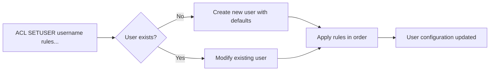
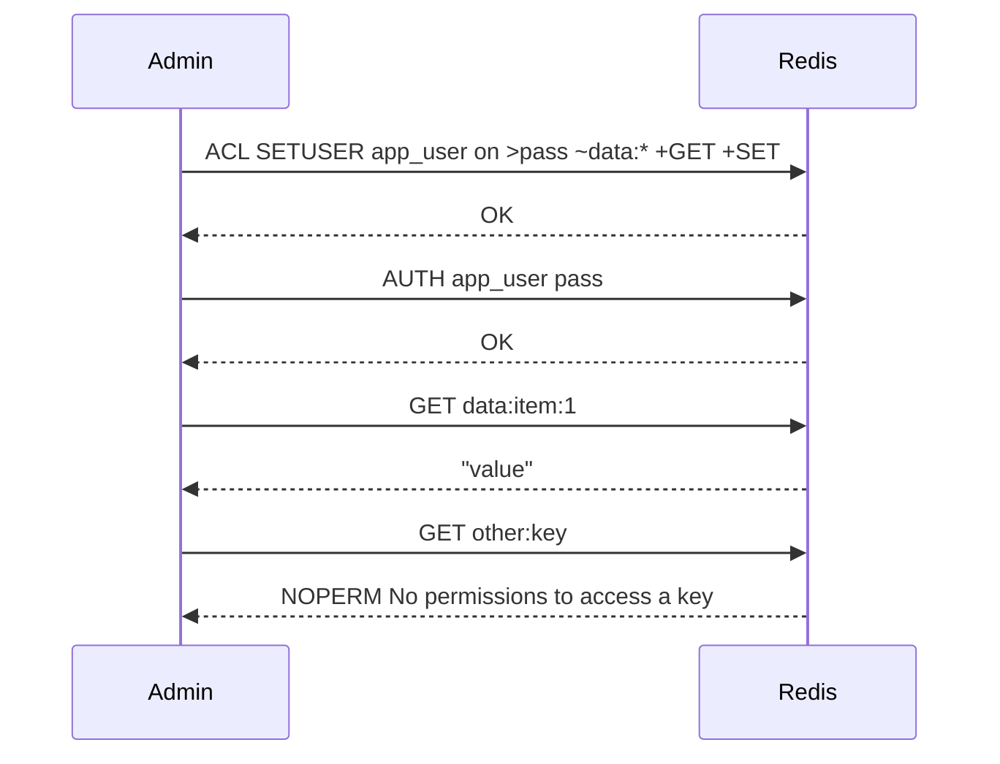

# How to Use ACL SETUSER in Redis to Create and Configure Users

Author: [nawazdhandala](https://www.github.com/nawazdhandala)

Tags: Redis, ACL SETUSER, ACL, Security, Authentication

Description: Learn how to use ACL SETUSER in Redis to create users, set passwords, grant command permissions, and restrict key and channel access.

---

## What is ACL SETUSER

ACL SETUSER creates a new Redis user or modifies an existing one. It accepts a series of rules that control the user's state, passwords, allowed commands, key patterns, and Pub/Sub channel patterns.

```redis
ACL SETUSER username [rules ...]
```

If the username does not exist, it is created with default settings (disabled, no password, no permissions). Rules are applied left to right, so later rules override earlier ones.



## Rule Syntax Reference

| Rule | Meaning |
|---|---|
| `on` | Enable the user (allow login) |
| `off` | Disable the user |
| `>password` | Add a password (hashed) |
| `<password` | Remove a password |
| `nopass` | Allow login without a password |
| `resetpass` | Remove all passwords |
| `~pattern` | Allow access to keys matching glob pattern |
| `%R~pattern` | Read-only key pattern (Redis 7.0+) |
| `%W~pattern` | Write-only key pattern (Redis 7.0+) |
| `allkeys` | Allow access to all keys |
| `resetkeys` | Remove all key patterns |
| `+command` | Allow a specific command |
| `-command` | Deny a specific command |
| `+@category` | Allow all commands in a category |
| `-@category` | Deny all commands in a category |
| `allcommands` | Allow all commands |
| `nocommands` | Deny all commands |
| `&pattern` | Allow Pub/Sub channels matching pattern |
| `allchannels` | Allow all Pub/Sub channels |
| `resetchannels` | Remove all channel patterns |
| `reset` | Reset all rules to defaults |

## Creating a New User

### Create a read-only user for a specific key namespace

```redis
ACL SETUSER readonly_user on >securepass ~cache:* +@read
```

This creates a user that:
- Is enabled (`on`)
- Has password `securepass`
- Can only access keys matching `cache:*`
- Can run all read commands (`+@read`)

### Create an application user with specific command access

```redis
ACL SETUSER app_user on >apppassword123 ~app:* +GET +SET +DEL +EXPIRE +TTL
```

### Create an admin user with full access

```redis
ACL SETUSER admin on >adminpass allkeys allcommands allchannels
```

### Create a read-only replica monitoring user

```redis
ACL SETUSER monitor on >monpass allkeys +INFO +MONITOR +CLIENT +COMMAND nocommands +INFO +MONITOR
```

## Modifying an Existing User

Rules accumulate. Calling ACL SETUSER on an existing user adds to or modifies its current configuration:

```redis
-- Start with basic access
ACL SETUSER webservice on >pass1 ~web:* +GET

-- Later, add write access to a new prefix
ACL SETUSER webservice ~session:* +SET +DEL

-- The user now has access to both web:* and session:* keys
```

### Reset and reconfigure

```redis
-- Reset all rules first, then set fresh configuration
ACL SETUSER webservice reset on >newpassword ~web:* +@read +SET
```



## Key Pattern Access Control

### Restrict to a single key

```redis
ACL SETUSER limited_user on >pass ~config:app +GET
```

### Allow multiple patterns

```redis
ACL SETUSER multi_user on >pass ~user:* ~session:* +GET +SET +DEL
```

### Read-write split (Redis 7.0+)

```redis
-- Read from all keys, write only to cache:*
ACL SETUSER split_user on >pass %R~* %W~cache:* +@read +SET
```

## Command Categories

Redis groups commands into categories for easier permission management:

```redis
-- Common categories
+@read      -- GET, HGET, LRANGE, SMEMBERS, etc.
+@write     -- SET, HSET, LPUSH, SADD, etc.
+@string    -- All string commands
+@hash      -- All hash commands
+@list      -- All list commands
+@set       -- All set commands
+@sortedset -- All sorted set commands
+@stream    -- All stream commands
+@pubsub    -- All Pub/Sub commands
+@admin     -- Administrative commands (INFO, CONFIG, etc.)
+@dangerous -- Commands that can affect server state
```

### View all available categories

```redis
ACL CAT
```

### View commands in a category

```redis
ACL CAT read
```

## Pub/Sub Channel Access

```redis
-- Allow access to specific channels
ACL SETUSER pubsub_user on >pass allkeys +SUBSCRIBE +PUBLISH &notifications:* &alerts:*

-- Allow all channels
ACL SETUSER full_pubsub on >pass allkeys +SUBSCRIBE +PUBLISH allchannels
```

## Summary

ACL SETUSER creates or modifies a Redis user with granular controls over authentication, command access, key patterns, and Pub/Sub channels. Rules are applied left to right, making it easy to build up complex permission sets incrementally. Use categories like `+@read` and `+@write` for broad permissions, and specific command names for fine-grained control. Always verify the result with ACL GETUSER after configuration.
