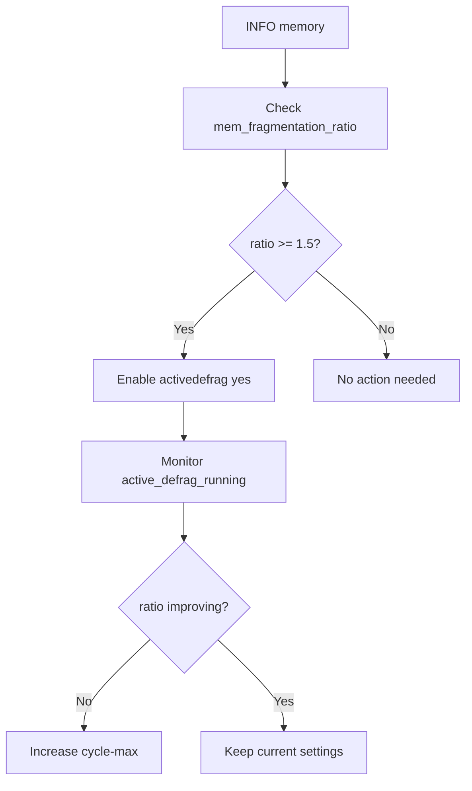

# How to Enable Redis Active Defragmentation

Author: [nawazdhandala](https://www.github.com/nawazdhandala)

Tags: Redis, Defragmentation, Memory, Performance, Configuration

Description: Learn how to enable and tune Redis active defragmentation to reduce memory fragmentation and recover wasted memory without restarting the server.

---

## Introduction

Memory fragmentation occurs when Redis allocates and frees many small objects over time. The allocator (jemalloc) retains freed memory in its own pool, and fragmentation causes `used_memory_rss` (RSS, as seen by the OS) to be significantly larger than `used_memory` (what Redis actually uses for data). Active defragmentation (activedefrag) compacts live data to reclaim this wasted memory without a restart.

## What is Memory Fragmentation?

```mermaid
flowchart TD
    subgraph Without Defrag
        U1["Used: 200MB"]
        F1["Fragmented: 100MB (wasted)"]
        R1["RSS = 300MB"]
    end
    subgraph After Defrag
        U2["Used: 200MB"]
        F2["Fragmented: ~5MB"]
        R2["RSS ~= 205MB"]
    end
    Without Defrag --> After Defrag
```

## Enabling Active Defragmentation

In `redis.conf` (requires Redis 4.0+ compiled with jemalloc):

```redis
activedefrag yes
```

At runtime:

```redis
CONFIG SET activedefrag yes
CONFIG GET activedefrag
# 1) "activedefrag"
# 2) "yes"
```

## Tuning Parameters

```redis
# Start defragmentation when fragmentation ratio exceeds this
active-defrag-ignore-bytes 100mb   # min bytes of fragmentation before starting
active-defrag-threshold-lower 10   # fragmentation % to start defrag (10%)
active-defrag-threshold-upper 100  # fragmentation % to use max CPU effort (100%)

# CPU effort limits (% of main thread time)
active-defrag-cycle-min 1          # minimum CPU % for defrag
active-defrag-cycle-max 25         # maximum CPU % for defrag

# Max number of set/hash/list/zset fields moved per cycle
active-defrag-max-scan-fields 1000
```

### Conservative (minimal impact)

```redis
active-defrag-ignore-bytes 200mb
active-defrag-threshold-lower 15
active-defrag-threshold-upper 50
active-defrag-cycle-min 1
active-defrag-cycle-max 10
```

### Aggressive (faster recovery)

```redis
active-defrag-ignore-bytes 50mb
active-defrag-threshold-lower 5
active-defrag-threshold-upper 75
active-defrag-cycle-min 5
active-defrag-cycle-max 50
```

## Checking Fragmentation Ratio

```redis
INFO memory
# used_memory:209715200          (200MB - data Redis uses)
# used_memory_rss:314572800      (300MB - as seen by OS)
# mem_fragmentation_ratio:1.50   (1.5 = 50% fragmentation)
# mem_fragmentation_bytes:104857600
# active_defrag_running:0
# active_defrag_hits:0
# active_defrag_misses:0
# active_defrag_key_hits:0
# active_defrag_key_misses:0
```

A `mem_fragmentation_ratio` above 1.5 is a strong signal to enable defragmentation.

## Fragmentation Threshold Decision



## Monitoring Defragmentation Progress

```redis
INFO memory
# active_defrag_running:1         (defrag is active)
# active_defrag_hits:15230        (successful reallocations)
# active_defrag_misses:120        (skipped allocations)
# active_defrag_key_hits:3200     (keys with defragmented values)
# active_defrag_key_misses:50
```

After defragmentation completes:

```redis
INFO memory
# mem_fragmentation_ratio:1.05   (reduced from 1.50)
# active_defrag_running:0
```

## Prerequisites

Active defragmentation requires Redis to be compiled with jemalloc. Verify:

```redis
INFO memory
# mem_allocator:jemalloc-5.3.0
```

If the allocator is `libc` or `tcmalloc`, active defrag is not supported.

## Summary

Redis active defragmentation continuously compacts live data to reduce memory fragmentation without restarting the server. Enable it with `activedefrag yes` and tune the CPU effort via `active-defrag-cycle-min` and `active-defrag-cycle-max`. Monitor progress with `INFO memory`, checking `mem_fragmentation_ratio` and `active_defrag_running`. This feature requires jemalloc and is most impactful when fragmentation exceeds 1.5.
