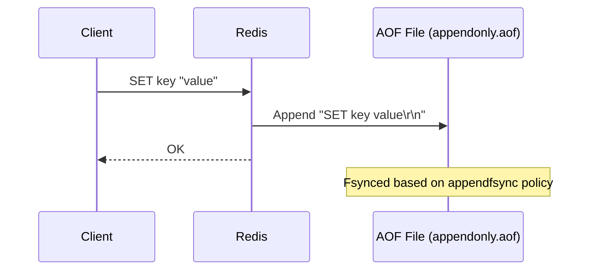
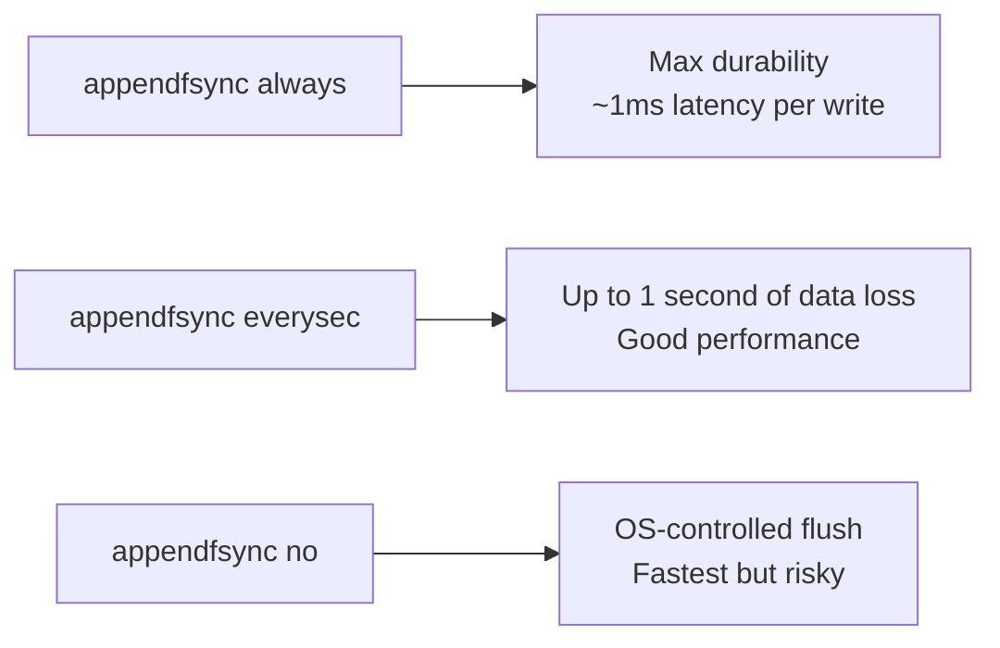
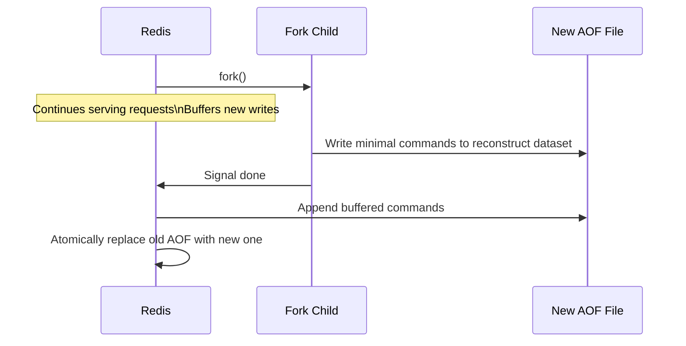

# How to Configure Redis AOF Persistence

Author: [nawazdhandala](https://www.github.com/nawazdhandala)

Tags: Redis, AOF, Persistence, Durability, Configuration

Description: Learn how to configure Redis Append-Only File persistence, including fsync policies, AOF rewrite settings, and how to combine AOF with RDB for maximum durability.

---

## Introduction

The Append-Only File (AOF) is Redis's write-ahead log. Every write command is appended to the AOF file. On restart, Redis replays the log to reconstruct the dataset. AOF provides stronger durability guarantees than RDB snapshots because it can be configured to fsync on every write.

## How AOF Works



## Enabling AOF

In `redis.conf`:

```redis
appendonly yes
appendfilename "appendonly.aof"
dir /var/lib/redis
```

Or at runtime (applies until next restart unless also set in config):

```redis
CONFIG SET appendonly yes
```

## AOF fsync Policies

The `appendfsync` directive controls how often Redis calls `fsync()` to flush the AOF buffer to disk:

```redis
# fsync on every write - strongest durability, highest latency
appendfsync always

# fsync every second - good balance (default)
appendfsync everysec

# Never fsync - OS decides, fastest but least safe
appendfsync no
```

### Durability vs Performance Tradeoff



## AOF Rewrite

Over time the AOF grows as it records every command. AOF rewrite compacts it by replacing the history with the minimal set of commands needed to reconstruct the current dataset.

### Automatic rewrite configuration

```redis
# Rewrite when AOF is 100% larger than last rewrite
auto-aof-rewrite-percentage 100

# Only rewrite if AOF is at least 64 MB
auto-aof-rewrite-min-size 64mb
```

### Manual rewrite trigger

```redis
BGREWRITEAOF
# Background append only file rewriting started
```

## AOF Rewrite Process



## Mixed RDB+AOF Persistence (Redis 4.0+)

The AOF can embed an RDB snapshot at the start for faster loading:

```redis
aof-use-rdb-preamble yes
```

On `BGREWRITEAOF`, Redis writes an RDB snapshot at the beginning of the new AOF file, then appends incremental AOF commands. This makes restart much faster than a full AOF replay.

## AOF File Format Example

```
*3
$3
SET
$4
user
$5
Alice
*3
$6
EXPIRE
$4
user
$4
3600
```

Each command is stored in RESP (REdis Serialization Protocol) format.

## Monitoring AOF

```redis
INFO persistence
# aof_enabled:1
# aof_rewrite_in_progress:0
# aof_rewrite_scheduled:0
# aof_last_rewrite_time_sec:3
# aof_current_rewrite_time_sec:-1
# aof_last_bgrewrite_status:ok
# aof_last_write_status:ok
# aof_last_cow_size:524288
# module_fork_in_progress:0
# module_fork_last_cow_size:0
```

## Handling a Truncated AOF

If Redis was killed mid-write, the AOF tail may be truncated. Redis provides a repair tool:

```bash
redis-check-aof --fix /var/lib/redis/appendonly.aof
```

## RDB vs AOF Summary

| Feature | RDB | AOF |
|---|---|---|
| Durability | Periodic snapshot | Up to per-write |
| File size | Small (compact) | Larger (log) |
| Restart speed | Fast | Slower (full replay) |
| Data loss risk | Minutes to hours | 0-1 second |
| CPU/IO overhead | Low | Low-Medium |

## Summary

AOF persistence appends every write command to a log file, providing much stronger durability than RDB. Configure `appendfsync everysec` for a good balance of safety and performance. Use `BGREWRITEAOF` or `auto-aof-rewrite-percentage` to keep the file compact. Enable `aof-use-rdb-preamble yes` for faster restarts. Monitor AOF health via `INFO persistence`.
