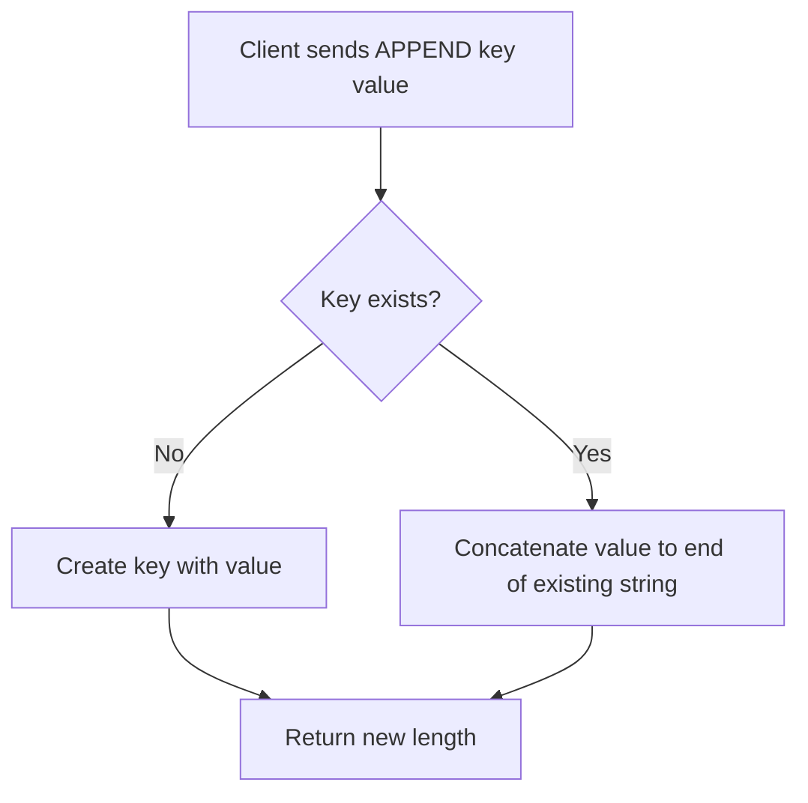

# How to Use APPEND in Redis to Concatenate Strings

Author: [nawazdhandala](https://www.github.com/nawazdhandala)

Tags: Redis, APPEND, String, Concatenation, Command

Description: Learn how to use the Redis APPEND command to concatenate strings onto existing keys, with practical examples for log buffers and time-series data.

---

## How APPEND Works

`APPEND` adds a value to the end of an existing string stored at a key. If the key does not exist, `APPEND` creates it with the given value (behaving like `SET`). The command returns the total length of the string after the append operation. Because Redis strings are binary-safe, `APPEND` works with plain text as well as arbitrary binary data.



## Syntax

```redis
APPEND key value
```

- `key` - the key to append to (or create)
- `value` - the string to append

Returns the length of the string after the append.

## Examples

### Basic append

Start with an empty key and build up a sentence word by word.

```redis
DEL greeting
APPEND greeting "Hello"
APPEND greeting ", "
APPEND greeting "World!"
GET greeting
```

```text
(integer) 5
(integer) 7
(integer) 13
"Hello, World!"
```

### Creating a key on first APPEND

If the key does not exist, `APPEND` creates it just like `SET`.

```redis
DEL log:session1
APPEND log:session1 "2026-03-31T10:00:00 - Session started\n"
APPEND log:session1 "2026-03-31T10:01:23 - User login\n"
STRLEN log:session1
```

```text
(integer) 39
(integer) 73
(integer) 73
```

### Building a CSV buffer

Accumulate CSV rows in Redis before flushing to a file.

```redis
DEL export:orders
APPEND export:orders "id,amount,status\n"
APPEND export:orders "1001,49.99,paid\n"
APPEND export:orders "1002,12.50,pending\n"
GET export:orders
```

```text
"id,amount,status\n1001,49.99,paid\n1002,12.50,pending\n"
```

### Using APPEND for compact time-series

Store a fixed-width time-series of temperature readings. Each reading is 2 bytes.

```redis
DEL temps
APPEND temps "\x00\x1a"
APPEND temps "\x00\x1c"
APPEND temps "\x00\x1b"
STRLEN temps
```

```text
(integer) 2
(integer) 4
(integer) 6
(integer) 6
```

Each 2-byte chunk is one reading. You can retrieve reading `n` with `GETRANGE key start end`.

## Checking the return value

The return value is the total byte length after appending. Use this to detect when a buffer reaches a flush threshold.

```bash
# Pseudocode - flush when buffer exceeds 1 MB
length=$(redis-cli APPEND log:buffer "$new_line")
if [ "$length" -gt 1048576 ]; then
  redis-cli GETDEL log:buffer | write_to_disk
fi
```

## Use Cases

| Pattern | Description |
|---------|-------------|
| Log buffers | Accumulate log lines in Redis before writing to disk |
| CSV / JSON stream | Build up export data incrementally |
| Binary time-series | Store fixed-width samples compactly |
| Message assembly | Concatenate chunked messages from a stream |

## Important notes

- `APPEND` operates on the raw bytes of the value. Unicode multi-byte characters count as multiple bytes toward the length.
- There is no upper limit enforced by the command, but Redis strings are capped at 512 MB.
- `APPEND` is not atomic with a subsequent read. If you need to read and reset atomically, use `GETDEL` or a Lua script.

## Summary

`APPEND` is a simple but powerful command for building up string values incrementally. It creates the key if it does not exist, concatenates the new value to the end, and returns the resulting length. Common use cases include log buffers, CSV exports, and compact binary time-series storage. For heavy time-series workloads, consider Redis Streams (`XADD`) as a more structured alternative.
