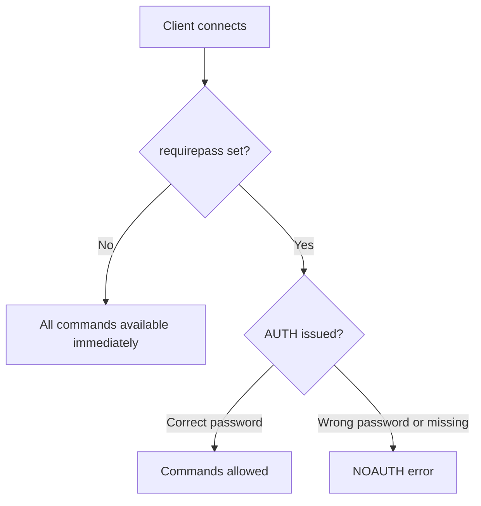

# How to Set Up Redis Authentication with requirepass

Author: [nawazdhandala](https://www.github.com/nawazdhandala)

Tags: Redis, Security, Authentication, Configuration, Requirepass

Description: Learn how to enable password authentication in Redis using the requirepass directive, securing your server against unauthorized access with a simple shared password.

---

## Overview

`requirepass` is the simplest way to add authentication to a Redis server. When set, every client must issue `AUTH password` before executing any command. This is the legacy single-password model, predating the ACL system introduced in Redis 6.0. For new deployments, Redis ACLs offer more granular control, but `requirepass` remains widely used for quick setups and backward compatibility.



## Setting requirepass in redis.conf

Open your Redis configuration file (typically `/etc/redis/redis.conf`) and set:

```text
requirepass yourStrongPasswordHere
```

Then restart Redis:

```bash
sudo systemctl restart redis
```

## Setting requirepass at Runtime

You can set or change the password without restarting:

```redis
CONFIG SET requirepass "yourStrongPasswordHere"
```

```text
OK
```

To remove the password:

```redis
CONFIG SET requirepass ""
```

To make the runtime change permanent:

```redis
CONFIG REWRITE
```

## Connecting with a Password

### Using redis-cli

```bash
redis-cli -a yourStrongPasswordHere
```

Or authenticate after connecting:

```bash
redis-cli
127.0.0.1:6379> AUTH yourStrongPasswordHere
OK
127.0.0.1:6379> PING
PONG
```

### Connection URI format

```bash
redis-cli -u redis://:yourStrongPasswordHere@127.0.0.1:6379
```

## What Happens Without Authentication

```redis
PING
```

```text
(error) NOAUTH Authentication required.
```

```redis
GET mykey
```

```text
(error) NOAUTH Authentication required.
```

## requirepass and ACL Together

In Redis 6.0+, `requirepass` sets the password for the `default` user. It is equivalent to:

```redis
ACL SETUSER default on >yourpassword ~* +@all
```

If you use both `requirepass` in `redis.conf` and ACL rules, they can conflict. The recommended approach for Redis 6.0+ is to manage authentication entirely through ACLs and leave `requirepass` empty or unset.

## Password Strength Recommendations

Redis processes authentication extremely fast, making brute-force attacks practical on weak passwords. Use a strong, randomly generated password:

```bash
# Generate a secure password
openssl rand -base64 32
```

Example output:

```text
9K+mZ3X2vLqRwN5pT8cAjUh1DsYeF0bG7OiQlnVkCdM=
```

The resulting `redis.conf` line:

```text
requirepass 9K+mZ3X2vLqRwN5pT8cAjUh1DsYeF0bG7OiQlnVkCdM=
```

## Binding Redis to Localhost

`requirepass` alone does not prevent network exposure. Combine it with binding Redis to localhost or a private network interface:

```text
bind 127.0.0.1
requirepass yourStrongPasswordHere
```

Or use `protected-mode yes` (the default) which requires a password if Redis is bound to non-loopback interfaces.

## Verifying Authentication Works

```redis
AUTH wrongpassword
```

```text
(error) WRONGPASS invalid username-password pair or user is disabled.
```

```redis
AUTH yourStrongPasswordHere
```

```text
OK
```

```redis
ACL WHOAMI
```

```text
"default"
```

## Summary

`requirepass` in `redis.conf` enables single-password authentication for all Redis connections. Every client must call `AUTH password` before issuing commands, or receive a `NOAUTH` error. Set it in `redis.conf` for persistence or use `CONFIG SET requirepass` at runtime followed by `CONFIG REWRITE`. For Redis 6.0+ deployments requiring per-user permissions, use the ACL system instead of or alongside `requirepass`. Always use a strong, randomly generated password and bind Redis to private interfaces to limit attack surface.
