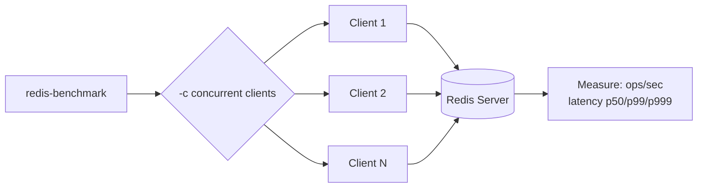

# How to Benchmark Redis Performance with redis-benchmark

Author: [nawazdhandala](https://github.com/nawazdhandala)

Tags: Redis, Performance, Benchmark, Monitoring, Operations

Description: Learn how to use redis-benchmark to measure Redis throughput and latency across commands, data sizes, and concurrency levels to validate performance before and after changes.

---

## Introduction

`redis-benchmark` is the built-in Redis performance testing tool shipped with every Redis installation. It simulates multiple clients sending commands concurrently and reports operations per second and latency percentiles. Use it to baseline your server performance, compare configurations, validate tuning changes, and test before production deployments.

## Basic Syntax

```bash
redis-benchmark [OPTIONS]
```

Common flags:

| Flag | Description | Default |
|---|---|---|
| `-h` | Redis host | `127.0.0.1` |
| `-p` | Redis port | `6379` |
| `-a` | Password | none |
| `-n` | Total requests | 100000 |
| `-c` | Concurrent clients | 50 |
| `-d` | Data size in bytes | 3 |
| `-t` | Commands to test (comma-separated) | all |
| `--pipeline` | Pipelining factor | 1 (no pipeline) |
| `-q` | Quiet mode (one line per test) | off |
| `--latency-history` | Show latency samples over time | off |
| `--csv` | Output in CSV format | off |

## Running a Quick Benchmark

```bash
redis-benchmark -q -n 100000
```

Sample output:

```yaml
PING_INLINE: 182149.36 requests per second, p50=0.271 msec
PING_MBULK:  187265.91 requests per second, p50=0.263 msec
SET:         175438.59 requests per second, p50=0.279 msec
GET:         181818.18 requests per second, p50=0.271 msec
INCR:        178890.87 requests per second, p50=0.279 msec
LPUSH:       161290.33 requests per second, p50=0.303 msec
RPUSH:       166666.67 requests per second, p50=0.295 msec
LPOP:        172413.80 requests per second, p50=0.287 msec
...
```

## Testing Specific Commands

```bash
# Only test GET and SET
redis-benchmark -t set,get -n 200000 -q

# Only test LPUSH and LPOP
redis-benchmark -t lpush,lpop -n 100000 -q
```

## Benchmark Architecture



## Varying Concurrency

```bash
# Low concurrency
redis-benchmark -c 10 -n 100000 -t set,get -q

# Medium concurrency
redis-benchmark -c 100 -n 100000 -t set,get -q

# High concurrency
redis-benchmark -c 500 -n 100000 -t set,get -q
```

Use this to find where throughput plateaus and latency degrades.

## Testing with Different Data Sizes

```bash
# Small values (16 bytes)
redis-benchmark -d 16 -n 100000 -t set,get -q

# Medium values (1 KB)
redis-benchmark -d 1024 -n 100000 -t set,get -q

# Large values (100 KB)
redis-benchmark -d 102400 -n 100000 -t set,get -q
```

Large values are affected by network bandwidth and memory allocation.

## Pipelining Benchmark

Pipelining batches multiple commands per network round-trip and dramatically increases throughput:

```bash
# No pipelining (baseline)
redis-benchmark -t set,get -n 100000 -q --pipeline 1

# Pipeline 16 commands per request
redis-benchmark -t set,get -n 100000 -q --pipeline 16

# Pipeline 32 commands per request
redis-benchmark -t set,get -n 100000 -q --pipeline 32
```

## Detailed Latency Report

```bash
redis-benchmark -t get -n 1000000 -c 100
```

Sample output:

```yaml
GET: 287356.32 requests per second, p50=0.327 msec

Summary:
  throughput summary: 287356.32 requests per second
  latency summary (msec):
          avg       min       p50       p95       p99       max
        0.341     0.128     0.327     0.479     0.575     3.583
```

The p99 and max values reveal outliers that matter for tail latency.

## CSV Output for Scripting

```bash
redis-benchmark -t set,get,incr -n 100000 -q --csv
```

```text
"SET","175438.59"
"GET","181818.18"
"INCR","178890.87"
```

## Custom Command Benchmark

Test a command not in the built-in suite using the `eval` subcommand:

```bash
redis-benchmark -n 100000 eval "return redis.call('set', KEYS[1], ARGV[1])" 1 mykey myvalue
```

## Comparing Before and After a Configuration Change

```bash
# Before change
redis-benchmark -t set,get -n 500000 -c 100 -q > before.txt

# Apply config change, e.g. enable TCP_NODELAY
redis-cli config set tcp-nodelay yes

# After change
redis-benchmark -t set,get -n 500000 -c 100 -q > after.txt

diff before.txt after.txt
```

## Testing Against Remote Redis (with Auth)

```bash
redis-benchmark -h redis.example.com -p 6379 -a yourpassword \
  -t set,get -n 100000 -c 50 -q
```

## Benchmarking Redis Cluster

Run a benchmark against a cluster node. The tool does not auto-shard keys, so use `--cluster` aware mode or test individual shards:

```bash
redis-benchmark -h redis-node-1 -p 6379 -t set,get -n 100000 -q
```

## Interpreting Results

| Metric | Meaning |
|---|---|
| ops/sec | Throughput at given concurrency |
| p50 (median) | Typical latency a user experiences |
| p99 | Latency for 1 in 100 requests |
| p99.9 | Latency for 1 in 1000 requests |
| max | Worst single request observed |

A healthy Redis standalone instance typically achieves 100,000+ ops/sec for simple GET/SET with sub-millisecond median latency on modern hardware.

## Benchmark Script for Regression Testing

```bash
#!/usr/bin/env bash
echo "=== Redis Benchmark $(date) ==="
redis-benchmark -q -n 500000 -c 100 -t set,get,incr,lpush,rpop,zadd \
  --pipeline 1 2>&1 | tee /var/log/redis-bench-$(date +%Y%m%d).log
echo "=== Done ==="
```

## Summary

`redis-benchmark` is the standard tool for measuring Redis throughput and latency. Run it with `-q` for a quick summary, vary `-c` (clients) and `-d` (data size) to understand performance at different loads, and use `--pipeline` to measure the throughput gains from batching. Always record baseline results before making configuration changes such as adjusting `maxmemory-policy`, `save`, or network settings.
