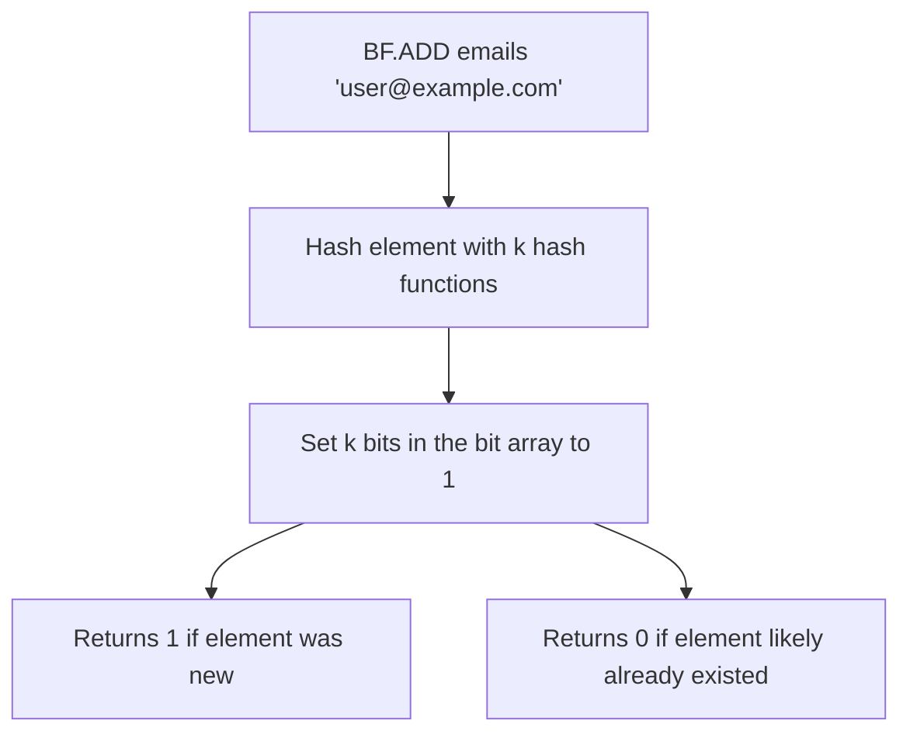

# How to Use BF.ADD in Redis Bloom Filter to Add Elements

Author: [nawazdhandala](https://www.github.com/nawazdhandala)

Tags: Redis, RedisBloom, Bloom Filter, Probabilistic, Command

Description: Learn how to use BF.ADD in Redis to add a single element to a Bloom filter for memory-efficient duplicate and membership detection.

---

## How BF.ADD Works

`BF.ADD` adds a single element to a Bloom filter in Redis. A Bloom filter is a probabilistic data structure that answers membership queries with either "definitely not in the set" or "probably in the set." It uses a fixed amount of memory regardless of how many elements are added and never produces false negatives, though it can produce false positives at a configurable rate.



## Syntax

```redis
BF.ADD key item
```

- `key` - the Bloom filter key (created automatically on first use with default settings)
- `item` - the element to add

Returns:
- `1` - element was not present (new addition)
- `0` - element was likely already in the filter (possible false positive)

## Default Filter Settings

When you call `BF.ADD` on a non-existent key, Redis creates a Bloom filter with defaults:
- Initial capacity: 100 elements
- Error rate: 0.01 (1% false positive rate)

For custom capacity and error rates, use `BF.RESERVE` before the first `BF.ADD`.

## Examples

### Add a Single Element

```redis
BF.ADD visited_urls "https://example.com/page1"
```

```text
(integer) 1
```

Returns 1, confirming the URL was not in the filter before.

### Add the Same Element Again

```redis
BF.ADD visited_urls "https://example.com/page1"
```

```text
(integer) 0
```

Returns 0, indicating the element was already present.

### Add Multiple Elements One by One

```redis
BF.ADD email_list "alice@example.com"
BF.ADD email_list "bob@example.com"
BF.ADD email_list "charlie@example.com"
```

For adding multiple elements at once, use `BF.MADD`.

### Check Existence with BF.EXISTS

After adding, verify membership:

```redis
BF.EXISTS email_list "alice@example.com"
-- Returns 1 (probably in set)

BF.EXISTS email_list "unknown@example.com"
-- Returns 0 (definitely not in set)
```

## Creating a Custom Filter Before Adding

For better memory efficiency, reserve the filter with expected capacity and desired error rate before adding elements:

```redis
-- Reserve a filter for 1 million emails with 0.1% false positive rate
BF.RESERVE email_dedup 0.001 1000000

-- Now add elements
BF.ADD email_dedup "alice@example.com"
BF.ADD email_dedup "bob@example.com"
```

## Use Cases

### Email Deduplication

Prevent sending duplicate emails to the same address:

```redis
-- Before sending email
BF.ADD sent_emails "user@example.com"

-- Returns 1: first time, send the email
-- Returns 0: already sent, skip
```

### URL Crawl Deduplication

Web crawlers use Bloom filters to avoid revisiting pages:

```redis
BF.RESERVE crawled_urls 0.001 10000000

-- Before crawling a URL
BF.ADD crawled_urls "https://example.com/article-123"
-- If returns 1: crawl this URL
-- If returns 0: skip, already crawled
```

### Cache Negative Lookups

Avoid hitting the database for keys you know do not exist:

```redis
-- When a key is confirmed missing from database
BF.ADD missing_keys "user:99999"

-- Next request: check before querying DB
-- BF.EXISTS missing_keys "user:99999" returns 1 -> skip DB
```

### Unique Visitor Tracking

Track unique visitors per day without storing all IPs:

```redis
-- Add visitor IP with daily key
BF.ADD "visitors:2026-03-31" "192.168.1.100"
-- Returns 1: new visitor today
-- Returns 0: visitor already counted today
```

## Understanding the Return Values

The return value of `BF.ADD` tells you whether the element was new at the time of insertion:

| Return | Meaning |
|--------|---------|
| `1` | Element was definitely not in the filter before this call |
| `0` | Element was probably already in the filter |

A return of `0` does not guarantee the element was previously added - it could be a false positive. The probability of a false positive depends on the filter's error rate setting.

## Summary

`BF.ADD` adds a single element to a Redis Bloom filter and returns `1` if the element was new or `0` if it was likely already present. The filter is created automatically with default settings if the key does not exist; use `BF.RESERVE` beforehand for custom capacity and error rate. Use `BF.MADD` to add multiple elements in a single command for better throughput.
