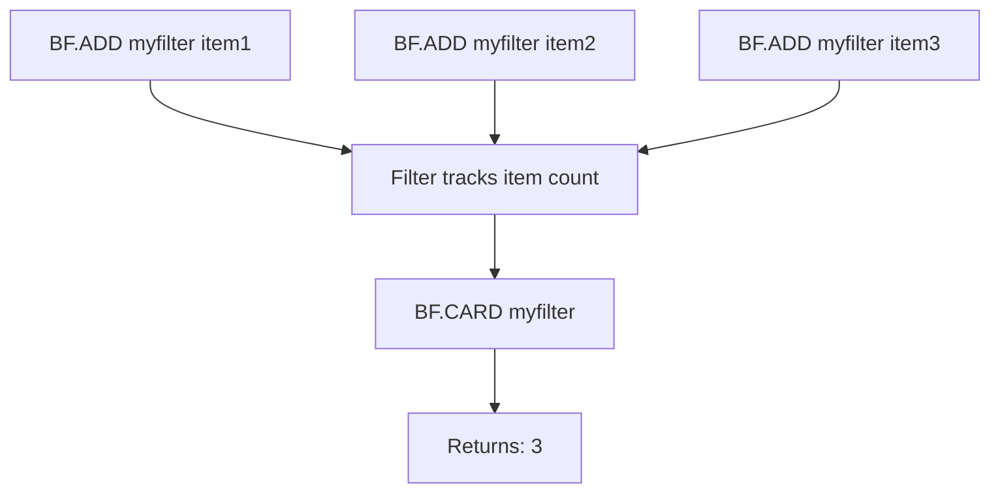

# How to Use BF.CARD in Redis to Estimate Bloom Filter Size

Author: [nawazdhandala](https://www.github.com/nawazdhandala)

Tags: Redis, Bloom Filter, Probabilistic, Command

Description: Learn how to use BF.CARD in Redis to return the number of unique items added to a Bloom filter, helping you track filter saturation and plan capacity.

---

## How BF.CARD Works

`BF.CARD` returns the cardinality (number of unique elements) that have been added to a Bloom filter. This is an estimate because Bloom filters are probabilistic structures - they do not store the actual items, only hashed bit positions. Redis tracks the number of `BF.ADD` and `BF.MADD` insertions internally and returns that count via `BF.CARD`.



## Syntax

```redis
BF.CARD key
```

- `key` - the name of the Bloom filter
- Returns the number of items added to the filter as an integer
- Returns 0 if the key does not exist

## Examples

### Basic Usage

```redis
BF.ADD visitors "user:1001"
BF.ADD visitors "user:1002"
BF.ADD visitors "user:1003"
BF.CARD visitors
```

```text
(integer) 3
```

### After Batch Insert with BF.MADD

```redis
BF.MADD emails "alice@example.com" "bob@example.com" "carol@example.com" "dave@example.com"
BF.CARD emails
```

```text
(integer) 4
```

### Non-Existent Key Returns Zero

```redis
DEL no-filter
BF.CARD no-filter
```

```text
(integer) 0
```

### Checking Saturation Against Reserved Capacity

When you create a filter with `BF.RESERVE`, you define a target capacity. Comparing `BF.CARD` against that capacity helps you decide when to rotate filters.

```redis
BF.RESERVE url-seen 0.001 100000
BF.MADD url-seen "https://example.com/a" "https://example.com/b"
BF.CARD url-seen
```

```text
(integer) 2
```

## Use Cases

### Monitoring Filter Saturation

Overfilled Bloom filters produce more false positives. Poll `BF.CARD` to alert before the filter exceeds its designed capacity.

```redis
-- After every batch of inserts, check cardinality
BF.CARD crawled-urls
```

If the count approaches the `BF.RESERVE` capacity, create a new filter and start routing new items there.

### Tracking Unique Event Counts Approximately

```redis
-- Log each unique session once
BF.ADD sessions:2026-03-31 "sess:abc123"
BF.ADD sessions:2026-03-31 "sess:def456"
BF.ADD sessions:2026-03-31 "sess:abc123"
-- Third add is a re-insertion; count still increments in some versions
BF.CARD sessions:2026-03-31
```

### Validating Filter Population After Bulk Load

After loading a dataset into Redis, confirm the expected number of items were inserted:

```redis
BF.CARD product-catalog
```

```text
(integer) 50000
```

## BF.CARD vs BF.INFO

`BF.INFO` gives a full picture of the filter; `BF.CARD` gives only the item count quickly.

```redis
BF.CARD myfilter
-- Returns a single integer

BF.INFO myfilter
-- Returns: Capacity, Size, Number of filters, Number of items inserted, Expansion rate
```

Use `BF.CARD` in hot paths where you only need to check how full a filter is. Use `BF.INFO` for diagnostics and capacity planning.

## Performance Considerations

- `BF.CARD` is O(1) - it reads a stored counter, not the filter bits.
- It does not re-scan the underlying bit array.
- Safe to call frequently without memory or CPU impact.

## Summary

`BF.CARD` returns the number of items inserted into a Redis Bloom filter in O(1) time. Use it to monitor filter saturation, compare against the reserved capacity set by `BF.RESERVE`, and trigger rotation or expansion before false positive rates climb above the configured error rate.
