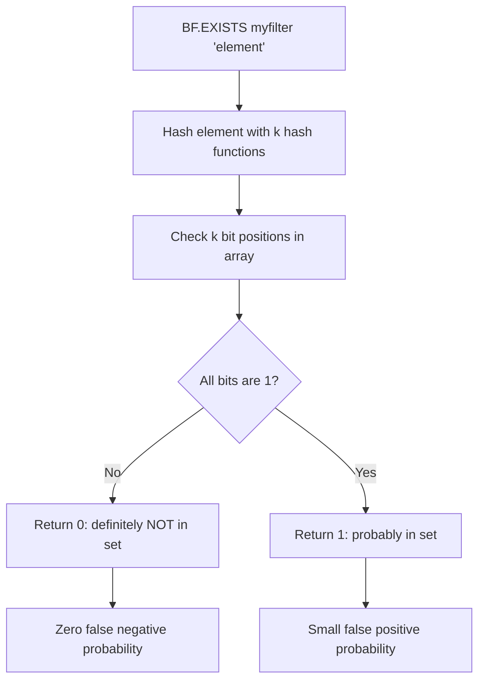
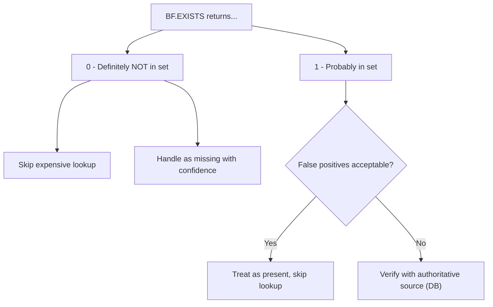

# How to Use BF.EXISTS in Redis Bloom Filter to Check Existence

Author: [nawazdhandala](https://www.github.com/nawazdhandala)

Tags: Redis, RedisBloom, Bloom Filter, Probabilistic, Command

Description: Learn how to use BF.EXISTS in Redis to check whether an element is probably in a Bloom filter, enabling fast membership testing with no false negatives.

---

## How BF.EXISTS Works

`BF.EXISTS` checks whether a given element is present in a Redis Bloom filter. It returns `0` if the element is definitely not in the filter (no false negatives) or `1` if the element is probably in the filter (small chance of false positive). This is the primary read operation on a Bloom filter and runs in O(k) time where k is the number of hash functions.



## Syntax

```redis
BF.EXISTS key item
```

- `key` - the Bloom filter key
- `item` - the element to check for membership

Returns:
- `0` - element is definitely not in the filter
- `1` - element is probably in the filter (may be a false positive)

If the key does not exist, returns `0`.

## Examples

### Basic Existence Check

```redis
BF.ADD usernames "alice"
BF.ADD usernames "bob"

BF.EXISTS usernames "alice"
-- (integer) 1 - alice is in the filter

BF.EXISTS usernames "charlie"
-- (integer) 0 - charlie is definitely not in the filter
```

### Check Before Adding (Deduplication Pattern)

```redis
-- Check if event already processed
BF.EXISTS processed_events "event:abc123"

-- If 0: safe to process, then add
BF.ADD processed_events "event:abc123"

-- If 1: likely already processed, skip
```

### Non-Existent Key Returns 0

```redis
BF.EXISTS nonexistent_filter "anything"
-- (integer) 0
```

Checking against a filter that has not been created always returns 0 (not a member).

## Understanding False Positives

A Bloom filter can report `1` (present) for elements that were never added. The probability of this depends on the filter's error rate setting:

```redis
-- Default filter: 1% false positive rate
BF.RESERVE myfilter 0.01 1000

BF.ADD myfilter "real_item"

-- For roughly 1 in 100 non-members, this returns 1
BF.EXISTS myfilter "some_other_item"
```

The false positive rate increases as the filter fills up beyond its designed capacity.

## Use Cases

### Cache Stampede Prevention

Before querying the database for a key, check the Bloom filter to reject known-missing keys:

```redis
-- Key known to not exist in DB was added to filter
BF.ADD missing_user_ids "user:99999"

-- On request for user:99999
BF.EXISTS missing_user_ids "user:99999"
-- Returns 1 -> skip DB query, return 404 immediately
```

### Username Availability Check

Pre-screen username availability before a database lookup:

```redis
BF.ADD taken_usernames "alice"
BF.ADD taken_usernames "bob"

-- User tries "charlie"
BF.EXISTS taken_usernames "charlie"
-- Returns 0 -> definitely available, no DB query needed

-- User tries "alice"
BF.EXISTS taken_usernames "alice"
-- Returns 1 -> probably taken, verify with DB
```

This reduces database load for the common case of checking truly unique names.

### Duplicate Request Detection

Detect duplicate API requests or webhooks:

```redis
BF.RESERVE processed_requests 0.001 5000000

-- On receiving request
BF.EXISTS processed_requests "req:abc123"
-- If 1: likely duplicate, reject
-- If 0: new request, process it then add to filter
BF.ADD processed_requests "req:abc123"
```

### Email Unsubscribe List

Check if an email is on the unsubscribe list before sending:

```redis
BF.EXISTS unsubscribed_emails "user@example.com"
-- If 1: do not send (conservative: false positives only skip extra emails)
-- If 0: send the email
```

False positives are acceptable here since they only cause a missed email, not a harmful send.

## BF.EXISTS vs BF.MEXISTS

`BF.MEXISTS` checks multiple elements in a single command and is more efficient when checking several items:

```redis
-- Single checks
BF.EXISTS emails "alice@example.com"
BF.EXISTS emails "bob@example.com"
BF.EXISTS emails "charlie@example.com"

-- Equivalent batch check (one round trip)
BF.MEXISTS emails "alice@example.com" "bob@example.com" "charlie@example.com"
```

## Decision Framework



## Summary

`BF.EXISTS` checks membership in a Redis Bloom filter with zero false negatives: a result of `0` guarantees the element was never added. A result of `1` means the element is probably present, with a small chance of false positive depending on the filter's configured error rate. Use it to gate expensive operations like database queries, API calls, or email sends for elements that are almost certainly absent.
