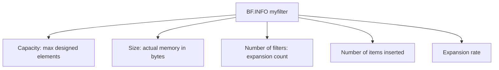
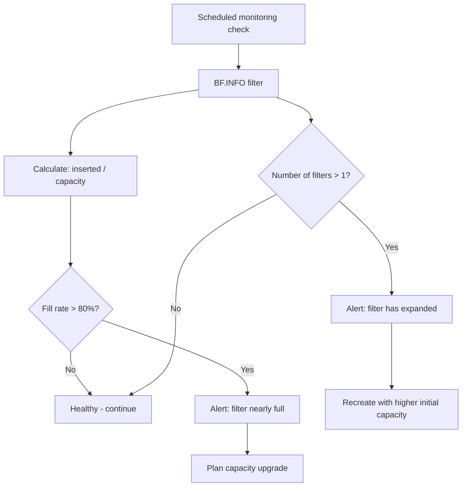

# How to Use BF.INFO in Redis to Get Bloom Filter Stats

Author: [nawazdhandala](https://www.github.com/nawazdhandala)

Tags: Redis, RedisBloom, Bloom Filter, Probabilistic, Command

Description: Learn how to use BF.INFO in Redis to retrieve statistics about a Bloom filter including its capacity, current size, error rate, and number of inserted elements.

---

## How BF.INFO Works

`BF.INFO` returns detailed statistics about a Redis Bloom filter. It shows the filter's capacity, error rate, the number of elements inserted, the number of bits in the bit array, the number of hash functions, and whether the filter has expanded beyond its initial capacity. Use it to monitor filter health, detect capacity issues, and validate configuration.



## Syntax

```redis
BF.INFO key
```

- `key` - the Bloom filter key

Returns a flat array of field-value pairs. Returns an error if the key does not exist.

## Examples

### Inspect a Default Filter

```redis
BF.ADD simple_filter "item1" "item2" "item3"
BF.INFO simple_filter
```

```text
 1) "Capacity"
 2) (integer) 100
 3) "Size"
 4) (integer) 240
 5) "Number of filters"
 6) (integer) 1
 7) "Number of items inserted"
 8) (integer) 3
 9) "Expansion rate"
10) (integer) 2
```

### Inspect a Custom Reserved Filter

```redis
BF.RESERVE email_dedup 0.001 1000000
BF.MADD email_dedup "alice@example.com" "bob@example.com"
BF.INFO email_dedup
```

```text
 1) "Capacity"
 2) (integer) 1000000
 3) "Size"
 4) (integer) 1646952
 5) "Number of filters"
 6) (integer) 1
 7) "Number of items inserted"
 8) (integer) 2
 9) "Expansion rate"
10) (integer) 2
```

### Inspect an Expanded Filter

When a Bloom filter exceeds its initial capacity, it automatically expands (if not created with `NONSCALING`). Each expansion adds a new sub-filter:

```redis
BF.RESERVE small_filter 0.01 10
-- Add 20 items to exceed capacity
BF.MADD small_filter "a" "b" "c" "d" "e" "f" "g" "h" "i" "j" "k" "l" "m"
BF.INFO small_filter
```

```text
 1) "Capacity"
 2) (integer) 30
 3) "Size"
 4) (integer) 480
 5) "Number of filters"
 6) (integer) 2
 7) "Number of items inserted"
 8) (integer) 13
 9) "Expansion rate"
10) (integer) 2
```

`Number of filters: 2` means the filter has expanded once and now consists of two sub-filters.

## Understanding the Output Fields

| Field | Description |
|-------|-------------|
| `Capacity` | Total number of elements the filter can hold before the false positive rate degrades |
| `Size` | Memory used by the filter in bytes |
| `Number of filters` | How many sub-filters exist (1 = no expansion, >1 = has expanded) |
| `Number of items inserted` | Total elements added across all sub-filters |
| `Expansion rate` | Multiplier for each new sub-filter capacity (default 2) |

## Monitoring Filter Health

### Check Fill Rate

Compare inserted items to capacity to detect when a filter is nearly full:

```redis
BF.INFO email_dedup
-- Capacity: 1000000
-- Number of items inserted: 850000
-- Fill rate: 85% -> consider creating a new filter soon
```

### Detect Unexpected Expansion

If `Number of filters` is greater than 1, the filter has grown beyond its designed capacity. This increases the false positive rate:

```redis
BF.INFO myfilter
-- Number of filters: 5
-- This filter has expanded 4 times
-- Consider recreating with a higher initial capacity
```

### Memory Sizing

Use `Size` to understand actual memory usage and plan Redis memory allocation:

```redis
BF.INFO large_filter
-- Size: 20000000 (approximately 20 MB)
```

## Practical Monitoring Workflow



## Using BF.INFO for Capacity Planning

Before deploying a Bloom filter in production, calculate the expected memory:

```redis
-- Test with target capacity and error rate
BF.RESERVE test_filter 0.001 10000000
BF.INFO test_filter
-- Size: ~17.5 MB for 10M elements at 0.1% error rate
```

Use this to allocate sufficient Redis memory before production deployment.

## Summary

`BF.INFO` returns statistics about a Redis Bloom filter: its designed capacity, current memory size, number of sub-filters (indicating expansions), total items inserted, and expansion rate. Use it to monitor fill rates, detect unexpected growth, size memory allocations, and decide when to recreate a filter with higher capacity. Regular monitoring prevents the false positive rate from degrading silently as the filter fills.
