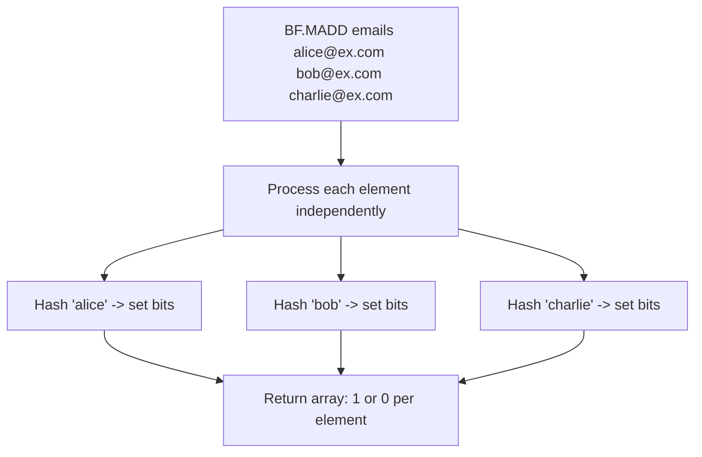

# How to Use BF.MADD in Redis Bloom Filter for Batch Adds

Author: [nawazdhandala](https://www.github.com/nawazdhandala)

Tags: Redis, RedisBloom, Bloom Filter, Probabilistic, Command

Description: Learn how to use BF.MADD in Redis to add multiple elements to a Bloom filter in a single command for efficient bulk insertion with one round trip.

---

## How BF.MADD Works

`BF.MADD` adds multiple elements to a Redis Bloom filter in one command. It is the batch version of `BF.ADD` and returns an array indicating whether each element was new. Using `BF.MADD` reduces network round trips when you need to add several items at once, which is common during data ingestion, bulk import, or processing batches of events.



## Syntax

```redis
BF.MADD key item [item ...]
```

- `key` - the Bloom filter key (auto-created if absent)
- `item [item ...]` - one or more elements to add

Returns an array of integers, one per item:
- `1` - element was not present (new addition)
- `0` - element was likely already in the filter

## Examples

### Add Multiple Items at Once

```redis
BF.MADD processed_orders "order:1001" "order:1002" "order:1003"
```

```text
1) (integer) 1
2) (integer) 1
3) (integer) 1
```

All three are new.

### Mix of New and Existing Elements

```redis
BF.MADD seen_users "user:alice" "user:bob"

-- Add again with one new entry
BF.MADD seen_users "user:alice" "user:charlie"
```

```text
1) (integer) 0
2) (integer) 1
```

`user:alice` was already in the filter (0), `user:charlie` is new (1).

### Bulk Loading During Import

```redis
BF.RESERVE email_dedup 0.001 10000000

-- Process a batch of emails from an import file
BF.MADD email_dedup \
  "user1@company.com" \
  "user2@company.com" \
  "user3@company.com" \
  "user4@company.com" \
  "user5@company.com"
```

```text
1) (integer) 1
2) (integer) 1
3) (integer) 1
4) (integer) 1
5) (integer) 1
```

## BF.MADD vs Multiple BF.ADD Calls

Both achieve the same result, but `BF.MADD` is more efficient:

```redis
-- Inefficient: 3 separate round trips
BF.ADD emails "alice@example.com"
BF.ADD emails "bob@example.com"
BF.ADD emails "charlie@example.com"

-- Efficient: 1 round trip
BF.MADD emails "alice@example.com" "bob@example.com" "charlie@example.com"
```

The performance difference becomes significant when adding hundreds or thousands of items.

## Use Cases

### Event Stream Deduplication

Processing events from a queue in batches:

```redis
BF.RESERVE events 0.001 50000000

-- Batch from message queue
BF.MADD events "evt:a1b2c3" "evt:d4e5f6" "evt:g7h8i9" "evt:j0k1l2"
```

Check return values to identify which events are new vs already seen, and only process new ones.

### Bulk URL Crawl Queue

Loading a list of URLs into a crawl Bloom filter:

```redis
BF.RESERVE crawled 0.001 100000000

-- Load batch from sitemap
BF.MADD crawled \
  "https://example.com/page1" \
  "https://example.com/page2" \
  "https://example.com/page3"
```

### Session Tracking Initialization

At application startup, pre-populate from a known-seen list:

```redis
BF.RESERVE seen_sessions 0.01 1000000

-- Seed from last checkpoint
BF.MADD seen_sessions "sess:aaa" "sess:bbb" "sess:ccc" "sess:ddd"
```

### Spam Detection

Add known spam domains in bulk:

```redis
BF.MADD spam_domains \
  "spam-site.com" \
  "malicious.net" \
  "phishing-attempt.org" \
  "fake-bank.co"
```

## Processing the Return Array

The return array aligns positionally with the input items. Use the results to count new vs duplicate additions:

```redis
BF.MADD myfilter "a" "b" "c" "a" "d"
-- Returns: [1, 1, 1, 0, 1]
-- "a" appears twice: first is new (1), second is duplicate (0)
```

Count new insertions:
- Sum of return values = number of new (non-duplicate) items added

## Pipeline Optimization

For very large batches, split `BF.MADD` into chunks of 100-1000 items and pipeline them:

```redis
-- Chunk 1
BF.MADD filter item1 item2 ... item1000

-- Chunk 2
BF.MADD filter item1001 item1002 ... item2000
```

Smaller chunks avoid blocking Redis for long periods on a single command.

## Summary

`BF.MADD` adds multiple elements to a Redis Bloom filter in one round trip and returns an array indicating whether each element was new (1) or likely already present (0). It is the efficient alternative to calling `BF.ADD` repeatedly in a loop. Use it during bulk data ingestion, event batch processing, and any scenario where you add groups of items to a Bloom filter at once.
