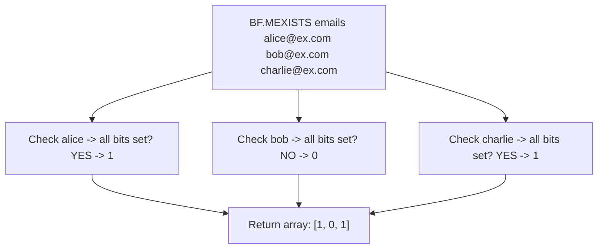

# How to Use BF.MEXISTS in Redis Bloom Filter for Batch Checks

Author: [nawazdhandala](https://www.github.com/nawazdhandala)

Tags: Redis, RedisBloom, Bloom Filter, Probabilistic, Command

Description: Learn how to use BF.MEXISTS in Redis to check membership of multiple elements in a Bloom filter with a single command for efficient batch lookups.

---

## How BF.MEXISTS Works

`BF.MEXISTS` checks whether multiple elements are present in a Redis Bloom filter in a single command. It is the batch version of `BF.EXISTS` and returns an array of results. Each result is `0` (definitely not in set) or `1` (probably in set). Use it to reduce round trips when checking several items at once.



## Syntax

```redis
BF.MEXISTS key item [item ...]
```

- `key` - the Bloom filter key
- `item [item ...]` - one or more elements to check

Returns an array of integers, one per item:
- `0` - element is definitely not in the filter
- `1` - element is probably in the filter

If the key does not exist, all elements return `0`.

## Examples

### Check Multiple Items

```redis
BF.MADD usernames "alice" "bob" "diana"

BF.MEXISTS usernames "alice" "bob" "charlie" "diana"
```

```text
1) (integer) 1
2) (integer) 1
3) (integer) 0
4) (integer) 1
```

`charlie` was never added, so it returns `0`.

### All Items Absent

```redis
BF.MEXISTS empty_filter "x" "y" "z"
```

```text
1) (integer) 0
2) (integer) 0
3) (integer) 0
```

### All Items Present

```redis
BF.MADD domains "redis.io" "github.com" "example.com"
BF.MEXISTS domains "redis.io" "github.com" "example.com"
```

```text
1) (integer) 1
2) (integer) 1
3) (integer) 1
```

## BF.MEXISTS vs Multiple BF.EXISTS Calls

```redis
-- Inefficient: 4 round trips
BF.EXISTS emails "alice@example.com"
BF.EXISTS emails "bob@example.com"
BF.EXISTS emails "charlie@example.com"
BF.EXISTS emails "diana@example.com"

-- Efficient: 1 round trip
BF.MEXISTS emails "alice@example.com" "bob@example.com" "charlie@example.com" "diana@example.com"
```

## Use Cases

### Batch Request Deduplication

Before processing a batch of API requests, check all of them at once:

```redis
-- Check all request IDs in the incoming batch
BF.MEXISTS processed_requests "req:a1" "req:b2" "req:c3" "req:d4"
-- [0, 1, 0, 0]
-- req:b2 is likely a duplicate, skip it; process the others
```

### Bulk Cache Pre-Check

Before issuing database queries for multiple items, filter out known-missing keys:

```redis
-- Check if any of these user IDs are known to not exist
BF.MEXISTS missing_user_ids "user:101" "user:202" "user:303"
-- [1, 0, 1] -> user:101 and user:303 are known missing, only query user:202
```

### Batch Spam Filtering

Filter a list of domains against a known spam domain filter:

```redis
BF.MADD spam_domains "spam.com" "phishing.net" "malware.io"

-- Check all sender domains in an email batch
BF.MEXISTS spam_domains "trusted.com" "spam.com" "newsletter.org" "phishing.net"
```

```text
1) (integer) 0
2) (integer) 1
3) (integer) 0
4) (integer) 1
```

Reject emails from indices 2 and 4 (1-based: `spam.com` and `phishing.net`).

### Pre-Screening Content IDs

Check if multiple content items have already been shown to a user:

```redis
-- Has user "user:42" already seen these articles?
BF.MEXISTS "seen:user:42" "article:1" "article:2" "article:3" "article:4"
-- [1, 0, 1, 0] -> show articles 2 and 4 (new), skip 1 and 3 (already seen)
```

## Combining BF.MEXISTS with BF.MADD

A common pattern: check a batch, process only the new ones, then add them:

```redis
-- 1. Check which items are new
BF.MEXISTS event_log "evt:001" "evt:002" "evt:003" "evt:004"
-- [0, 1, 0, 0] -> evt:002 already seen

-- 2. Process only new items: evt:001, evt:003, evt:004

-- 3. Add the newly processed items to the filter
BF.MADD event_log "evt:001" "evt:003" "evt:004"
```

## Performance Comparison

| Operation | Round Trips | Items | Total Time |
|-----------|------------|-------|-----------|
| 100x BF.EXISTS | 100 | 1 each | ~100 * RTT |
| 1x BF.MEXISTS | 1 | 100 | ~1 * RTT |

For an application with 1ms RTT to Redis, checking 100 items drops from ~100ms to ~1ms.

## Summary

`BF.MEXISTS` checks membership of multiple elements in a Redis Bloom filter in one round trip and returns an array of `0` (definitely absent) or `1` (probably present) results. It is the efficient alternative to calling `BF.EXISTS` in a loop. Use it for batch deduplication, bulk cache pre-checks, spam filtering, and any scenario where you need to test several items against a Bloom filter at once.
