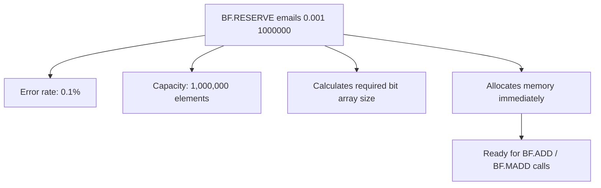

# How to Use BF.RESERVE in Redis to Create a Custom Bloom Filter

Author: [nawazdhandala](https://www.github.com/nawazdhandala)

Tags: Redis, RedisBloom, Bloom Filter, Probabilistic, Command

Description: Learn how to use BF.RESERVE in Redis to create a Bloom filter with a custom error rate, capacity, and expansion policy instead of relying on default settings.

---

## How BF.RESERVE Works

`BF.RESERVE` creates a new Bloom filter with explicit configuration for error rate, capacity, and expansion behavior. When you call `BF.ADD` on a non-existent key, Redis auto-creates a filter with default settings (100 capacity, 1% error rate). `BF.RESERVE` lets you provision the right size filter upfront so the false positive rate stays within bounds at your actual data volume.



## Syntax

```redis
BF.RESERVE key error_rate capacity [EXPANSION expansion] [NONSCALING]
```

- `key` - the Bloom filter key (must not exist)
- `error_rate` - desired false positive rate (0.0 to 1.0, e.g., `0.01` for 1%)
- `capacity` - the number of elements you expect to add
- `EXPANSION` - when the filter is full, the new sub-filter is `expansion` times the previous size (default 2)
- `NONSCALING` - disables automatic expansion; returns an error when capacity is exceeded

Returns `OK` on success. Returns an error if the key already exists.

## Examples

### Basic Reservation

```redis
BF.RESERVE email_dedup 0.01 100000
```

Creates a filter designed for 100,000 emails with a 1% false positive rate.

### Low Error Rate Filter

```redis
BF.RESERVE critical_ids 0.0001 10000000
```

For 10 million IDs with only a 0.01% false positive rate (much more memory required).

### Custom Expansion Rate

```redis
BF.RESERVE growing_set 0.01 1000 EXPANSION 4
```

When this filter fills up, each subsequent sub-filter is 4x the previous size (1000, 4000, 16000, ...).

### Non-Scaling Filter

```redis
BF.RESERVE fixed_cache 0.01 50000 NONSCALING
```

This filter holds exactly 50,000 items. If you try to add the 50,001st item, `BF.ADD` returns an error.

Use `NONSCALING` when you want strict capacity enforcement and predictable memory usage.

### Verify Reservation

```redis
BF.INFO email_dedup
```

```text
1) "Capacity"
2) (integer) 100000
3) "Size"
4) (integer) 131728
5) "Number of filters"
6) (integer) 1
7) "Number of items inserted"
8) (integer) 0
9) "Expansion rate"
10) (integer) 2
```

0 items inserted, full capacity available.

## Error Rate vs Memory Trade-off

Lower error rates require more memory. The relationship is roughly logarithmic:

| Error Rate | Memory per 1M Elements |
|-----------|----------------------|
| 1% (0.01) | ~1.2 MB |
| 0.1% (0.001) | ~1.8 MB |
| 0.01% (0.0001) | ~2.4 MB |
| 0.001% (0.00001) | ~3.0 MB |

Calculate the required capacity for your use case and error tolerance before reserving.

## Capacity Planning Guide

### E-commerce Duplicate Order Detection

```redis
-- 5 million orders per month, 0.1% false positive acceptable
BF.RESERVE order_dedup 0.001 5000000
```

### URL Deduplication for Web Crawler

```redis
-- Expect 500 million URLs, very low false positive rate needed
BF.RESERVE crawled_urls 0.0001 500000000
```

### Daily Unique Visitor Tracking

```redis
-- 10 million daily visitors, rotate daily keys
BF.RESERVE "visitors:2026-03-31" 0.01 10000000
```

### Username Availability Pre-Check

```redis
-- 50 million registered usernames
BF.RESERVE taken_usernames 0.001 50000000
```

## BF.RESERVE vs Auto-Creation

| Approach | Use When |
|----------|---------|
| `BF.RESERVE` then `BF.ADD` | You know expected volume; want optimal memory |
| `BF.ADD` (auto-create) | Prototyping; small or unknown volume |

Always use `BF.RESERVE` for production filters where you know the approximate scale.

## Error: Key Already Exists

```redis
BF.RESERVE myfilter 0.01 10000
BF.RESERVE myfilter 0.01 20000
-- (error) ERR item exists
```

If you need to resize a Bloom filter, you must delete the old key and recreate it (Bloom filters cannot be resized in place):

```redis
DEL myfilter
BF.RESERVE myfilter 0.01 20000
```

Note: this loses all previously added elements.

## Summary

`BF.RESERVE` creates a Redis Bloom filter with explicit error rate, capacity, and expansion policy. Use it to provision the right-sized filter before adding data, avoiding the undersized defaults of auto-creation. Choose lower error rates for critical deduplication at the cost of more memory. Use `NONSCALING` for fixed-size filters with strict memory budgets. Always prefer `BF.RESERVE` over auto-creation for production deployments.
