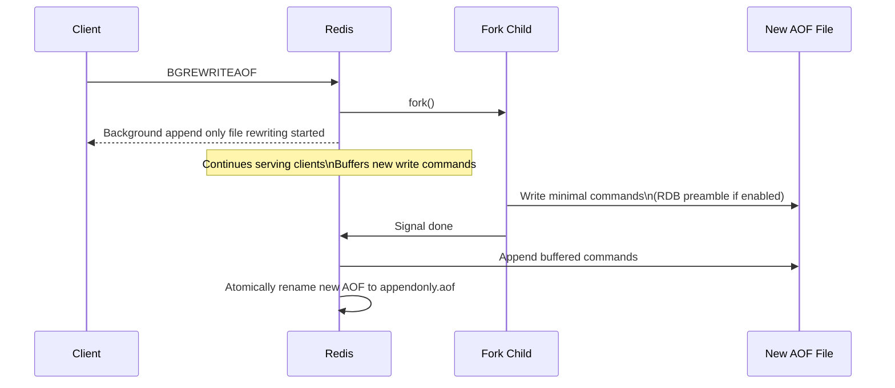
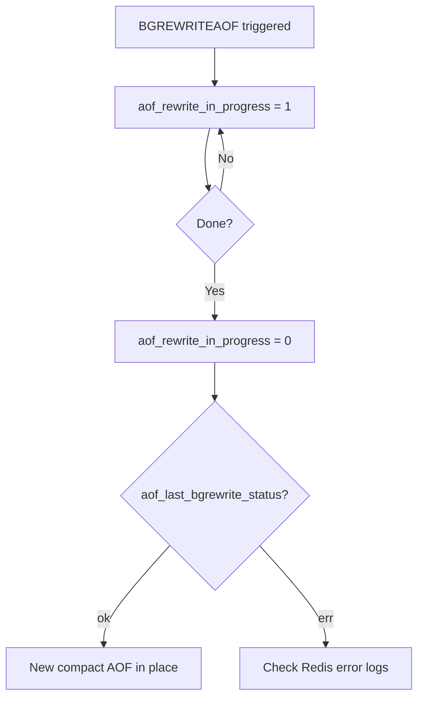

# How to Use BGREWRITEAOF in Redis to Rewrite the AOF

Author: [nawazdhandala](https://www.github.com/nawazdhandala)

Tags: Redis, Bgrewriteaof, AOF, Persistence, Maintenance

Description: Learn how to use BGREWRITEAOF to compact the Redis Append-Only File in the background, reducing its size and improving restart performance.

---

## Introduction

As Redis processes write commands, the Append-Only File (AOF) grows over time. Even if a key is set and then deleted, both operations remain in the log. `BGREWRITEAOF` triggers a background rewrite that replaces the current AOF with the minimal set of commands needed to reconstruct the current dataset. This keeps the AOF file compact and speeds up restarts.

## Basic Syntax

```redis
BGREWRITEAOF
```

Returns `Background append only file rewriting started`.

## How BGREWRITEAOF Works



## Examples

### Trigger a background AOF rewrite

```redis
BGREWRITEAOF
# Background append only file rewriting started
```

### Check rewrite status

```redis
INFO persistence
# aof_rewrite_in_progress:1
# aof_last_rewrite_time_sec:-1
# aof_current_rewrite_time_sec:2
```

### Wait for completion

```redis
INFO persistence
# aof_rewrite_in_progress:0
# aof_last_rewrite_time_sec:3
# aof_last_bgrewrite_status:ok
```

## Before and After Rewrite

A bloated AOF might look like this before the rewrite:

```bash
*3
$3
SET
$3
key
$5
value
*2
$3
DEL
$3
key
*3
$3
SET
$3
key
$8
newvalue
```

After `BGREWRITEAOF`, only the final state is recorded:

```bash
*3
$3
SET
$3
key
$8
newvalue
```

## Automatic AOF Rewrite

Configure Redis to rewrite automatically:

```redis
# Trigger rewrite when AOF is 100% larger than last rewrite
auto-aof-rewrite-percentage 100

# Only rewrite if AOF is at least 64 MB
auto-aof-rewrite-min-size 64mb
```

These settings prevent unnecessary rewrites on small instances while ensuring large AOF files are compacted.

## RDB Preamble for Faster Rewrite

When `aof-use-rdb-preamble yes` is set (default in Redis 4.0+), the rewrite embeds an RDB snapshot at the top of the new AOF. This makes the rewrite faster and the resulting file more compact:

```redis
CONFIG GET aof-use-rdb-preamble
# 1) "aof-use-rdb-preamble"
# 2) "yes"
```

## No-Appendfsync During Rewrite

Heavy disk I/O during a rewrite can cause latency. This setting prevents extra fsyncs during the rewrite:

```redis
no-appendfsync-on-rewrite yes
```

With `appendfsync everysec`, this means up to 1 additional second of data loss risk during the rewrite window.

## Monitoring



## Disk Space Consideration

During rewrite, Redis needs extra disk space to write the new AOF alongside the old one. Ensure at least `2x` the current AOF file size in free disk space before triggering a rewrite.

```bash
# Check current AOF file size
ls -lh /var/lib/redis/appendonly.aof
```

## Summary

`BGREWRITEAOF` compacts the AOF by rewriting it with the minimal commands needed to represent the current dataset. Use it manually before maintenance windows or let Redis handle it automatically via `auto-aof-rewrite-percentage` and `auto-aof-rewrite-min-size`. Enable `aof-use-rdb-preamble yes` for faster rewrites and faster restarts.
