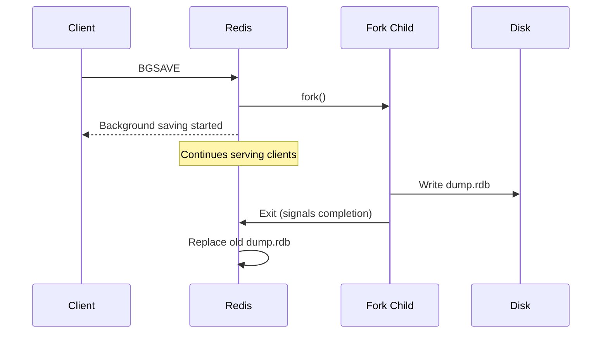
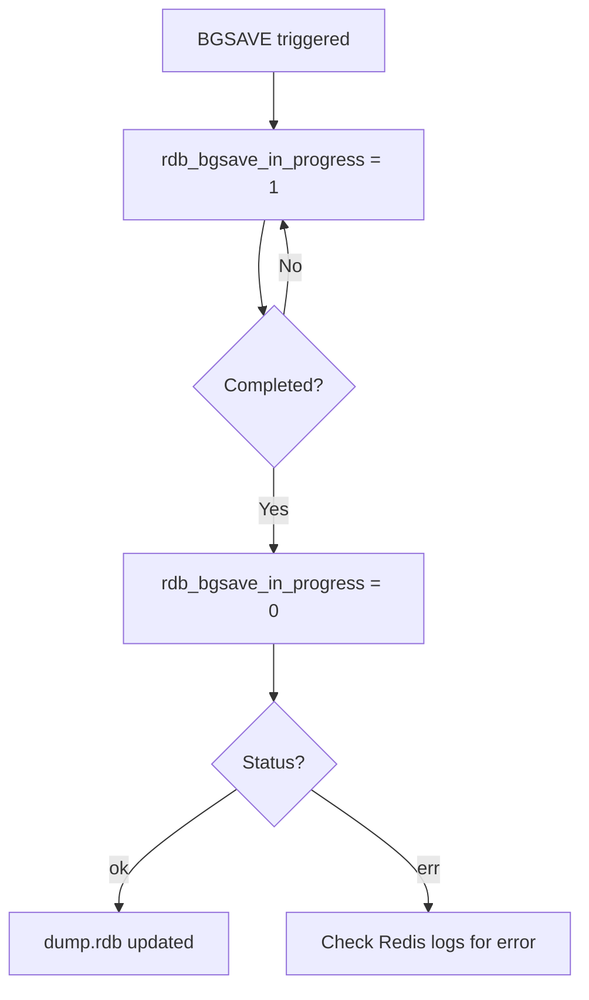

# How to Use BGSAVE in Redis to Trigger a Background Save

Author: [nawazdhandala](https://www.github.com/nawazdhandala)

Tags: Redis, BGSAVE, RDB, Persistence, Snapshot

Description: Learn how to use BGSAVE to trigger a non-blocking Redis RDB snapshot in a background process, and how to monitor its progress and completion.

---

## Introduction

`BGSAVE` instructs Redis to save the current dataset to disk as an RDB snapshot using a forked child process. Unlike `SAVE`, which blocks all client commands while writing, `BGSAVE` lets Redis continue serving requests normally while the snapshot is written in the background.

## Basic Syntax

```redis
BGSAVE [SCHEDULE]
```

- No arguments: start a background save immediately
- `SCHEDULE`: if an AOF rewrite is in progress, schedule the BGSAVE to run after it completes

Returns `Background saving started` on success.

## How BGSAVE Works



## Examples

### Trigger an immediate background save

```redis
BGSAVE
# Background saving started
```

### Check if a save is in progress

```redis
INFO persistence
# rdb_bgsave_in_progress:1
# rdb_last_save_time:1711900100
```

### Wait for the save to complete

```redis
# Poll until rdb_bgsave_in_progress is 0
INFO persistence
# rdb_bgsave_in_progress:0
# rdb_last_bgsave_status:ok
# rdb_last_bgsave_time_sec:3
```

### Check the last save timestamp with LASTSAVE

```redis
LASTSAVE
# (integer) 1711900200

# Convert to human-readable (in shell)
# date -d @1711900200
# Thu Mar 31 12:30:00 UTC 2026
```

### Use SCHEDULE to avoid conflict with AOF rewrite

```redis
BGSAVE SCHEDULE
# Background saving scheduled
```

Redis will start the RDB save as soon as the ongoing `BGREWRITEAOF` finishes.

## BGSAVE vs SAVE

| Feature | BGSAVE | SAVE |
|---|---|---|
| Blocking | No (uses fork) | Yes (blocks all clients) |
| Client impact | None | Complete block |
| Use in production | Recommended | Avoid unless emergency |
| Copy-on-write | Yes | No fork needed |

## Automatic BGSAVE Triggers

Redis automatically calls `BGSAVE` based on the `save` configuration:

```redis
# Trigger BGSAVE if 1+ keys changed in the last 3600 seconds
save 3600 1
save 300 100
save 60 10000
```

Manual `BGSAVE` calls are useful when you want a snapshot at a specific point, such as before deploying a new application version.

## Monitoring BGSAVE



```redis
INFO persistence
# rdb_bgsave_in_progress:0
# rdb_last_bgsave_status:ok
# rdb_last_bgsave_time_sec:2
# rdb_last_cow_size:1048576
```

## Error Scenarios

If `BGSAVE` fails (e.g., disk full), you will see:

```redis
INFO persistence
# rdb_last_bgsave_status:err
```

And in the Redis logs:

```json
[1234] 31 Mar 12:30:00.000 # Background saving error
```

## Common Use Cases

- Pre-deployment snapshots before rolling out application changes
- Periodic off-schedule backups in addition to configured save intervals
- Verifying dataset integrity by examining the resulting RDB file with `redis-check-rdb`

## Summary

`BGSAVE` forks a child process to save the Redis dataset as an RDB snapshot without blocking the main server. Use it for on-demand backups, pre-deployment snapshots, or to supplement automatic save intervals. Monitor completion via `INFO persistence` and confirm success with `LASTSAVE`. Prefer `BGSAVE` over `SAVE` in all production scenarios.
