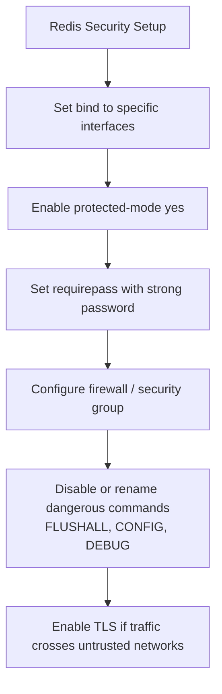

# How to Configure Redis bind and protected-mode

Author: [nawazdhandala](https://www.github.com/nawazdhandala)

Tags: Redis, Security, BIND, Protected Mode, Network

Description: Learn how to configure Redis bind addresses and protected-mode to control network exposure, prevent unauthorized access, and secure your Redis deployment.

---

## Introduction

Two of the most important security settings in Redis are `bind` and `protected-mode`. Together they control which network interfaces Redis listens on and whether it accepts connections from remote hosts. Misconfiguring them is one of the most common ways Redis instances get compromised.

## The bind Directive

`bind` specifies the IP addresses Redis listens on. By default (Redis 7.0+):

```redis
bind 127.0.0.1 -::1
```

This binds to the IPv4 loopback and (optionally) the IPv6 loopback. Redis only accepts connections from the same host.

### Bind to all interfaces (use with caution)

```redis
bind 0.0.0.0
```

This makes Redis accessible from any network interface, including public ones.

### Bind to a specific internal interface

```redis
bind 127.0.0.1 10.0.0.5
```

Redis listens on both localhost and the internal network interface at `10.0.0.5`.

## The protected-mode Directive

`protected-mode` is an additional safety layer introduced in Redis 3.2. When enabled (the default), Redis refuses connections from non-loopback addresses unless:

1. A `bind` address other than loopback is explicitly configured, **and**
2. A password is set via `requirepass`

```redis
protected-mode yes   # default
```

### When protected-mode blocks connections

```mermaid
flowchart TD
    A[Incoming connection from remote IP] --> B{bind includes\nnon-loopback?}
    B -- No --> C[protected-mode check]
    C --> D{requirepass set?}
    D -- No --> E[DENIED\nprotected-mode reply]
    D -- Yes --> F[Allowed]
    B -- Yes --> G{protected-mode yes?}
    G -- Yes --> H{requirepass set?}
    H -- No --> I[DENIED]
    H -- Yes --> J[Allowed]
    G -- No --> K[Allowed\n(no protection)]
```

## Secure Configuration Examples

### Localhost-only (development)

```redis
bind 127.0.0.1
protected-mode yes
```

No password needed when only accepting local connections.

### Internal network with password (production)

```redis
bind 127.0.0.1 10.0.1.5
protected-mode yes
requirepass your_strong_password
```

### Container/Kubernetes (all interfaces, auth required)

```redis
bind 0.0.0.0
protected-mode no
requirepass your_strong_password
```

In containerized environments, network isolation is handled by the orchestrator (firewall rules, NetworkPolicy, security groups). Disable `protected-mode` and rely on `requirepass` and network-level controls.

## Checking Current Binding

```bash
# Check what addresses Redis is listening on
redis-cli CONFIG GET bind
# 1) "bind"
# 2) "127.0.0.1 -::1"

# Or from the OS
ss -tlnp | grep redis
# LISTEN  0  511  127.0.0.1:6379  ...
```

## Testing Remote Access Rejection

```bash
# From a remote host, with protected-mode + no auth
redis-cli -h 10.0.1.5 PING
# DENIED Redis is running in protected mode because TCP connections from outside of the loopback interface have been made.
```

## TLS/SSL Configuration (Redis 6.0+)

For encrypted connections, configure TLS in addition to bind:

```redis
tls-port 6380
tls-cert-file /etc/redis/tls/redis.crt
tls-key-file /etc/redis/tls/redis.key
tls-ca-cert-file /etc/redis/tls/ca.crt
```

## Security Checklist



## Summary

Configure `bind` to restrict which network interfaces Redis listens on, and keep `protected-mode yes` as a safety net. For production deployments, always set `requirepass` and bind to specific internal interfaces. In containerized environments, bind to `0.0.0.0` but layer security with `requirepass`, network policies, and TLS. Never expose Redis directly to the public internet.
