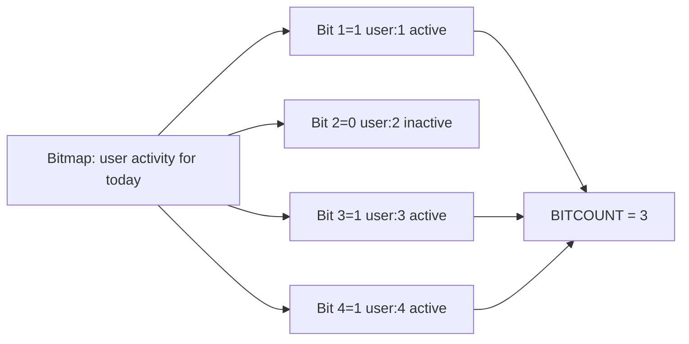

# How to Use BITCOUNT in Redis to Count Set Bits

Author: [nawazdhandala](https://www.github.com/nawazdhandala)

Tags: Redis, Bitmap, BITCOUNT, BIT, Analytics

Description: Learn how to use BITCOUNT to count the number of set bits (1s) in a Redis string, enabling efficient population count for bitmap-based analytics.

---

Redis strings can be used as bitmaps where each bit represents a boolean value for some entity (e.g., user ID 42 = bit 42). `BITCOUNT` counts how many bits are set to 1 in the entire string or within a specified byte or bit range - making it ideal for counting active users, feature flags, or attendance records.

## How BITCOUNT Works

`BITCOUNT` iterates over the bytes of a Redis string and counts all bits set to 1. With range arguments, you limit the scan to specific bytes or bits. Redis uses a fast population count (popcount) algorithm for this operation.



## Syntax

```redis
BITCOUNT key [start end [BYTE | BIT]]
```

- `key` - Redis string key used as a bitmap
- `start end` - optional range (inclusive)
- `BYTE` - interpret start/end as byte offsets (default before Redis 7.0)
- `BIT` - interpret start/end as bit offsets (Redis 7.0+)

Negative indices count from the end: `-1` = last byte, `-2` = second to last, etc.

## Setup

```redis
# Mark users 1, 5, 10, and 100 as active
SETBIT daily-active:2026-03-31 1 1
SETBIT daily-active:2026-03-31 5 1
SETBIT daily-active:2026-03-31 10 1
SETBIT daily-active:2026-03-31 100 1
```

## Examples

### Count All Active Users Today

```redis
BITCOUNT daily-active:2026-03-31
```

Output:

```text
(integer) 4
```

### Count Within a Byte Range

Count bits in bytes 0-1 (the first 16 bits, covering users 0-15):

```redis
BITCOUNT daily-active:2026-03-31 0 1
```

### Count Within a Bit Range (Redis 7.0+)

Count active users with IDs 0-9:

```redis
BITCOUNT daily-active:2026-03-31 0 9 BIT
```

### Count Active Users in Last Byte

```redis
BITCOUNT daily-active:2026-03-31 -1 -1
```

### Weekly Active Users (Approximate)

Count active days for all users across a week by ORing bitmaps first:

```redis
BITOP OR weekly-active daily-active:2026-03-25 daily-active:2026-03-26 daily-active:2026-03-27 daily-active:2026-03-28 daily-active:2026-03-29 daily-active:2026-03-30 daily-active:2026-03-31
BITCOUNT weekly-active
```

## Practical Patterns

### Daily Active User (DAU) Count

```redis
# User logins set their bit
SETBIT logins:2026-03-31 42 1
SETBIT logins:2026-03-31 1337 1
SETBIT logins:2026-03-31 99999 1

# Count DAU
BITCOUNT logins:2026-03-31
```

### Feature Flag Adoption

Track which users have a feature enabled:

```redis
SETBIT feature:dark-mode 101 1
SETBIT feature:dark-mode 202 1
SETBIT feature:dark-mode 303 1

BITCOUNT feature:dark-mode
# Returns 3 users with dark mode enabled
```

## Use Cases

- **Daily Active Users (DAU)** - count unique user logins per day
- **Retention analysis** - count users active on specific days using combined bitmaps
- **Feature adoption metrics** - count how many users have a flag enabled
- **A/B test participation** - track and count users assigned to each variant

## Summary

`BITCOUNT` provides an extremely fast and memory-efficient way to count boolean attributes across millions of entities. A bitmap for 10 million users requires only 1.25 MB of memory. Combine `BITCOUNT` with `BITOP` for set operations across multiple bitmaps, and use the `BIT` range type (Redis 7.0+) for precise bit-level queries.
