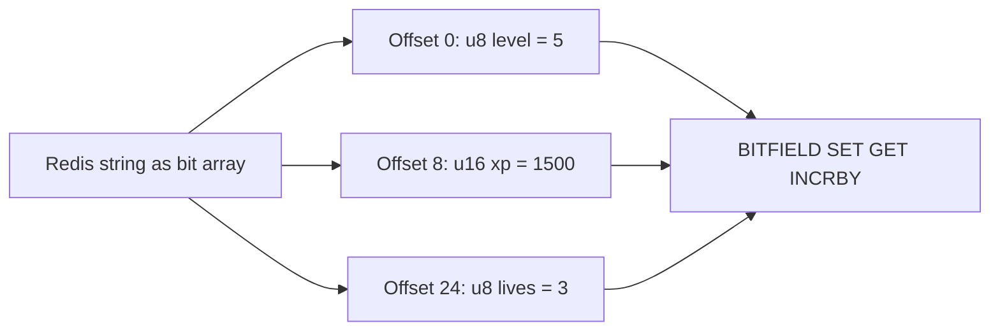

# How to Use BITFIELD in Redis for Arbitrary Bit Field Operations

Author: [nawazdhandala](https://www.github.com/nawazdhandala)

Tags: Redis, Bitmap, BITFIELD, Bit, Counter

Description: Learn how to use BITFIELD to read, write, and increment arbitrary-width integer fields packed within a Redis string, enabling compact data storage.

---

`BITFIELD` allows you to treat a Redis string as an array of arbitrary-width integers. You can store 8-bit, 16-bit, 32-bit, or any custom-width signed or unsigned integers at specific bit offsets and perform get, set, and increment operations atomically.

## How BITFIELD Works

`BITFIELD` addresses bits within a Redis string by offset and type. A type like `u8` means an 8-bit unsigned integer; `i16` means a 16-bit signed integer. Multiple sub-commands can be issued in one call, and they execute atomically.



## Syntax

```redis
BITFIELD key [GET type offset] [SET type offset value] [INCRBY type offset increment] [OVERFLOW WRAP | SAT | FAIL]
```

Sub-commands:
- `GET type offset` - return the integer at this position
- `SET type offset value` - set the integer at this position, return old value
- `INCRBY type offset increment` - add increment, return new value
- `OVERFLOW WRAP|SAT|FAIL` - configure overflow behavior for subsequent operations

Type format: `u<bits>` for unsigned (e.g., `u8`, `u16`, `u32`) or `i<bits>` for signed (e.g., `i8`, `i16`)

## Examples

### Store a Game Player's Stats

Pack level, XP, and lives into a compact string:

```redis
BITFIELD player:42 SET u8 0 5 SET u16 8 1500 SET u8 24 3
```

### Read Multiple Fields

```redis
BITFIELD player:42 GET u8 0 GET u16 8 GET u8 24
```

Output:

```text
1) (integer) 5
2) (integer) 1500
3) (integer) 3
```

### Increment XP

```redis
BITFIELD player:42 INCRBY u16 8 250
```

Output (new XP value):

```text
1) (integer) 1750
```

### Atomic Multi-Op

Read level, increment XP, and decrement lives in one atomic call:

```redis
BITFIELD player:42 GET u8 0 INCRBY u16 8 100 INCRBY u8 24 -1
```

### Overflow Handling

By default, BITFIELD uses `WRAP` (overflow wraps around). Use `SAT` to cap at max value:

```redis
BITFIELD player:42 OVERFLOW SAT INCRBY u8 0 200
# If level is 200 and u8 max is 255, result is 255 (saturated, not wrapped)
```

Use `FAIL` to return nil and make no change on overflow:

```redis
BITFIELD player:42 OVERFLOW FAIL INCRBY u8 0 200
# Returns nil if increment would overflow, value unchanged
```

### Unsigned vs Signed Types

```redis
# u8: values 0-255
BITFIELD mykey SET u8 0 200

# i8: values -128 to 127
BITFIELD mykey SET i8 8 -50
BITFIELD mykey GET i8 8
# Returns -50
```

## Memory Efficiency Example

Storing 1 million user counters (8-bit each) in BITFIELD:

```redis
# 1M users * 1 byte = 1 MB per counter type
# vs. 1M separate keys = ~64 MB overhead
```

## Use Cases

- **Game state storage** - pack player stats (level, XP, lives, coins) into one key
- **Rate limiting counters** - compact per-user request counters in a single string
- **Feature flags bitmask** - pack multiple boolean flags into a single integer field
- **Protocol simulation** - model binary protocol fields for testing

## Summary

`BITFIELD` is Redis's most flexible bit-manipulation command, letting you define and operate on arbitrary-width integer fields within a single string. Its atomic multi-sub-command execution, configurable overflow behavior, and support for both signed and unsigned integers make it ideal for compact, high-performance state storage. Use `BITFIELD_RO` for read-only access in replicated or multi-thread scenarios.
