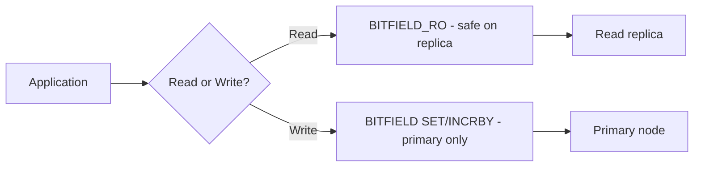

# How to Use BITFIELD_RO in Redis for Read-Only Bit Field Access

Author: [nawazdhandala](https://www.github.com/nawazdhandala)

Tags: Redis, Bitmap, BITFIELD_RO, Bit, Read-Only

Description: Learn how to use BITFIELD_RO to safely read bit field values from a Redis string without any write operations, suitable for read replicas and safe concurrency.

---

`BITFIELD_RO` is a read-only variant of `BITFIELD` introduced in Redis 6.0. It only supports `GET` sub-commands, making it safe to run on Redis read replicas and in contexts where write operations must be prevented. It is functionally identical to `BITFIELD ... GET` but is explicitly marked as a read-only command.

## How BITFIELD_RO Works

`BITFIELD_RO` reads integer values from specified bit offsets in a Redis string, just like `BITFIELD GET`. Because it never modifies the key, Redis routes it to read replicas in cluster setups, and it does not trigger keyspace notifications or replication events.



## Syntax

```redis
BITFIELD_RO key GET type offset [GET type offset ...]
```

- `key` - Redis string key
- `GET type offset` - read the integer of the given type at this bit offset

Only `GET` sub-commands are allowed - `SET` and `INCRBY` are not permitted.

## Setup

```redis
# Write via BITFIELD on primary
BITFIELD player:42 SET u8 0 15 SET u16 8 3200 SET u8 24 5
```

## Examples

### Read a Single Field

```redis
BITFIELD_RO player:42 GET u8 0
```

Output:

```text
1) (integer) 15
```

### Read Multiple Fields

```redis
BITFIELD_RO player:42 GET u8 0 GET u16 8 GET u8 24
```

Output:

```text
1) (integer) 15
2) (integer) 3200
3) (integer) 5
```

### Read Signed Integer

```redis
BITFIELD_RO sensor:1 GET i16 0
# Returns a signed 16-bit integer
```

### Using with Read Replicas

In a Redis cluster or replication setup, direct read-only commands to replicas:

```bash
redis-cli -h replica-host -p 6380 BITFIELD_RO player:42 GET u8 0 GET u16 8
```

## BITFIELD_RO vs BITFIELD GET

Both commands produce identical output for `GET` operations. The key differences are:

| Aspect | BITFIELD GET | BITFIELD_RO GET |
|---|---|---|
| Read replicas | Typically not routed | Yes, explicitly safe |
| Allows SET/INCRBY | Yes (in same call) | No (compile-time rejection) |
| Redis version | All | 6.0+ |
| Keyspace events | Possible (if mixed ops) | Never |

## Use Cases

- **Read replica offloading** - run analytics reads on replicas without affecting the primary
- **Multi-threaded safety** - use `BITFIELD_RO` in read paths where accidental writes would be a bug
- **Audit dashboards** - read game or user stats without risk of modifying them
- **High-read workloads** - distribute `BITFIELD_RO` calls across replicas to scale read throughput

## Summary

`BITFIELD_RO` is the safe, read-only counterpart to `BITFIELD` for GET operations. Use it when reading bit field data from Redis read replicas, or whenever you want to enforce a strict read-only contract in your code. Its behavior is identical to `BITFIELD GET` but it is explicitly classified as a read-only command, making it the correct choice in replica-aware Redis deployments.
