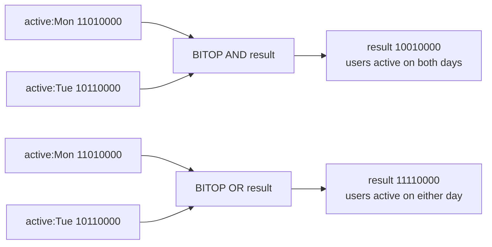

# How to Use BITOP in Redis for Bitwise Operations on Strings

Author: [nawazdhandala](https://www.github.com/nawazdhandala)

Tags: Redis, Bitmap, BITOP, Bit, Analytics

Description: Learn how to use BITOP to perform AND, OR, XOR, and NOT bitwise operations across multiple Redis string bitmaps and store the result.

---

`BITOP` applies a bitwise operation (AND, OR, XOR, or NOT) across one or more Redis string keys and stores the result in a destination key. This enables powerful set operations on bitmap-encoded data, such as finding users who were active on all days of a week or on any day of a week.

## How BITOP Works

`BITOP` processes its input keys byte by byte and applies the specified operation. If input keys have different lengths, shorter ones are zero-padded. The result is stored in the destination key with a length equal to the longest input.



## Syntax

```redis
BITOP AND | OR | XOR | NOT destkey key [key ...]
```

- `AND` - destination bit = 1 only if all source bits are 1
- `OR` - destination bit = 1 if any source bit is 1
- `XOR` - destination bit = 1 if an odd number of source bits are 1
- `NOT` - invert all bits (single source key only)
- `destkey` - where to store the result
- `key` - one or more source bitmap keys

Returns the length of the destination string in bytes.

## Setup

```redis
# Mark users active on Monday (users 1, 2, 4)
SETBIT active:mon 1 1
SETBIT active:mon 2 1
SETBIT active:mon 4 1

# Mark users active on Tuesday (users 1, 3, 4)
SETBIT active:tue 1 1
SETBIT active:tue 3 1
SETBIT active:tue 4 1

# Mark users active on Wednesday (users 2, 3, 4)
SETBIT active:wed 2 1
SETBIT active:wed 3 1
SETBIT active:wed 4 1
```

## Examples

### AND - Users Active All 3 Days

```redis
BITOP AND active:all-3-days active:mon active:tue active:wed
BITCOUNT active:all-3-days
# Returns 1 (only user 4 was active all 3 days)
```

### OR - Users Active on Any Day (Weekly Active Users)

```redis
BITOP OR active:any-day active:mon active:tue active:wed
BITCOUNT active:any-day
# Returns 4 (users 1, 2, 3, 4 were active on at least one day)
```

### XOR - Users Active on Mon or Tue but Not Both

```redis
BITOP XOR active:mon-xor-tue active:mon active:tue
BITCOUNT active:mon-xor-tue
# Users 2 (mon only) and 3 (tue only)
```

### NOT - Users NOT Active on Monday

```redis
BITOP NOT inactive:mon active:mon
# All bits are flipped - bits not set in active:mon become 1
```

Note: `NOT` inverts all bits including unused ones, so the result may have many unintended 1 bits for high user IDs. Use `BITPOS` or `BITCOUNT` with a range to limit the scope.

### Weekly Active Users Pipeline

```redis
BITOP OR weekly:2026-13 active:2026-03-25 active:2026-03-26 active:2026-03-27 active:2026-03-28 active:2026-03-29 active:2026-03-30 active:2026-03-31
BITCOUNT weekly:2026-13
EXPIRE weekly:2026-13 604800
```

## Use Cases

- **Cohort retention** - AND multiple daily bitmaps to find users active on all days
- **Weekly active users (WAU)** - OR daily bitmaps into a weekly aggregate
- **Exclusive segments** - XOR to find users in one group but not another
- **Complement sets** - NOT to find users who have NOT performed an action

## Summary

`BITOP` transforms Redis bitmaps from individual counters into a set algebra system. AND, OR, XOR, and NOT operations on bitmap keys enable cohort analysis, retention calculation, and segment intersection at scale - all in a single command with O(N) complexity proportional to the bitmap size, not the element count.
